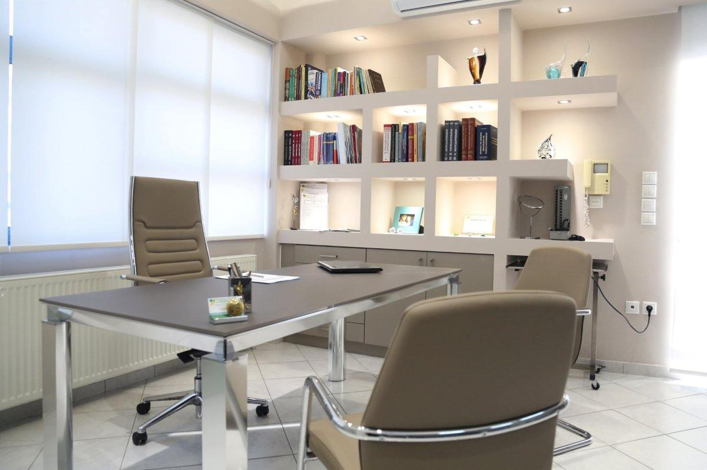

 
 

#####<u>ΕΚΠΑΙΔΕΥΣΗ ΚΑΙ ΜΕΤΕΚΠΑΙΔΕΥΣΗ:</u>  
* Χειρουργική Εξειδίκευση και Μετεκπαίδευση στο Λονδίνο, Μεγάλη Βρετανία **2013 – 2017**  

Εκπαίδευση στη Ρινοπλαστική, Ενδοσκοπική Χειρουργική Ρινός και Παραρρινίων, Χειρουργική Ροχαλητού και Άπνοιας, Παιδο - ΩΡΛ, LASER Μικρο-Χειρουργική Κεφαλής και Τραχήλου. 

**Queen’s Hospital London, BHR University Hospitals NHS Trust, London United Kingdom Eastbourne District General Hospital, East Sussex, United Kingdom**

 

* Συμμετοχή σε Εξειδικευμένα Εκπαιδευτικά Χειρουργικά Courses - Hands on Workshops - των Ιατρικών Σχολών των Πανεπιστημίων του Λονδίνου **"Kings College London"** και **"Queen Mary University of London"** και της Ιατρικής σχολής του Πανεπιστημίου του Liverpool.  

Advanced Surgical Training Courses σε πτωματικά παρασκευάσματα στην Ρινοπλαστική, Ενδοσκοπική Χειρουργική Ρινός και Παραρρινίων, Ωτοχειρουργική και Χειρουργική Κεφαλής και Τραχήλου.

**- Temporal Bone Dissection Course, "hands-on" Cadaver Dissection Training Course** 
Kings College London - Guy's and St. Thomas' NHS Trust
LONDON, UNITED KINGDOM, June 2016

**- Rhinoplasty Practical Workshop, “hands-on” Cadaver Dissection Training Course** 
Queen Mary University of London - Bart's and the London NHS Trust
LONDON, UNITED KINGDOM, June 2015

**- F.E.S.S. Practical Workshop, "hands-on" Cadaver Dissection Training Course** 
Queen Mary University of London - Bart's and the London NHS Trust
LONDON, UNITED KINGDOM, June 2014

**- Head and Neck Surgery Practical Workshop, “hands-on” Cadaver Dissection Training Course** 
Queen Mary University of London - Bart's and the London NHS Trust
LONDON, UNITED KINGDOM, June 2014

 
 

 
 

* **Ετήσια Αξιολόγηση APPRAISAL και REVALIDATION από το GMC στη Μεγάλη Βρετανία 2013 – 2017**:  
    Επιτυχής συμμετοχή στο πρόγραμμα αξιολόγησης Ιατρών του Ιατρικού Συλλόγου της Μεγάλης Βρετανίας με ετήσια πιστοποίηση συνεχιζόμενης εκπαίδευσης, διατήρησης και επέκτασης της ιατρικής γνώσης.

 

* Ειδικευόμενος Ιατρός στην Ωτορινολαρυγγολογία και Χειρουργική Κεφαλής και Τραχήλου **2009 - 2013**  
Ολοκλήρωση της ειδικότητας μετά από επιτυχείς Προφορικές και Γραπτές εξετάσεις υπό τον Καθηγητή Σισμάνη, Αθήνα 2013.

 

* **Απόφοιτος της Ιατρικής Σχολής, του Αριστοτελείου Πανεπιστημίου Θεσσαλονίκης - Λίαν Καλώς 2003**.

 

* Δευτεροβάθμια εκπαίδευση, Απολυτήριο Λυκείου με βαθμό Άριστα  1912/13.

 
 

 
 

#####<u>ΕΠΑΓΓΕΛΜΑΤΙΚΗ ΕΜΠΕΙΡΙΑ:</u>  

* Ιδιώτης Ωτορινολαρυγγολόγος - Χειρουργός Κεφαλής και Τραχήλου
    
    **- ΩΡΛ Ιατρείο Περιστέρι, Αττικής** 
    **- Επιστημονικός Συνεργάτης – Χειρουργός ΩΡΛ Νοσοκομείο ΥΓΕΙΑ** 
    **- Επιστημονικός Συνεργάτης – Χειρουργός ΩΡΛ Νοσοκομείο "Metropolitan"** 
    **-** Συνεργασία με τις μεγαλύτερες Ιδιωτικές Κλινικές και Νοσοκομεία των Αθηνών 
    **-** Συνεργασία με Ιδιωτικές Ασφαλιστικές εταιρείες για Εξέταση στο ιατρείο, Νοσηλεία και Χειρουργικές Επεμβάσεις 

 

* **Επιμελητής Χειρουργός ΩΡΛ στην Πανεπιστημιακή Κλινική ΩΡΛ - Χειρουργικής Κεφαλής και Τραχήλου**  
  **Queen's Hospital, London United Kingdom**  
  **BHR University Hospitals NHS Trust, London United Kingdom** 
  Έμμισθη Θέση Επιμελητή ΩΡΛ για 3 χρόνια, 2014 - 2017

 

* **Επιμελητής Χειρουργός ΩΡΛ στην Πανεπιστημιακή Κλινική ΩΡΛ - Χειρουργικής Κεφαλής και Τραχήλου** 
  **Eastbourne District General Hospital**  
  **East Sussex Healthcare NHS Trust, United Kingdom**  
  Έμμισθη Θέση Επιμελητή ΩΡΛ ,  2013 – 2014

 
 

 
 

#####<u>ΚΛΙΝΙΚΟ και ΧΕΙΡΟΥΡΓΙΚΟ ΕΡΓΟ στη ΜΕΓΑΛΗ ΒΡΕΤΑΝΙΑ:</u>  

* Διενέργεια χειρουργικών επεμβάσεων σε όλο το φάσμα της Ωτορινολαρυγγολογίας Ενηλίκων και Παίδων (Περισσότερες από 5000 επεμβάσεις).
* Αυτόνομη τακτική λίστα χειρουργείου (Μοναδικός Χειρουργός).
* Εκπαιδευτής Χειρουργός Ειδικευόμενων Ιατρών.
* Χειρουργική αντιμετώπιση εξειδικευμένων περιστατικών στο πεδίο της Μετεκπαίδευσης (Ρινοχειρουργική, Ροχαλητό και Άπνοια).
* Υπεύθυνος Επιμελητής Τακτικών Εξωτερικών Ιατρείων στην Γενική ΩΡΛ και σε ΥποΕιδικότητες - Ιατρείο Ρινολογίας, Ωτολογίας και Ιλίγγου, Ροχαλητού και Άπνοιας, Ογκολογίας Κεφαλής      και Τραχήλου, ΠΑΙΔΟ-Ωτορινολαρυγγολογίας, Λαρυγγολογίας και Φωνιατρικής.
* Διάγνωση και θεραπευτική αντιμετώπιση περίπλοκων και χρόνιων ΩΡΛ παθήσεων ενηλίκων και παίδων.
* Συμμετοχή σε συνεδριάσεις ομάδας ιατρών διαφορετικών ιατρικών ειδικοτήτων (Specialist Multidisciplinary Team - MDT) από νοσοκομεία του Λονδίνου για εξειδικευμένα περιστατικά και   ογκολογικούς ασθενείς (London Zone - North East London Cancer Network).
* Συμμετοχή στο πρόγραμμα εφημεριών στο επίπεδο του Επιμελητή.
* Διενέργεια (ως Μοναδικός Χειρουργός) επειγουσών χειρουργικών επεμβάσεων Ενηλίκων και Παίδων και αντιμετώπιση κρίσιμων και εξαιρετικά σοβαρών επειγόντων ΩΡΛ περιστατικών. 
* Υπεύθυνος για την επίβλεψη και διδασκαλία των νεαρών ιατρών (Junior Doctors) του ΩΡΛ τμήματος κατά την εφημερία.
* Υπεύθυνος για την επίσκεψη στους θαλάμους νοσηλευομένων ασθενών (Leading Ward Round) σχεδιασμός θεραπευτικού πλάνου των ασθενών, αξιολόγηση πορείας νόσου, οργάνωση και ανάθεση     των καθηκόντων των νεαρών Ιατρών (Junior Doctors) της ΩΡΛ κλινικής.

 
 

 
 

* **Ειδικευόμενος Ωτορινολαρυγγολόγος - Χειρουργός Κεφαλής και Τραχήλου στο Τζάνειο Γενικό Νοσοκομείο Πειραιά** 
    Έμμισθη Θέση Ειδίκευσης, 2009 - 2013  
* Ειδικευόμενος Ιατρός Γενικής Χειρουργικής για συνολικά 16 μήνες 
  Έμμισθη Θέση Ειδίκευσης Γενικό Νοσοκομείο Καστοριάς, 2004 - 2005  
* Υπηρεσία Υπαίθρου 
  Έμμισθη Θέση Αγροτικός Ιατρός στο Κέντρο Υγείας Άργους Ορεστικού Καστοριάς, για 6 μήνες  
* Υπηρεσία Υπαίθρου 
  Έμμισθη Θέση Αγροτικός Ιατρός στο Κέντρο Υγείας Αιγινίου Πιερίας, για 6 μήνες  
* Στρατιωτική Θητεία 
  Ιατρός στο στρατό ξηράς, με υπηρεσία σε Άρτα, Αλεξανδρούπολη και Σέρρες για 1 έτος  
* Ιατρός Ελεύθερος Επαγγελματίας 
  Κέντρο Αποκατάστασης "Αναγέννηση", Θεσσαλονίκη, για 1 έτος.  
* Τρίμηνη Εκπαίδευση στο Γενικό Νοσοκομείο Καστοριάς 
  Έμμισθη Θέση Γενική Χειρουργική, Καρδιολογία και Παθολογία

 
 

#####<u>ΙΑΤΡΙΚΟΙ ΣΥΛΛΟΓΟΙ:</u>  
* **Εγγραφή στον Ιατρικό Σύλλογο Μεγάλης Βρετανίας (GMC) ως Ειδικός Χειρουργός Ωτορινολαρυγγολόγος** 
  **GMC Registration No 7447877, On Specialist Register, ENT Surgeon - Otorhinolaryngologist Full Registration with License to Practice**

* Ιατρικός Σύλλογος Αθηνών, Ειδικός Χειρουργός Ωτορινολαρυγγολόγος
* Πανελλήνια Εταιρία ΩΡΛ - Χειρουργικής Κεφαλής & Τραχήλου
* ΕΛΛΗΝΙΚΗ ΕΤΑΙΡΕΙΑ ΟΓΚΟΛΟΓΙΑΣ ΚΕΦΑΛΗΣ ΚΑΙ ΤΡΑΧΗΛΟΥ (ΕΕΟΚΤ)
* Ελληνική Εταιρεία ΩΡΛ Αλλεργίας, Ανοσιολογίας και Ρογχοπαθειών

 
 

 
 

#####<u>ΔΙΔΑΚΤΙΚΟ ΚΑΙ ΕΚΠΑΙΔΕΥΤΙΚΟ ΕΡΓΟ ΣΤΗ ΜΕΓΑΛΗ ΒΡΕΤΑΝΙΑ:</u>  
**<u>Εκπαιδευτής Χειρουργός των Ειδικευόμενων στην ΩΡΛ Ιατρών:</u>**  
Queen's Hospital, London, United Kingdom

* Εκπαιδευτής Χειρουργός των Ειδικευόμενων στην Ωτορινολαρυγγολογία σε ΩΡΛ επεμβάσεις με άμεση επίβλεψη και καθοδήγηση στην Χειρουργική Αίθουσα.
* Κλινική Εκπαίδευση των Ειδικευόμενων στην Ωτορινολαρυγγολογία, ανάλυση και επεξήγηση περιστατικών, ερμηνεία και εφαρμογή των κατευθυντήριων οδηγιών (Guidelines).
* Διαλέξεις και παρουσιάσεις εξειδικευμένων ΩΡΛ θεμάτων και περιστατικών.

 
 

**<u>Εκπαίδευση Φοιτητών Ιατρικής:</u>**
Queen’s Hospital, London, United Kingdom

* Εκπαίδευση φοιτητών στην κλινική Ωτορινολαρυγγολογία, βασικές αρχές εκτίμησης περιστατικών, λήψης ιστορικού και κλινικής εξέτασης.
* Εφαρμογή στην κλινική πράξη των κατευθυντήριων οδηγιών (Guidelines).
* Διαλέξεις και παρουσιάσεις ΩΡΛ θεμάτων και περιστατικών.

 
 

**<u>Εκπαίδευση Νοσηλευτικού &amp; Παραϊατρικού προσωπικού:</u>**
Queen’s Hospital, London United Kingdom και Eastbourne DGH

* Εκπαίδευση στις βασικές αρχές της Ωτορινολαρυγγολογίας, λήψης ιστορικού και κλινικής εξέτασης.
* Πρώτες Βοήθειες και Αντιμετώπιση επειγόντων ΩΡΛ περιστατικών στην κλινική.
* Διαλέξεις και παρουσιάσεις ΩΡΛ θεμάτων και περιστατικών.

 
 

 
 

#####<u>ΔΙΑΛΕΞΕΙΣ ΣΤΗ ΜΕΓΑΛΗ ΒΡΕΤΑΝΙΑ:</u>  
**Σε Ειδικούς ΩΡΛ & Ειδικευόμενους ΩΡΛ Ιατρούς και Φοιτητές Ιατρικής**  
* **Difference in duration of tonsillectomy using Laryngeal mask airway (LMA) vs. Endotracheal tube (ETT)** 
    Clinical Audit Presentation 
    At Queen's Hospital London, Lecture Theatre LONDON UNITED KINGDOM, May 2015 
* **Chronic non-specific rhinitis (allergic and non-allergic)** 
    At Queen's Hospital London, Lecture Theatre LONDON UNITED KINGDOM, February 2017 
* **Salivary Gland Neoplasms** 
    At Queen's Hospital London, Lecture Theatre LONDON UNITED KINGDOM, December 2016 
* **Parapharyngeal space swellings** 
    At Queen's Hospital London, Lecture Theatre LONDON UNITED KINGDOM, October 2016 
* **Sinonasal neoplasms** 
    At Queen's Hospital London, Lecture Theatre LONDON UNITED KINGDOM, July 2016 
* **Vocal Cords Paralysis** 
    At Queen's Hospital London, Lecture Theatre LONDON UNITED KINGDOM, April 2016 
* **Paragangliomas** 
    At Queen's Hospital London, Lecture Theatre LONDON UNITED KINGDOM, February 2016 
* **Chronic rhinosinusitis (with and without polyps)** 
    At Queen's Hospital London, Lecture Theatre LONDON UNITED KINGDOM, December 2015 
* **Chronic rhinosinusitis complications** 
    At Queen's Hospital London, Lecture Theatre LONDON UNITED KINGDOM, November 2015 
* **Tinnitus** 
    At Queen's Hospital London, Lecture Theatre LONDON UNITED KINGDOM, September 2015 
* **Tumours of the Nasopharynx** 
    At Queen's Hospital London, Lecture Theatre LONDON UNITED KINGDOM, July 2015 
* **Deep Head & Neck Infections and Treatment** 
    At Queen's Hospital London, Lecture Theatre LONDON UNITED KINGDOM, June 2015 
* **Benign Head and Neck Masses** 
    At Queen's Hospital London, Lecture Theatre LONDON UNITED KINGDOM, March 2015 
* **Complications of tonsillectomy** 
    At Queen's Hospital London, Lecture Theatre LONDON UNITED KINGDOM, January 2015 
* **Epistaxis surgical management** 
    At Queen's Hospital London, Lecture Theatre LONDON UNITED KINGDOM, October 2014 
* **Laryngeal Cancer involving the Anterior Commissure** 
    At Eastbourne District General Hospital (EDGH) Lecture Theatre & Training Centre, UNITED KINGDOM, October 2013 

 
 

 
 

#####<u>ΣΥΜΜΕΤΟΧΗ ΣΕ ΕΚΠΑΙΔΕΥΤΙΚΑ COURSES & WORKSHOPS:</u>  
######<u>ADVANCED SURGICAL TRAINING COURSES ΣΤΗ ΜΕΓΑΛΗ ΒΡΕΤΑΝΙΑ:</u>  

* Συμμετοχή σε Εξειδικευμένα Εκπαιδευτικά Χειρουργικά Courses - Hands on Workshops - των Ιατρικών Σχολών των Πανεπιστημίων του Λονδίνου **"Kings College London"** και **"Queen       Mary University of London"** και της Ιατρικής σχολής του Πανεπιστημίου του Liverpool.  
  Advanced Surgical Training Courses σε πτωματικά παρασκευάσματα στην Ρινοπλαστική, Ενδοσκοπική Χειρουργική Ρινός και Παραρρινίων, Ωτοχειρουργική και LASER Μικρο-Χειρουργική Κεφαλής και Τραχήλου.

   

**- Trans-Oral LASER Microsurgery for Head and Neck Cancer , “hands-on” Cadaver Dissection Training Course** 
    University of Liverpool - School of Medicine, Aintree University Hospital NHS Foundation Trust
    Liverpool, UNITED KINGDOM, June 2019

**- Temporal Bone Dissection Course, "hands-on" Cadaver Dissection Training Course** 
    Guy's & St Thomas' NHS Trust, Kings College London 
    LONDON UNITED KINGDOM, June 2016

**- Rhinoplasty Practical Workshop, "hands-on" Cadaver Dissection Training Course** 
    Bart's and the London NHS Trust, Queen Mary University London 
    LONDON UNITED KINGDOM, June 2015

**- F.E.S.S. Practical Workshop, "hands-on" Cadaver Dissection Training Course** 
    Bart's and the London NHS Trust, Queen Mary University London 
    LONDON UNITED KINGDOM, June 2014

**- Head & Neck Surgery Practical Workshop, "hands-on" Cadaver Dissection Training Course** 
    Bart's and the London NHS Trust, Queen Mary University London 
    LONDON UNITED KINGDOM, June 2014

 
 

 
 

######<u>TRAINING COURSES ΣΤΗ ΜΕΓΑΛΗ ΒΡΕΤΑΝΙΑ:</u>  

* BLS Training Course at Queen's Hospital London Educational & Training Centre, 
LONDON UNITED KINGDOM February 10th, 2017  
* BLS Training Course at Queen's Hospital London Educational & Training Centre, 
LONDON UNITED KINGDOM March 13th, 2015  
* BLS Training Course at Eastbourne District General Hospital (EDGH) Training Centre, 
LONDON UNITED KINGDOM August 22th, 2013 

 

######<u>TRAINING COURSES ΣΤΗΝ ΕΛΛΑΔΑ:</u>  

* Training Seminar "New developments in Clinical Audiology (Wideband Tympanometry, ASSR, OAE, v-Hit)" organised by INTERACOUSTICS  at Stratos Vassilikos Hotel, Athens Greece, May 6th, 2017  
* 4th Training Course, Interesting Cases in Voice Pathology  at Centre of Voice and Swallowing of Athens, Greece, November 2nd, 2010  
* 20th Training Seminar of Greek ENT Society  at Veria, Greece, October 22nd - 24th, 2010  
* 2nd Snoring Laboratory Training Course  at Royal Olympic Hotel, Athens Greece, May 8th, 2010  
* 11th Training Seminar Greek ENT Allergy-Anosology-Ronchopathy Society  at Kalamata Greece, October 15th – 17th, 2010  
* 2nd Training Seminar of the Greek ENT Voice Disorders Society  at Kalamata Greece, October 15th – 17th, 2010 
 
 

#####<u>ΣΥΜΜΕΤΟΧΗ ΣΕ ΣΥΝΕΔΡΙΑ:</u>  

* 5th British Academic Conference in Otolaryngology (BACO2015),  at BT Convention Centre, Liverpool United Kingdom July 8th - 10th, 2015  
* 10th Symposium of Intensive Care Medicine  at General Air Forces Hospital, Athens Greece, May 25th - 26th, 2012  
* 16th PanHellenic Otorhinolaryngologic - Head & Neck Surgery Congress  at Hilton Hotel, Athens Greece, December 1st - 4th, 2011  
* Greek ENT Society Conference "Salivary glands disorders: from diagnosis to treatment"  at Athens Greece, December 12th, 2010  
* Greek ENT Society Conference "Sleep Apnoea"  at Royal Olympic Hotel, Athens, Greece, May 8th, 2010  
* 20th PanHellenic Medical Seminar of Otology, Audiology and Neurotology "Updates in Neurotology"  at Divani Caravel Hotel, Athens Greece, March 13th, 2010  
* 15th PanHellenic Otorhinolaryngologic - Head & Neck Surgery Congress  at Creta Maris Hotel, Iraklion Greece, October 21st - 25th, 2009  
* Greek ENT Society Conference "Neck Masses: Diagnosis & Treatment"  at Athens, Greece December 5th, 2009  
* Greek ENT Society Conference "Updates in Middle Ear Surgery & Prevention of Complications"  at Athens Greece, September 26th, 2009

 
 

 
 

#####<u>ΠΑΡΟΥΣΙΑΣΕΙΣ:</u>  

* **"Difference in duration of tonsillectomy using Laryngeal mask airway (LMA) vs. Endotracheal tube (ETT)"** 
     Boukonis K, Kumar G, Eweiss A. 
     15th British Academic Conference in Otolaryngology (BACO2015), 
     BT Convention Centre, Liverpool, United Kingdom July 8th - 10th, 2015  

* **"Videonystagmography findings of benign paroxysmal positional vertigo"** 
    Balatsouras D, Koukoutsis G, Boukonis K 
    15th PanHellenic Otorhinolaryngologic Head & Neck Surgery Congress, 
    Creta Maris Hotel, Iraklion, Greece, October 21st - 25th, 2009  

* **"Benign paroxysmal positional vertigo of the superior SCC"** 
    Balatsouras D, Aspris A, Boukonis K 
    15th PanHellenic Otorhinolaryngologic Head & Neck Surgery Congress, 
    Creta Maris Hotel, Iraklion, Greece, October 21st - 25th, 2009  

* **"Evaluation of maxillary sinus puncture in patients suffering from fever of unknown origin"** 
    Ganelis P, Papaliakos E, Boukonis K 
    15th PanHellenic Otorhinolaryngologic Head & Neck Surgery Congress, 
    Creta Maris Hotel, Iraklion, Greece, October 21st - 25th, 2009  
* **"Necessity of blood test in patients with rhinorrhagia (epistaxis) at the emergency room"** 
    Koukoutsis G, Kloutsos G, Boukonis K 
    15th PanHellenic Otorhinolaryngologic Head & Neck Surgery Congress, 
    Creta Maris Hotel, Iraklion, Greece, October 21st - 25th, 2009
 
 

#####<u>ΣΥΜΜΕΤΟΧΗ ΣΕ POSTER:</u>  

* **"Difference in duration of tonsillectomy using Laryngeal mask airway (LMA) vs. Endotracheal tube (ETT)"** 
    Boukonis K, Kumar G, Eweiss A. 
    15th British Academic Conference in Otolaryngology (BACO2015), 
    BT Convention Centre, Liverpool, United Kingdom July 8th - 10th, 2015  
* **"Atypical cases of benign paroxysmal positional vertigo"** 
    Balatsouras D, Ablonitou I, Boukonis K 
    16th PanHellenic Otorhinolaryngologic - Head & Neck Surgery Congress, 
    Hilton Hotel, Athens, Greece, December 1st - 4th, 2011

 
 

 
 

#####<u>ΔΙΑΛΕΞΕΙΣ - ORAL ACADEMIC PRESENTATIONS:</u>  

* **"Difference in duration of tonsillectomy using Laryngeal mask airway (LMA) vs. Endotracheal tube (ETT)"** 
    At Queen's Hospital Romford Lecture Theatre (under the ENT Clinical Governance & Audit meeting, May 2015)  
* **"Rare complications of tonsillectomy and interesting case presentation"** 
    at "Ippokrateio" University Hospital of Athens Lecture Theatre (under post-training lessons of the ENT Clinics of the Medical School of Athens)  
* **"OAE in elderly population"** 
    at "Tzaneio" General Hospital Lecture Theatre (under continuing medical education and continuing professional development courses)
 
 

#####<u>CLINICAL AUDIT:</u>  

Lead Auditor in  
**"Difference in duration of tonsillectomy using Laryngeal mask airway (LMA) vs. Endotracheal tube (ETT)"** 
  Boukonis K, Kumar G, Eweiss A. 
  Queen's Hospital London, BHR University Hospitals Trust, June 2015
 
 

#####<u>ΣΥΜΜΕΤΟΧΗ ΣΕ ΔΗΜΟΣΙΕΥΣΕΙΣ - PUBLICATIONS:</u>  

* **"Mucous membrane plasmacytosis - Α case report"** 
    Balatsouras D, Fassolis A, Boukonis K 
    Hellenic Otorhinolaryngology - Head & Neck Surgery Journal, Volume 33 - Issue 1, 2012  

* **"The effect of recurrent purulent acute otitis media on the immunologic profile of children and its causes"** 
    Ganelis P, Kloutsos G, Balatsouras D, Boukonis K, Katsiari E, Papaliakos E, Kaberos A. 
    Journal of Hellenic Otorhinolaryngology - Head & Neck Surgery Journal, Volume 31 - Issue 2, 2010  

* **"Transient evoked otoacoustic emissions in the elderly population"** 
    Balatsouras D, Kaberos A, Boukonis K 
    Scientific Annals Journal of the "Tzaneion" General Hospital, Volume 04, 2009
 
 

#####<u>ΣΥΜΜΕΤΟΧΗ ΣΕ ΕΡΕΥΝΑ - RESEARCH:</u>  

**"The effect of recurrent purulent acute otitis media on the immunologic profile of children and its causes"**  
  Ganelis P, Kloutsos G, Balatsouras D, Boukonis K, Katsiari E, Papaliakos E, Kaberos A.  
  Journal of Hellenic Otorhinolaryngology - Head & Neck Surgery Journal, Volume 31 - Issue 2, 2010  

**<u>Synopsis:</u>**

The scope of the research is to study the causes and the influence of Recurrent Purulent Acute Otitis Media (RPAOM) to the immunologic profile of children prone to RPAOM. Total IgG, IgG1 and IgG3 were found increased, whereas IgG2 and IgG4 were decreased, in comparison with the general population of equal age. The increase of IgG, IgG1 and IgG3 may be caused by stimulation of the immunologic system from RPAOM episodes or colonization of the rhinopharynx from pathogens. The increase may, also, be caused by early maturation of these classes of immunoglobulins or may be owed to all the above reasons. The decrease of IgG2 can be attributed to deficient production. Either this or inefficient production of specific IgG antibodies against the polysaccharidic capsule of pathogens responsible for RPAOM can be the reason to proneness of these children to RPAOM. This view is supported by the finding of insusceptibility of these children to other infections.

 
 

 
 

######**Κωνσταντίνος Χ. Μπουκόνης**
######**Χειρουργός Ωτορινολαρυγγολόγος Περιστέρι**
######**Επιστημονικός Συνεργάτης – Χειρουργός ΩΡΛ  Νοσοκομείο "ΥΓΕΙΑ"**
######***Για περισσότερες πληροφορίες και ραντεβού με το γιατρό καλέστε [2130 575052](tel:2130575052 "2130 575052")***

