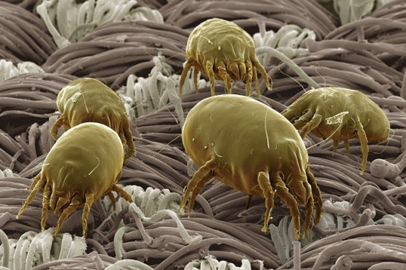

 
 

 
 

Υπάρχουν γενικά δύο τύποι ρινίτιδας: η αλλεργική και η μη-αλλεργική.

###### Αλλεργική Ρινίτιδα
Στην αλλεργική ρινίτιδα, το ανοσοποιητικό σύστημα αναγνωρίζει λανθασμένα μια αβλαβή ουσία ως επικίνδυνο εισβολέα. Η ουσία αυτή ονομάζεται αλλεργιογόνο. Το ανοσοποιητικό σύστημα αποκρίνεται στο αλλεργιογόνο απελευθερώνοντας ισταμίνη και άλλους χημικούς μεσολαβητές (φλεγμονή) που συνήθως προκαλούν συμπτώματα απ’ τη μύτη, το λαιμό, τα μάτια, τα αυτιά, το δέρμα και στόμα.

Η εποχιακή αλλεργική ρινίτιδα προκαλείται συνήθως από τη γύρη που μεταφέρεται στον αέρα κατά τη διάρκεια ανθοφορίας, σε διάφορες περιόδους του έτους.

Η αλλεργική ρινίτιδα μπορεί επίσης να προκληθεί από κοινά οικιακά αλλεργιογόνα όπως τα επιθήλια του δέρματος ζώων, τη μούχλα και τα ακάρεα της σκόνης. Αυτή ονομάζεται χρόνια ή ολοετής αλλεργική ρινίτιδα, καθώς τα συμπτώματα εμφανίζονται συνήθως καθ’ όλη τη διάρκεια του έτους.

Εκτός από τη παρουσία του αλλεργιογόνου, τα ρινικά συμπτώματα μπορούν να προκληθούν ή να επιδεινωθούν και από διάφορα “αθώα“ ερεθίσματα όπως ο καπνός, οι έντονες οσμές και τα αρώματα ή από αλλαγές στη θερμοκρασία και την υγρασία του αέρα. Αυτό συμβαίνει επειδή η αλλεργική ρινίτιδα προκαλεί μια μόνιμη, χρόνια φλεγμονή στη ρινική κοιλότητα, η οποία αυξάνει την ευαισθησία και σε μη παθολογικά ερεθίσματα. Η κατάσταση αυτή ονομάζεται Υπερευερεθιστότητα Ρινικού Βλεννογόνου.

Πολλοί άνθρωποι με αλλεργική ρινίτιδα είναι επιρρεπείς και σε αλλεργική επιπεφυκίτιδα (αλλεργία στα μάτια). Επιπλέον, η αλλεργική ρινίτιδα μπορεί να επιδεινώσει τα συμπτώματα του άσθματος ή να εξελιχθεί σε άσθμα σε ασθενείς που δεν αντιμετωπίζονται επαρκώς.

 
 

 
 

###### Μη Αλλεργική Ρινίτιδα
Τουλάχιστον ένα στα τρία άτομα με συμπτώματα ρινίτιδας δεν έχουν αλλεργίες.

Η μη-αλλεργική ρινίτιδα συνήθως προσβάλλει ενήλικες και προκαλεί συμπτώματα καθ’ όλη τη διάρκεια του έτους. Εκδηλώνεται συνήθως με λεπτόρευστη ρινική καταρροή και ρινική συμφόρηση. Αυτή η κατάσταση διαφέρει από την αλλεργική ρινίτιδα επειδή δεν εμπλέκεται το ανοσοποιητικό σύστημα.
 
 

###### Συμπτώματα
* Κνησμό (φαγούρα) στη μύτη, στο στόμα, στο λαιμό, στα μάτια
* Πταρμό
* Ρινική Συμφόρηση
* Στοματική αναπνοή
* Ρινική Καταρροή
* Δακρύρροια
* Μαύρους κύκλους κάτω από τα μάτια
* Διαταραχή του ύπνου

Συχνές επιπλοκές της αλλεργική ρινίτιδας είναι η ιγμορίτιδα, οι εξελκώσεις του ρινικου βλεννογόνου, η ρινορραγία, ο πονοκέφαλος και το αίσθημα ξηροτητας του φάρυγγα και του λάρυγγα.

Τα συμπτώματα της εποχιακής αλλεργικής ρινίτιδας τείνουν να είναι εντονότερα την άνοιξη και το φθινόπωρο, ενώ τα συμπτώματα χρόνιας αλλεργικής ρινίτιδας είναι σταθερά καθ’ όλο το έτος.

 
 

 
 

###### Διάγνωση
Ο Ωτορινολαρυγγολόγος με εξειδίκευση στην Ρινολογία έχει την κατάλληλη εκπαίδευση και εμπειρία για τη διάγνωση του τύπου της ρινίτιδας. Μπορεί να καθορίσει ποια είναι τα συγκεκριμένα αλλεργιογόνα που προκαλούν το πρόβλημά σας ή να διαπιστώσει ότι τα συμπτώματά σας δεν οφείλονται σε αλλεργία.

Ο γιατρός θα πάρει ένα λεπτομερές ιατρικό και αλλεργιολογικό ιστορικό και θα εξετάσει με ειδικό εύκαμπτο ενδοσκόπιο τη ρινική κοιλότητα, το φάρυγγα και το λάρυγγα.

**Ο ενδοσκοπικός έλεγχος είναι απαραίτητος προκειμένου να εντοπιστούν επιπλέον βλάβες όπως οι Ρινικοί Πολύποδες, η Υπερτροφία των Αδενοειδών Εκβλαστήσεων (Κρεατάκια), η Υπερτροφία των Ρινικών Κογχών και η Σκολίωση του Ρινικού Διαφράγματος.**

Η διερεύνηση ολοκληρώνεται με ειδικά αλλεργικά τεστ. Οι πιο συνηθισμένες μέθοδοι για τον προσδιορισμό των αλλεργιογόνων που προκαλούν τα συμπτώματα είναι οι ειδικές Δερματικές Δοκιμασίες **(Skin Prick Tests)** και οι εξετάσεις αίματος **(RAST Test)**.
 
 

###### Θεραπεία & Αντιμετώπιση
Μόλις διαγνωστούν τα υπεύθυνα αλλεργιογόνα , ο γιατρός θα συζητήσει μαζί σας ένα πλάνο για την αποφυγή των αλλεργιογόνων που προκαλούν τα συμπτώματά σας. Για παράδειγμα, αν είστε αλλεργικοί στα ακάρεα της σκόνης ή τη μούχλα, θα πρέπει να λάβετε μέτρα για τη μείωση όσο το δυνατόν αυτών των αλλεργιογόνων μέσα στο σπίτι σας. Για τις εξωτερικές αλλεργίες, όπως η γύρη, τα μέτρα αποφυγής περιλαμβάνουν περιορισμό των υπαίθριων δραστηριοτήτων κατά τη διάρκεια έξαρσης της γύρης.

Για την αντιμετώπιση των συμπτωμάτων της αλλεργικής ρινίτιδας τα φάρμακα που συνιστώνται είναι τα ρινικά κορτικοστεροειδή spray, τα αντιισταμινικά χάπια και τα ρινικά αντιισταμινικά spray. Για τη μη-αλλεργική ρινίτιδα οι θεραπευτικές επιλογές περιλαμβάνουν τα ρινικά κορτικοστεροειδή spray και τα σκευάσματα ρινικού αλατούχου διαλύματος.

Για την αντιμετώπιση της έντονης ρινικής συμφόρησης μπορούν να χρησιμοποιηθούν αποσυμφορητικά sprays μόνο για περιορισμένο χρονικό διάστημα έως πέντε ημέρες. Η κατάχρηση των αποσυμφορητικών προκαλεί **Φαρμακευτική Ρινίτιδα** και επιδείνωση των συμπτωμάτων.

Η **Ανοσοθεραπεία** είναι μια σύγχρονη και αποδεδειγμένα αποτελεσματική θεραπευτική προσέγγιση που παρέχει μακροχρόνια ανακούφιση σε άτομα που πάσχουν από αλλεργική ρινίτιδα. Η ανοσοθεραπεία αποτρέπει την εξέλιξη της ρινίτιδας σε άσθμα αλλά και την ευαισθητοποίηση σε άλλα αλλεργιογόνα. Με το πέρας της αγωγής ο ασθενής δεν είναι πλέον αλλεργικό άτομο.

Η **Υπογλώσσια Ανοσοθεραπεία (SLIT)** αποτελεί την πλέον σύγχρονη μορφή ανοσοθεραπείας που εγκρίθηκε στις Ηνωμένες Πολιτείες της Αμερικής και την Ευρώπη. Αντί των ενέσιμων εμβολίων χρησιμοποιούνται πλέον **Υπογλώσσια Sprays** (κάτω από τη γλώσσα) σε καθημερινή βάση.

Η διάρκεια της θεραπείας είναι 3 με 5 έτη και τα αποτελέσματα είναι επιτυχή στην συντριπτική πλειοψηφία των ασθενών.

 
 

######**Κωνσταντίνος Χ. Μπουκόνης**
######**Χειρουργός Ωτορινολαρυγγολόγος Περιστέρι**
######**Επιστημονικός Συνεργάτης – Χειρουργός ΩΡΛ  Νοσοκομείο "ΥΓΕΙΑ"**
######***Για περισσότερες πληροφορίες και ραντεβού με το γιατρό καλέστε [2130 575052](tel:2130575052 "2130 575052")***