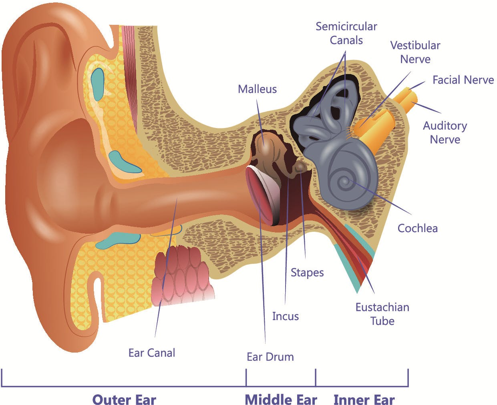
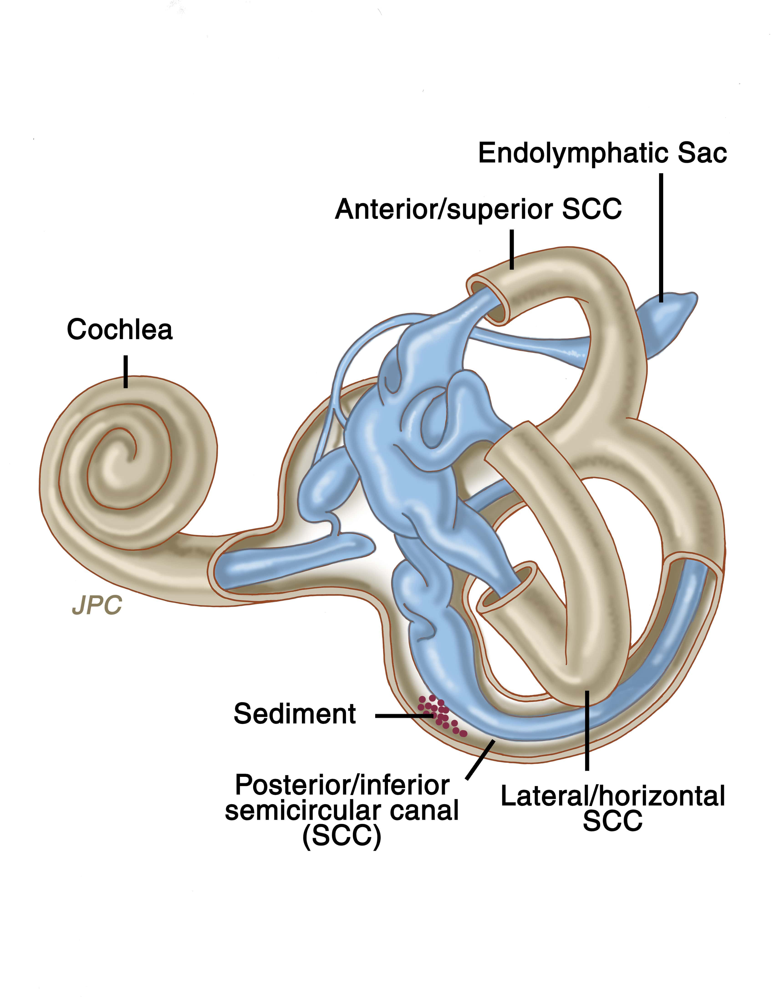
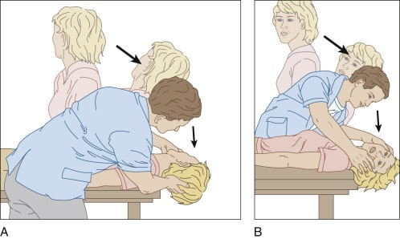

##### Καλοήθης Παροξυσμικός Ίλιγγος Θέσης - ΚΠΙΘ

##### Benign Paroxysmal Positional Vertigo - BPPV

 
 

 
 

Ο ίλιγγος θέσης (BPPV) είναι η συχνότερη αιτία ιλίγγου (έως και 80%) και χαρακτηρίζεται από την ξαφνική αίσθηση περιστροφής του χώρου ή του ίδιου του ασθενούς μέσα στο χώρο.

Η ονομασία της πάθησης περιγράφει επακριβώς τα ιδιαίτερα χαρακτηριστικά της:

- **Καλοήθης** - δεν είναι απειλητικός για τη ζωή.
- **Παροξυσμικός** - έρχεται αιφνίδια και διαρκεί ελάχιστα.
- **Ίλιγγος** - η ψευδαίσθηση περιστροφής.
- **Θέσης** - εμφανίζεται με την αλλαγή στάσης.

Προκαλείται από συγκεκριμένες απότομες αλλαγές της θέσης του κεφαλιού και τα επεισόδια ζάλης είναι σύντομα, μέτριας ή μεγάλης έντασης. Για παράδειγμα, όταν ο ασθενής μετακινεί το κεφάλι πάνω και κάτω ή όταν ξαπλώνει, σηκώνετε ή αλλάζει πλευρό στο κρεβάτι.

<u>"Ο ίλιγγος θέσης, εφόσον διαγνωστεί, μπορεί να αντιμετωπιστεί αποτελεσματικά κατά τη διάρκεια μιας απλής επίσκεψης στον ειδικό Ωτορινολαρυγγολόγο."</u>

Αν και είναι ένα ιδιαίτερα ενοχλητικό πρόβλημα σπάνια είναι σοβαρό, εκτός από το γεγονός ότι αυξάνει την πιθανότητα πτώσεων, ειδικά σε ηλικιωμένα άτομα. Η θεραπεία για τον καλοήθη παροξυσμικό ίλιγγο θέσης γίνετε με τις ειδικές ασκήσεις επανατοποθέτησης της ωτοκονίας.

 
 

 
 

##### Ο ρόλος του αυτιού

Μέσα στο αυτί υπάρχει ένα μικροσκοπικό όργανο που ονομάζεται Λαβύρινθος.

Στο λαβύρινθο υπάρχουν τρεις ημικυκλικοί σωλήνες που περιέχουν λεπτούς αισθητήρες που παρακολουθούν την περιστροφή του κεφαλιού - πάνω και κάτω, δεξιά και αριστερά - και στέλνουν ερεθίσματα στον εγκέφαλο.

Στο λαβύρινθο υπάρχουν επίσης κάποια άλλα ειδικά όργανα που ανιχνεύουν τις κινήσεις και τη θέση του κεφαλιού σε σχέση με τη βαρύτητα. Αυτά τα όργανα περιέχουν μικρούς κρυστάλλους (**Ωτοκονία**) που είναι ευαίσθητα στη βαρύτητα.

Για διάφορους λόγους, αυτοί οι κρύσταλλοι μπορούν να αποκολληθούν απ' την φυσιολογική θέση τους και να μετακινηθούν μέσα σε έναν από τους ημικυκλικούς σωλήνες.

Η παρουσία της Ωτοκονίας μέσα στον ημικυκλικό σωλήνα έχει σαν αποτέλεσμα την υπερβολική διέγερση του ημικύκλιου σωλήνα με τις αλλαγές θέσης του κεφαλιού, που φυσιολογικά δεν θα ερεθιζόταν. Ο παθολογικός αυτός ερεθισμός των ημικύκλιων σωλήνων προκαλεί τον ίλιγγο θέσης.

Οι μη φυσιολογικές ρυθμικές κινήσεις των ματιών (Νυσταγμός) συνοδεύουν συνήθως τα συμπτώματα του καλοήθους παροξυσμικού ιλίγγου θέσης.

 
 

 
 

##### Υπάρχουν δύο τύποι BPPV:

Συχνότερος τύπος είναι η Καναλολιθίαση (canalithiasis), στην περίπτωση αυτή οι κρύσταλλοι της Ωτοκονίας μπορούν να κινούνται ελεύθερα στο υγρό του Ημικύκλιου Σωλήνα. Πιο σπάνιος τύπος είναι η Κυπελλολιθίαση (cupulolithiasis), όπου οι κρύσταλλοι είναι συνδεδεμένοι με το κυπέλλιο του Ημικυκλιου Σωλήνα.

Στη Καναλολιθίαση ο ίλιγγος διαρκεί λιγότερο από ένα λεπτό, όσο διαρκεί η κίνηση των κρυστάλλων μέσα στο σωλήνα. Μόλις ολοκληρωθεί η κίνηση της κεφαλής ο παρατηρούμενος Νυσταγμός σταματάει και τα συμπτώματα υποχωρούν.

Στην Κυπελλολιθίαση, οι κρύσταλλοι είναι κολλημένοι στο κυπέλλιο με αποτέλεσμα ο νυσταγμός και ο ίλιγγος να διαρκούν περισσότερο, συνήθως έως ότου το κεφάλι απομακρυνθεί από την ακραία θέση πρόκλησης.

Είναι σημαντικό να γίνει αυτή η διάκριση, καθώς η θεραπεία είναι διαφορετική για κάθε παραλλαγή.
 
 

##### Παράγοντες κινδύνου

Ο ίλιγγος θέσης εμφανίζεται συχνότερα στις γυναίκες απ' ό,τι στους άνδρες. Συχνότερα εκδηλώνεται σε άτομα ηλικίας άνω των 50 ετών, ωστόσο μπορεί να εμφανιστεί σε οποιαδήποτε ηλικία και σπάνια σε παιδιά. Ένας τραυματισμός στο κεφάλι ή οποιαδήποτε άλλη διαταραχή των οργάνων ισορροπίας του Λαβυρίνθου, μπορεί προκαλέσει ίλιγγο θέσης σε υγιή άτομα.
 
 

##### Αιτίες

Συνήθως δεν υπάρχει καμία γνωστή αιτία για τον ίλιγγο θέσης και ονομάζεται **Ιδιοπαθής**.
Όταν μπορεί να προσδιοριστεί μια αιτία , συχνότερα συσχετίζεται με ένα μικρό έως σοβαρό χτύπημα στο κεφάλι, πχ μετά από ένα τροχαίο ατύχημα.
Λιγότερο συχνές αιτίες είναι παθήσεις που επηρεάζουν το εσωτερικό αυτί και σπανιότερα βλάβες που προκαλούνται κατά τη διάρκεια μιας χειρουργικής επέμβασης στο αυτί.
Ο ίλιγγος θέσης έχει επίσης συσχετιστεί με Ημικρανίες και μπορεί να συνυπάρχει με τη Νόσο Meniere.

 
 

 
 

##### Συμπτώματα

Ο ίλιγγος θέσης (BPPV) μπορεί να εκδηλωθεί με:

- Ζάλη.
- Αίσθημα περιστροφής ή μετακίνησης (ίλιγγος).
- Αστάθεια ή απώλεια ισορροπίας.
- Ναυτία.
- Εμετός.

Τα συμπτώματα συνήθως διαρκούν περίπου ένα λεπτό και η ένταση του ιλίγγου μπορεί να μεταβάλλεται σε κάθε επεισόδιο. Ο ίλιγγος θέσης μπορεί να εξαφανιστεί για κάποιο χρονικό διάστημα και στη συνέχεια να επανέλθει.

Οι κινήσεις που προκαλούν τον ίλιγγο μπορεί να διαφέρουν από άτομο σε άτομο, αλλά σχεδόν πάντα προκαλούνται από μια απότομη αλλαγή της θέσης του κεφαλιού.
Μετά το οξύ επεισόδιο ο ασθενής μπορεί να αισθάνεται έντονη ζάλη ή αδιαθεσία για αρκετή ώρα. Μερικοί ασθενείς εμφανίζουν έντονη αστάθεια και απώλεια ισορροπίας όταν στέκονται ή περπατούν.

Ο Νυσταγμός, δηλαδή οι μη φυσιολογικές ρυθμικές κινήσεις των ματιών είναι τυπικό εύρημα κατά την εξέταση πρόκλησης που γίνεται στο ιατρείο.

 
 

 
 

##### Πότε να ζητήσετε επείγουσα ιατρική βοήθεια

Όταν ένα επεισόδιο ιλίγγου επιμένει για αρκετή ώρα και συνοδεύετε από τα συμπτώματα και σημεία που αναφέρονται παρακάτω, μπορεί να αποτελεί μέρος ενός πολύ σοβαρότερου προβλήματος (Αγγειακό Εγκεφαλικό Επεισόδιο, Όγκος στον Εγκέφαλο, Μηνιγγίτιδα, Λαβυρινθίτιδα):

- Ένας νέος, διαφορετικός ή πολύ σοβαρός πονοκέφαλος.
- Πυρετός.
- Διπλή όραση ή απώλεια της όρασης.
- Απώλεια ακοής.
- Πρόβλημα στην ομιλία.
- Αδυναμία στα πόδια ή στα χέρια.
- Απώλεια συνείδησης.
- Πτώση ή δυσκολία στο περπάτημα.
- Μούδιασμα ή μυρμήγκιασμα.

Ο ειδικός Ωτορινολαρυγγολόγος κατά την κλινική εξέταση (Νεύρο - Ωτολογικός Έλεγχος) θα εντοπίσει τα συμπτώματα που δεν προέρχονται από το Λαβύρινθο και χρήζουν περαιτέρω διερεύνησης.

Σε κάθε ασθενή με ίλιγγο γίνετε πλήρης ΩΡΛ εξέταση, Ακοολογικός Έλεγχος και Νευρολογική εξέταση.
 
 

##### Επιπλοκές

Παρόλο που ο ίλιγγος θέση είναι εξαιρετικά δυσάρεστος σπάνια προκαλεί επιπλοκές. Η ζάλη ωστόσο μπορεί να προκαλέσει έντονη αστάθεια, γεγονός που μπορεί να οδηγήσει σε πτώσεις και σοβαρούς τραυματισμούς. Ο κίνδυνος είναι μεγαλύτερος σε ηλικιωμένα άτομα με συνυπάρχουσες άλλες παθήσεις.

 
 

 
 

##### Θεραπεία

Ο ίλιγγος θέσης είναι μια πάθηση που μπορεί να θεραπευτεί με ειδικούς χειρισμούς στη διάρκεια μιας επίσκεψης στο Ιατρείο.

Στη πιο απλή του μορφή (Καναλολιθίαση του Οπίσθιου Ημικύκλιου Σωλήνα) η διάγνωση γίνεται με τον χειρισμό Dix-Hallpike και εφόσον είναι θετική, γίνεται ο χειρισμός Epley για την επανατοποθέτηση της Ωτοκονίας στην φυσιολογική της θέση.

<u>"Για τις πιο περίπλοκες περιπτώσεις απαιτείται ενδελεχής κλινική εξέταση για την εντόπιση του τύπου του ιλίγγου και του ημικύκλιου σωλήνα που έχει προσβληθεί. Η ακριβής διάγνωση είναι βασικής σημασίας για την κατάλληλη επιλογή και εφαρμογή πιο εξειδικευμένων θεραπευτικών χειρισμών."</u>

Σε περίπτωση υποτροπής θα χρειαστεί να επαναληφθούν οι θεραπευτικοί χειρισμοί από το γιατρό, ενώ σε σπάνιες περιπτώσεις πολλαπλών υποτροπών ο ασθενής εκπαιδεύεται να κάνει ειδικές ασκήσεις στο σπίτι.

Η χορήγηση φαρμακευτικής αγωγής δεν συνιστάται.

 
 

 
 

###### **Κωνσταντίνος Χ. Μπουκόνης**

###### **Χειρουργός Ωτορινολαρυγγολόγος Περιστέρι**

###### **Επιστημονικός Συνεργάτης – Χειρουργός ΩΡΛ Νοσοκομείο "ΥΓΕΙΑ"**

###### **_Για περισσότερες πληροφορίες και ραντεβού με το γιατρό καλέστε [2130 575052](tel:2130575052 '2130 575052')_**
