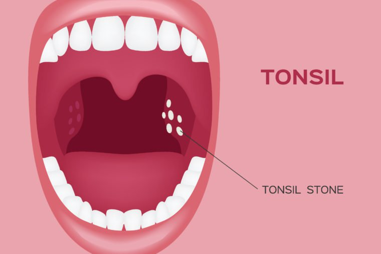
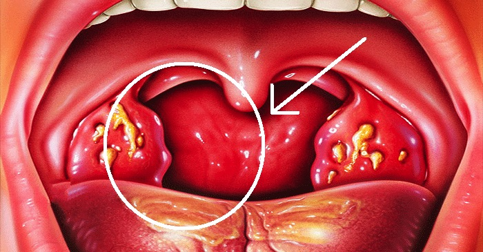
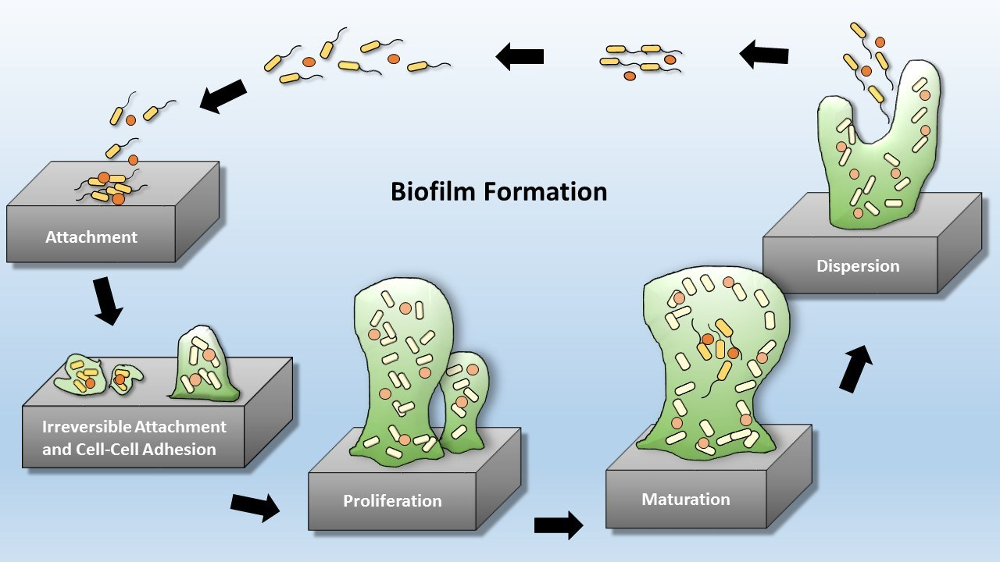
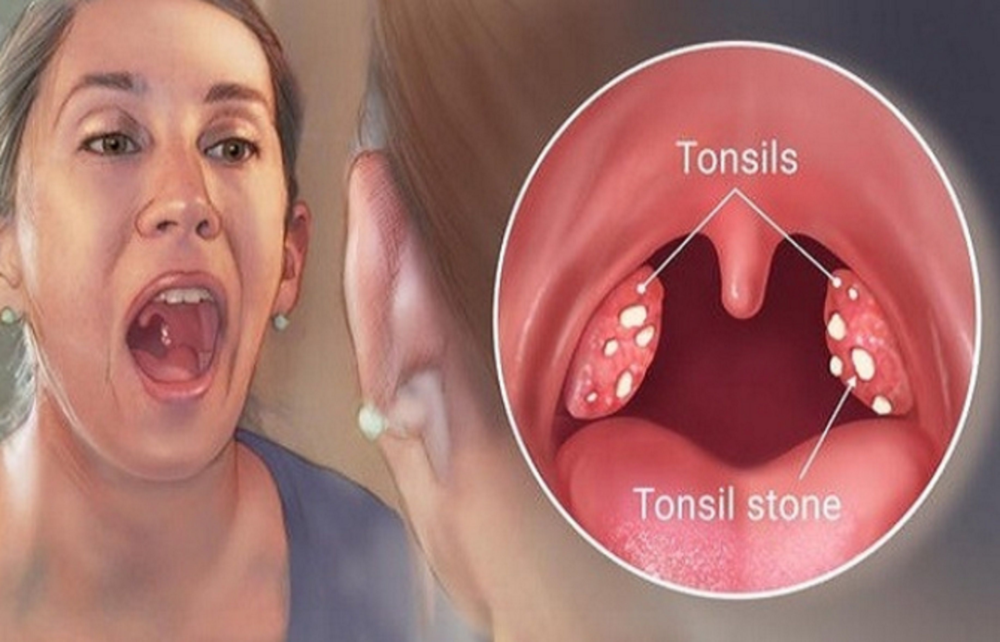

 
 

 
 

Οι παρίσθμιες αμυγδαλές εντοπίζονται στο πίσω μέρος του στόματος. Είναι μέρος του συστήματος
λεμφικού ιστού του ανώτερου αναπνευστικού (**Δακτύλιος του Waldeyer**). Παίζουν σημαντικό ρόλο
στην ωρίμανση του ανοσοποιητικού συστήματος ειδικά μέχρι την ηλικία των 3 ετών.

Η κρυπτική αμυγδαλίτιδα προκαλείται από τον εκφυλισμό των κρυπτών που βρίσκονται στην επιφάνεια της αμυγδαλής. Οι κρύπτες είναι βαθιές σχισμοειδείς αυλακώσεις που φυσιολογικά χρησιμεύουν στην λειτουργία του ανοσοποιητικού συστήματος. Όταν εκφυλιστούν σχηματίζουν ευρείες κοιλότητες όπου συσσωρεύονται υπολείμματα τροφών, νεκρά κυτταρικά επιθήλια, πυώδεις βλέννες και μικρόβια. Δημιουργείται σταδιακά ένα περιβάλλον σήψης και χρόνιας φλεγμονής με τυπικά συμπτώματα την έντονη κακοσμία του στόματος, τις υποτροπιάζουσες πυώδεις αμυγδαλίτιδες και το σχηματισμό αμυγδαλόλιθων. Οι λίθοι των αμυγδαλών έχουν κιτρινωπό χρώμα και είναι ουσιαστικά σηπτικό υλικό των κρυπτών που έχει αποτιτανωθεί και σκληρύνει, μετά από χρόνια εναπόθεση αλάτων ασβεστίου.

 
 

 
 

Στη χρόνια κρυπτική αμυγδαλίτιδα τα συμπτώματα είναι άτυπα και μη-ειδικά. Ο ασθενής αναφέρει
πονόλαιμο, αίσθημα κόπωσης, ανορεξία, μια άσχημη γεύση στο πίσω μέρος του λαιμού, δυσκολία
στην κατάποση και έντονη κακοσμία του στόματος. Μπορεί να υπάρχει ιστορικό επαναλαμβανόμενων
επεισοδίων πυώδους αμυγδαλίτιδας, με πυρετό και φαρυγγαλγία, ωστόσο αυτό δεν είναι ο κανόνας.
Λόγω της χρονιότητας των συμπτωμάτων ο ασθενής "μαθαίνει" να ζει με το πρόβλημα και όχι σπάνια
επισκέπτεται το γιατρό όταν παρατηρήσει κιτρινωπό πυώδες επίχρισμα στην επιφάνειας της
αμυγδαλής.

Κατά την κλινική εξέταση οι αμυγδαλές είναι εξέρυθρες, με πολλαπλές κρύπτες, αμυγδαλόλιθους ή
κύστεις. Υπάρχει διάχυτη ερυθρότητα της περιοχής και συχνά διογκωμένοι τραχηλικοί λεμφαδένες.
Όταν συμπιεστεί η αμυγδαλή εξέρχεται το δύσοσμο σηπτικό υλικό που γεμίζει τις κρύπτες.

 
 

 
 

##### Μικροβιακά Βιοφιλμ (Biofilm)

Η αντιμετώπιση της χρόνιας αμυγδαλίτιδας (αλλά και της χρόνιας ιγμορίτιδας, της χρόνιας
ρινοκολπίτιδας και της χρόνιας μέσης ωτίτιδας) είναι χειρουργική, λόγω της αποτυχίας των
αντιβιοτικών να αποστειρώσουν τους ιστούς. Η αποτυχία οφείλεται στο σχηματισμό ειδικών
μικροβιακών αποικιών που ονομάζονται Βιοφιλμ.

Ο σχηματισμός βιοφίλμ είναι μια στρατηγική επιβίωσης με την οποία τα μικρόβια προσαρμόζονται στο
περιβάλλον υπό δυσμενείς συνθήκες. Η ανάπτυξη ενός βιοφίλμ περιλαμβάνει την προσκόλληση των
μικροβίων σε μια επιφάνεια, την παραγωγή μιας προστατευτικής πολυμερούς μήτρας (**polymeric matrix**), τον πολλαπλασιασμό και
τέλος την απελευθέρωση νέων μικροβίων για τον αποικισμό νέων
ιστών. Η κατασκευή και η αρχιτεκτονική των βιοφιλμ προστατεύει την αποικία από αντιβιοτικά και
αντισηπτικά διαλύματα, ενώ όταν οι συνθήκες είναι ευνοϊκές (κοινό κρυολόγημα, ιογενείς λοιμώξεις)
τα μικρόβια εξαπλώνονται ταχύτητα και επιμολύνουν υγιείς ιστούς.

Τελευταίες έρευνες σε δείγματα ιστών αμυγδαλής μετά από αμυγδαλεκτομή, διαπίστωσαν την
παρουσία των καρκινογόνων στελεχών του HPV μέσα στις αμυγδαλικές κρυπτες (**tonsillar crypts**).
Ο ιός επιβιώνει μέσα στα βιοφίλμ που σχηματίζονται στις αμυγδαλικές κρύπτες και
προστατεύεται από το ανοσοποιητικό σύστημα για όσο διάστημα χρειαστεί. Ο ιός υπό κατάλληλες
συνθήκες μπορεί να ενεργοποιηθεί προσβάλλοντας τον αμυγδαλικό ιστό, πυροδοτώντας τη
διαδικασία της καρκινογένεσης.

 
 

 
 

##### Θεραπεία

Η αντιμετώπιση της χρόνιας αμυγδαλίτιδας είναι χειρουργική με αμυγδαλεκτομή. Παλιότερες αλλά και
νεότερες μέθοδοι μερικής εκτομής (Αμυγδαλοτομή) ή συρρίκνωσης του αμυγδαλικού ιστού με
καυτηριασμό (Αμυγδαλόλυση) δεν αντιμετωπίζουν ριζικά το πρόβλημα, το οποίο συνήθως γρήγορα
υποτροπιάζει, ενώ και ο ασθενής περνά όλη την ταλαιπωρία ενός χειρουργείου. Τα σχήματα με
διαφορετικούς συνδυασμούς αντιβιοτικών έχουν επίσης δείξει μικρή αποτελεσματικότητα , ακόμα και
σε μακροχρόνια αγωγή αρκετών εβδομάδων. Ο κίνδυνος ανάπτυξης αντοχής στα αντιβιοτικά θα
πρέπει να αποτρέπει γιατρούς και ασθενείς από πολλαπλές επαναλαμβανόμενες αγωγές.

 
 

 
 

Η Αμυγδαλεκτομή γίνεται με χρήση ειδικής διπολικής διαθερμίας, η οποία ταυτόχρονα αφαιρεί τον ιστό
και καυτηριάζει τα αγγεία της αμυγδαλής. Η απώλεια αίματος κατά την επέμβαση είναι σχεδόν
μηδενική. Το χειρουργείο γίνεται με γενική αναισθησία, διαρκεί περίπου 20 λεπτά στα χέρια ενός
έμπειρου Χειρουργού και είναι χειρουργείο ημέρας (δεν απαιτείται παραμονή στο νοσοκομείο). Η
αναρρωτική άδεια που χορηγείται είναι 2 εβδομάδες. Η επέμβαση είναι απόλυτα ασφαλής μετά την
ηλικία των 3 ετών.

Οι επιπλοκές μετά από Αμυγδαλεκτομή είναι γενικά σπάνιες και πιο συχνά εμφανίζονται όταν
χειρουργούμε εκτεταμένους όγκους ή σε ασθενείς με διαταραχές της πήξης του αίματος. Ο χειρουργός
θα πρέπει να έχει την ανάλογη εκπαίδευση και εμπειρία τόσο για την αποφυγή όσο και την
αντιμετώπιση των επιπλοκών εφόσον συμβούν. Η πιο σοβαρή επιπλοκή της αμυγδαλεκτομής είναι η
αιμορραγία. Ανεξαρτήτως της μεθόδου που χρησιμοποιείται επισυμβαίνει σε ποσοστό 3 - 5%. Ο
μετεγχειρητικός πόνος συνήθως ελέγχεται με απλά παυσίπονα και μπορεί να διαρκέσει ως 7 ημέρες.
Στην εποχή μας οι κίνδυνοι της γενικής αναισθησίας θεωρούνται αμελητέοι, με τις πολύ σοβαρές
επιπλοκές να μην ξεπερνούν την μία ανά 100.000 επεμβάσεις.

Συνήθως ο ασθενής δε χρειάζεται να διανυκτερεύσει στο νοσοκομείο μετά το χειρουργείο. Συνιστάται
άφθονη λήψη υγρών και καλή διατροφή για την ταχύτερη επούλωση και αποφυγή επιπλοκών. Θα
πρέπει να αποφεύγεται η λήψη σκληρών τροφών καθώς και όξινων και ζεστών ροφημάτων. Γενικά
προτιμώνται κρύες και μαλακές τροφές, χωρίς άλλο περιορισμό ή ειδικό διαιτολόγιο. Η αναρρωτική
άδεια που χορηγείται είναι 2 εβδομάδες.

 
 

 
 

###### **Κωνσταντίνος Χ. Μπουκόνης**

###### **Χειρουργός Ωτορινολαρυγγολόγος Περιστέρι**

###### **Επιστημονικός Συνεργάτης – Χειρουργός ΩΡΛ Νοσοκομείο "ΥΓΕΙΑ"**

###### **_Για περισσότερες πληροφορίες και ραντεβού με το γιατρό καλέστε [2130 575052](tel:2130575052 '2130 575052')_**
