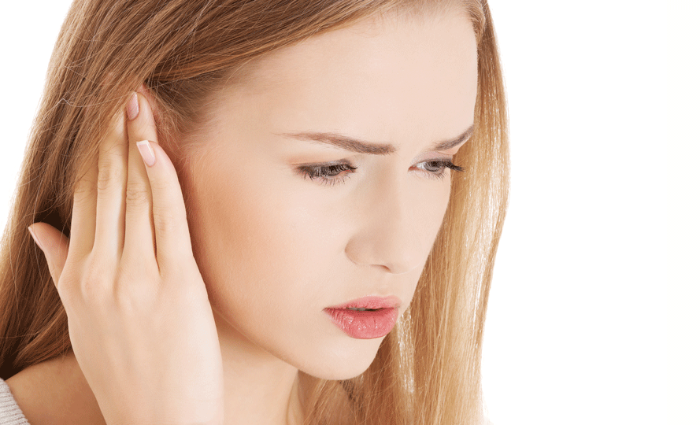
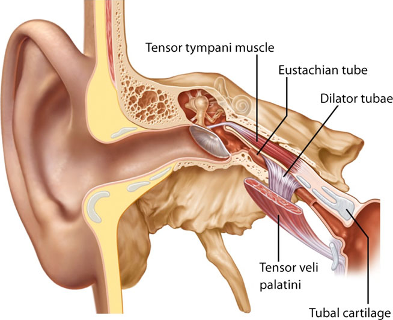
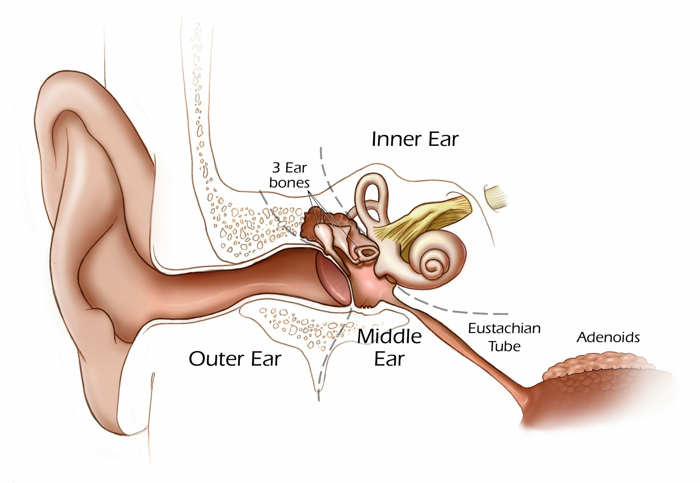
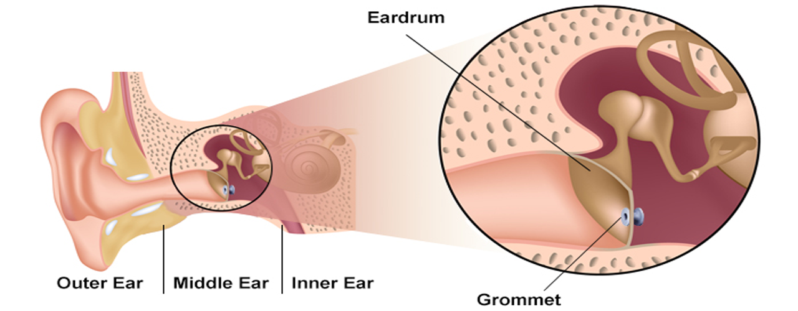
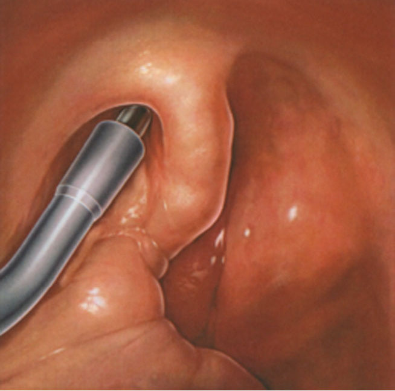
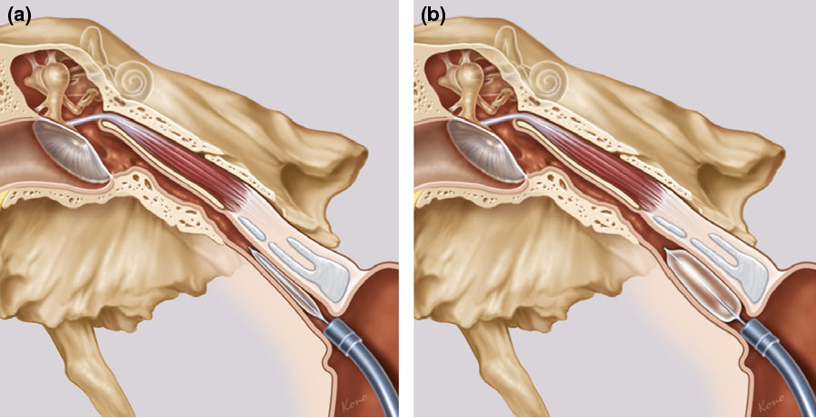

 
 

 
 

### **Τι ειναι η Ευσταχιανή Σάλπιγγα**

Η ευσταχιανή σάλπιγγα είναι ένας πόρος που συνδέει το πίσω μέρος της μύτης (Ρινοφάρυγγας) με το
αυτί (Μέσο ούς). Ο μικρός αυτός σωλήνας επιτρέπει την είσοδο αέρα στη κοιλότητα του μέσου ωτός
εξασφαλίζοντας εξίσωση της πίεσης. Η σάλπιγγα είναι τις περισσότερες ώρες της ημέρας κλειστή και
ανοίγει περιστασιακά (στη κατάποση, με το χασμουρητό, με το φύσημα της μύτης) επιτρέποντας τον
αερισμό του αυτιού. Όταν λειτουργεί σωστά υπάρχει εξισορρόπηση της πίεσης του αέρα και
φυσιολογική κινητικότητα της τυμπανικής μεμβράνης.

Η ευσταχιανή σάλπιγγα παροχετεύει τις εκκρίσεις του μέσω ωτός στο ρινοφάρυγγα και το προφυλάσσει
από την είσοδο παθογόνων μικροβίων και μολυσμένων εκκρίσεων από τη μύτη, επιπλέον προστατεύει
το αυτί από πολύ δυνατούς ήχους και ενδεχόμενο τραύμα . Είναι προφανές πως όλες αυτές οι
φυσιολογικές λειτουργίες δεν εξυπηρετούνται όταν η σάλπιγγα δυσλειτουργεί, δημιουργώντας σοβαρές
παθολογικές καταστάσεις στα αυτιά.

 
 

 
 

### **Τι ειναι η Δυσλειτουργία της Ευσταχιανής Σάλπιγγας**

Όταν δυσλειτουργεί η ευσταχιανή σάλπιγγα δεν εισέρχεται αρκετός αέρας στη κοιλότητα του μέσου
ωτός, με αποτέλεσμα να υπάρχει χαμηλότερη πίεση στο μέσο αυτί σε σχέση με την ατμόσφαιρα. Ο
ασθενής αντιλαμβάνεται τη διαφορά πίεσης σαν ένα αίσθημα βάρους στο αυτί. Η διαφορά πίεσης
εκατέρωθεν της τυμπανικής μεμβράνης προκαλεί την εισολκή της και διαταραχή στη μετάδοση των
ηχητικών κυμάτων. Ο ασθενής έχει μόνιμα ένα αίσθημα απόφραξης στα αυτιά όπως συμβαίνει κατά τη
διάρκεια της προσγείωσης ενός αεροπλάνου ή κατά τη διάρκεια κατάδυσης. Συχνά υπάρχει συλλογή
εκκρίσεων στο αυτί και υποτροπιάζουσες ωτίτιδες.

### **Τι προκαλεί το πρόβλημα**

Πιθανά αίτια της δυσλειτουργίας της ευσταχιανής σάλπιγγας είναι **η ρινίτιδα (αλλεργική και μη -**
**αλλεργική), η σκολίωση του ρινικού διαφράγματος, η υπερτροφία των ρινικών κόγχών, η**
**υπερτροφία των αδενοειδών εκβλαστήσεων (κρεατάκια), οι πολύποδες της μύτης, η**
**ιγμορίτιδα, η χρόνια ρινοκολπίτιδα και οι όγκοι της μύτης και του ρινοφάρυγγα (καλοήθεις ή κακοήθεις).**
 Σε πολλούς ασθενείς δεν ανευρίσκεται καμία συγκεκριμένη αιτία και τότε χαρακτηρίζεται ως Ιδιοπαθής .
Σε πολλές από αυτές τις περιπτώσεις υπάρχει ασυνεργία των μυών που είναι υπεύθυνοι για διάνοιξη
της ευσταχιανής ή χρόνια πάχυνση του βλεννογόνου που επενδύει τον αυλό της.

 
 

 
 

### **Συμπτώματα και Επιπλοκές**

Τα συχνότερα συμπτώματα είναι ο **πόνος στο αυτί, το αίσθημα πληρότητας (βουλωμένο αυτί), η βαρηκοΐα, οι εμβοές, το αίσθημα ζάλης ή ιλίγγου και οι υποτροπιάζουσες ωτίτιδες.**
Η δυσλειτουργία της ευσταχιανής σάλπιγγας μπορεί να είναι ιδιαίτερα ενοχλητική για τον ασθενή
επηρεάζοντας την απόδοση στην εργασία, τη συγκέντρωση και συνολικά την καθημερινότητα και την
ποιότητα ζωής.

Οι επιπλοκές από την χρόνια δυσλειτουργία της ευσταχιανής μπορεί να είναι εξαιρετικά σοβαρές για το
αυτί. Όταν υπάρχει μόνιμη απόφραξη της σάλπιγγας (πχ από κρεατάκια ή όγκο) τότε το μέσο αυτί
γεμίζει με ορώδες υγρό **(Εκκριτική Ωτίτιδα)**. Η μόλυνση των συσσωρευμένων εκκρίσεων οδηγεί σε
υποτροπιάζουσα **Πυώδη Μέση Ωτίτιδα** και **Διάτρηση του Τυμπάνου**. Η μόνιμη εισολκή του
τυμπανικού υμένα προδιαθέτει στην εμφάνιση **Χολοστεατώματος**, **Χρόνιας Μέσης Ωτίτιδας** και
**Βαρηκοΐας Αγωγιμότητας**, παθήσεις που απαιτούν χειρουργική επέμβαση στο αυτί.

### **Συμπτώματα και Επιπλοκές**

Αν και το ιστορικό είναι συνήθως τυπικό, τα ιδιαίτερα συμπτώματα κάθε ασθενή θα πρέπει να
αξιολογηθούν ξεχωριστά και να εκτιμηθεί η βαρύτητα τους. Ιδιαίτερη κατηγορία ασθενών είναι οι
ιπτάμενοι (πιλότοι και αεροσυνοδοί) καθώς και οι δύτες στους οποίους η ευσταχιανή σάλπιγγα θα
πρέπει να λειτουργεί άψογα υπό ακραίες συνθήκες. Η διάγνωση τίθεται μετά από ενδελεχή έλεγχο του
ωτός και της μύτης και την εκτέλεση ειδικών δοκιμασιών που ελέγχουν τη λειτουργία της ευσταχιανής.
Η Ενδοσκόπηση της Μύτης και του Ρινοφάρυγγα είναι η βασική εξέταση για τον έλεγχο του στομίου της
σάλπιγγας, που είναι στο πίσω μέρος της μύτης. Ο ακοολογικός έλεγχος (ακοόγραμμα και
τυμπανόγραμμα) καταδεικνύει τις επιπτώσεις του ανεπαρκούς αερισμού στη λειτουργία του αυτιού. Σε
επιλεγμένες περιπτώσεις θα χρειαστεί Αξονική ή Μαγνητική Τομογραφία.

### **Ο Ενδοσκοπικός Έλεγχος**

Η ενδοσκόπηση της μύτης, του φάρυγγα και του λάρυγγα είναι μια σύγχρονη, ανώδυνη και με μεγάλη
διαγνωστική ακρίβεια εξέταση. Γίνεται στο ιατρείο με άκαμπτο ή εύκαμπτο ενδοσκόπιο συνήθως
κατόπιν ήπιας τοπικής αναισθησίας. Είναι ασφαλής, γρήγορη και καλώς ανεκτή από παιδιά και
ενήλικες. Δεν έχει επιπλοκές, διαρκεί μόλις λίγα λεπτά και δεν απαιτείται κάποια προετοιμασία. Το
Εύκαμπτο Ενδοσκόπιο με ειδικούς μικρο-χειρισμούς μπορεί να διεισδύσει και στα πιο δύσκολα σημεία
επιτρέποντας τον ενδελεχή έλεγχο του ανώτερου αναπνευστικού συστήματος και να μεταφέρει
λεπτομερή εικόνα και βίντεο υψηλής ανάλυσης σε οθόνη Full HD. Ο ασθενής, εφόσον το επιθυμεί,
μπορεί να συμμετέχει στην εξέταση και να παρακολουθεί στην οθόνη την ενδοσκοπική εικόνα. Έχει τη
δυνατότητα να μιλάει κανονικά καθώς ο γιατρός εξηγεί τα ευρήματα και να διαμορφώνει τη δική του
άποψη για το αποτέλεσμα της εξέτασης. Η αναλυτική παρουσίαση των κλινικών ευρημάτων επιτρέπει
τη σύγκριση τους προ και μετά τη χειρουργική επέμβαση και βελτιώνει τη σχέση εμπιστοσύνης μεταξύ
γιατρού και ασθενή.

 
 

 
 

### **Συντηρητική Θεραπεία**

Κατά καιρούς έχει δοκιμαστεί ένα ευρύ φάσμα θεραπειών για τη δυσλειτουργία της ευσταχιανής
σάλπιγγας, με τις περισσότερες από αυτές να μην έχουν αποδείξει την αποτελεσματικότητα τους. Η
ενδελεχής ΩΡΛ εξέταση και η εξατομικευμένη διαγνωστική προσέγγιση είναι εξαιρετικά σημαντικές για
την επιλογή ενός ορθού θεραπευτικού πλάνου. Ανάλογα με τη βαρύτητα και τη χρονιότητα του
προβλήματος οι θεραπευτικές επιλογές μπορεί να περιλαμβάνουν από τη χρήση απλών
αποσυμφορητικών σπρέυ μέχρι τη χειρουργική επέμβαση, για πολύ ανθεκτικές περιπτώσεις.

### **Τροποποιήσεις του τρόπου ζωής - Lifestyle modifications**

Η διακοπή του καπνίσματος (τσιγάρα, καπνός ή εισπνεόμενος ατμός) μπορεί να βελτιώσει τη
δυσλειτουργία της ευσταχιανής σάλπιγγας μειώνοντας το οίδημα του βλεννογόνου. Ασθενείς με
Λαρυγγο-Φαρυγγική Παλινδρόμηση θα πρέπει να λάβουν την κατάλληλη αγωγή και να διορθώσουν το
σωματικό βάρος και τη διατροφή τους.

### **Εξίσωση της πίεσης στο αυτί - Χειρισμός Valsalva**

Πολύ χρήσιμος για την βελτίωση των συμπτωμάτων είναι ο Χειρισμός Valsalva, με τον οποίο
εξισώνουμε την πίεση στο μέσο αυτί. Με τον χειρισμό (ήπια προσπάθεια εκπνοής με τη μύτη και το
στόμα ερμητικά κλειστά), προωθούμε αέρα υπό πίεση στο αυτί διανοίγοντας "βίαια" τον αυλό της
σάλπιγγας. Το ίδιο αποτέλεσμα μπορούμε να πετύχουμε φουσκώνοντας ένα μπαλόνι. Η πίεση του
αέρα που απαιτείται για το φούσκωμα του μπαλονιού συνήθως είναι αρκετή για να ωθήσει αέρα μέσα
στο αυτί δια της ευσταχιανής. Οι χειρισμοί αυτοί πρέπει να αποφεύγονται σε περίπτωση ίωσης,
αδενοειδίτιδας ή ρινοκολπίτιδας, επειδή μπορεί να προωθήσουν μολυσμένες εκκρίσεις και βακτηρίδια
στο μέσο αυτί και να προκαλέσουν ωτίτιδα. Άλλες πρακτικές όπως το χασμουρητό, η μάσηση τσίχλας
και η κατάποση με κλειστή μύτη μπορεί να βοηθήσουν στην αντιμετώπιση του προβλήματος.

 
 

 
 

### **Αντιμετώπιση Αλλεργιών, Ρινίτιδας, Ιγμορίτιδας και Ρινικών Πολυπόδων**

Το οίδημα του βλεννογόνου της μύτης και της ευσταχιανής σάλπιγγας μπορεί να είναι αποτέλεσμα
ρινίτιδας, η οποία μπορεί να είναι αλλεργικής ή άλλης αιτιολογίας. Ο έλεγχος της αλλεργικής ρινίτιδας
γίνεται με δερματικά τεστ και θεραπευτικά χρησιμοποιούνται τα σπρέυ κορτιζόνης και η
ανοσοθεραπεία. Σε απλές ιογενείς λοιμώξεις τα αποσυμφορητικά σπρέυ μπορούν να μειώσουν το
οίδημα του βλεννογόνου προκαλώντας συστολή των αιμοφόρων αγγείων της μύτης και να βοηθήσουν
στη διάνοιξη της ευσταχιανής. Μεγάλη προσοχή απαιτείται όσον αφορά στη διάρκεια της θεραπείας, η
κατάχρηση προκαλεί "εθισμό", την εμφάνιση Φαρμακευτικής Ρινίτιδας και επιδείνωση των
συμπτωμάτων. Εξειδικευμένη αντιμετώπιση απαιτείται σε περίπτωση Ιγμορίτιδας και Χρόνιας
Ρινοκολπίτιδας με Πολύποδες.

### **Χειρουργική Θεραπεία για τη Δυσλειτουργία της Ευσταχιανής Σάλπιγγας**

Όταν η συντηρητική θεραπεία αποτυγχάνει να αντιμετωπίσει το πρόβλημα υπάρχει η επιλογή της
χειρουργικής επέμβασης. Βασικοί στόχοι της χειρουργικής θεραπείας είναι ο αερισμός του μέσου ωτός
και η αντιμετώπιση του ενοχλητικού αισθήματος πίεσης στο αυτί. Οι στόχοι αυτοί επιτυγχάνονται είτε με
τη παράκαμψη, είτε με τη διαστολή της ευσταχιανής σάλπιγγας. Συνήθως ταυτόχρονα διορθώνουμε
και προβλήματα της μύτης και του ρινοφάρρυγα που επιδεινώνουν το πρόβλημα.

**<u>"Η Ενδοσκοπική Αδενοειδεκτομή , η Πλαστική του Ρινικού Διαφράγματος, η Κογχοπλαστική, η Ενδοσκοπική αφαίρεση Ρινικών Πολυπόδων και η Ενδοσκοπική χειρουργική της χρόνιας ιγμορίτιδας και ρινοκολπίτιδας είναι οι συχνότερες επεμβάσεις"</u>**

### **Μυριγγοτομή και τοποθέτηση Σωληνίσκων Αερισμού**

 
 

 
 

Η επέμβαση μπορεί να γίνει με τοπική ή γενική αναισθησία και εξασφαλίζει άμεσα ύφεση όλων των
συμπτωμάτων. Η μικρή τομή στον Τυμπανικό Υμένα εξισορροπεί τη διαφορά πιέσεων και αποκαθιστά
τη φυσιολογική λειτουργία του μέσου ωτός. Ταυτόχρονα θα απομακρυνθούν εκκρίσεις και βλέννες που
έχουν συσσωρευτεί στο μέσο αυτί, Ο Σωληνίσκος Αερισμού θα διατηρήσει τον αερισμό για 8 με 12
μήνες, παρέχοντας τον απαραίτητο χρόνο να επανέλθει ο βλεννογόνος στη φυσιολογική κατάσταση.
Τα "σωληνάκια" πέφτουν μόνα τους , χωρίς να απαιτείται δεύτερη επέμβαση και η οπή του τυμπάνου
κλείνει μόνη της. Σπανιότερα και σε ανθεκτικές περιπτώσεις τοποθετείται ειδικό σωληνάκι αερισμού
μακράς διάρκειας **(Τ-tube)** που παραμένει στο τύμπανο για διάστημα 2 ετών.

### **Ενδοσκοπική Διαστολή με Μπαλονάκι της Ευσταχιανής Σάλπιγγας - Tuboplasty**

 
 

 
 

Η ενδοσκοπική διαστολή με μπαλονάκι αποσκοπεί στη διεύρυνση του χόνδρινου τμήματος της
ευσταχιανής σάλπιγγας και την αποκατάσταση της λειτουργικότητας της. Πρόκειται για μια ελάχιστα
επεμβατική ενδοσκοπική μέθοδο που μπορεί να γίνει υπό τοπική ή γενική νάρκωση και δεν απαιτεί
νοσηλεία. Κατά τη διάρκεια της επέμβασης εισάγεται ενδοσκοπικά ένας μικρός καθετήρας με μπαλόνι
εντός της σάλπιγγας. Το μπαλονάκι μετά την τοποθέτηση του εντός του αυλού γεμίζει με φυσιολογικό
ορό και διευρύνει τον πόρο ασκώντας πίεση. Η πίεση διατηρείται για περίπου 2 λεπτά και μετά το
μπαλονάκι αδειάζει και ο καθετήρας αφαιρείται. Αν και ο μηχανισμός που εξασφαλίζει μακροπρόθεσμα
θεραπευτικά αποτελέσματα δεν είναι απολύτως σαφής, τα δεδομένα μετά από βιοψία βλεννογόνου
ασθενών μετά την επέμβαση καταδεικνύουν ότι η σύνθλιψη του βλεννογόνου οδηγεί στο σχηματισμό
ενός λεπτού στρώματος ινώδους ιστού που βοηθά στην στήριξη του τοιχώματος του αυλού. Η
επέμβαση όταν εκτελείται από έμπειρο και με ανάλογη εκπαίδευση Χειρουργό ΩΡΛ είναι γενικά
ασφαλής και καλώς ανεκτή. Δεν έχουν αναφερθεί στη βιβλιογραφία σοβαρές επιπλοκές.

 
 

 
 

### **Χαίνουσα Ευσταχιανή Σάλπιγγα - Patulous Eustachian Tube**

Η Χαίνουσα Ευσταχιανή Σάλπιγγα είναι μια εξαιρετικά ενοχλητική πάθηση κατά την οποία ο αυλός της
ευσταχιανής παραμένει μόνιμα ανοιχτός και δημιουργεί αίσθημα πίεσης στο αυτί. Ο ασθενής μπορεί να
ακούει συνεχώς τον καρδιακό παλμό και την αναπνοή του. Χαρακτηριστική είναι επίσης η Αυτοφωνία,
κατάσταση κατά την οποία όταν ο ασθενής ακούει τη δική του φωνή.

Η αιτιοπαθογένεια σχετίζεται συνήθως με την ιδιαίτερη ανατομία και θεωρείται **Ιδιοπαθής**. Υπάρχουν
επίσης περιστατικά που προκλήθηκαν μετά απο σημαντική απώλεια βάρους, λόγω ορμονικών
διαταραχών ή μετά από μακροχρόνια χρήση διουρητικών και αφυδάτωση.

Η Χαίνουσα Ευσταχιανή είναι λιγότερο συχνή από την τυπική δυσλειτουργία της ευσταχιανής σάλπιγγας
και η διάγνωση απαιτεί ένα λεπτομερές ιστορικό και ενδελεχή ΩΡΛ εξέταση. Η διάγνωση τίθεται με το
Τυμπανόγραμμα και την Ενδοσκόπηση της Ρινός ενώ σπανιότερα θα χρειαστεί Αξονική Τομογραφία.

Για τα περιστατικά που έχουν εντοπιστεί ορμονικές διαταραχές ή αφυδάτωση η θεραπεία αυτών
συνήθως αντιμετωπίζει το πρόβλημα. Στην Ιδιοπαθή Χαίνουσα Ευσταχιανή η αντιμετώπιση
περιλαμβάνει χειρουργικές επεμβάσεις που είτε παρακάμπτουν την Ευσταχιανή Σάλπιγγα, είτε έχουν
ως στόχο την μερική απόφραξη του αυλού. Η **Μυριγγοτομή με τοποθέτηση Σωληνίσκων Αερισμού**
εξασφαλίζει άμεσα ύφεση των περισσότερων συμπτωμάτων και αποτελεί την συνήθη επέμβαση.
Ευρέως επίσης χρησιμοποιούνται η **Ενδοσκοπική έγχυση υλικών στον αυλό** της ευσταχιανής
σάλπιγγας και ο **Χημικός Καυτηριασμός**.

 
 

 
 

###### **Κωνσταντίνος Χ. Μπουκόνης**

###### **Χειρουργός Ωτορινολαρυγγολόγος Περιστέρι**

###### **Επιστημονικός Συνεργάτης – Χειρουργός ΩΡΛ Νοσοκομείο "ΥΓΕΙΑ"**

###### **_Για περισσότερες πληροφορίες και ραντεβού με το γιατρό καλέστε [2130 575052](tel:2130575052 '2130 575052')_**
