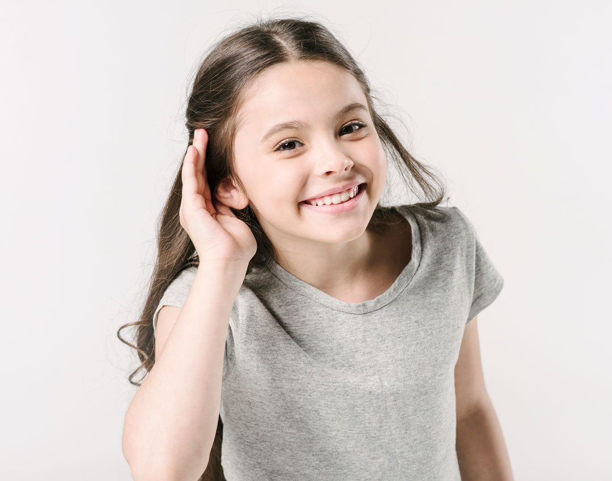
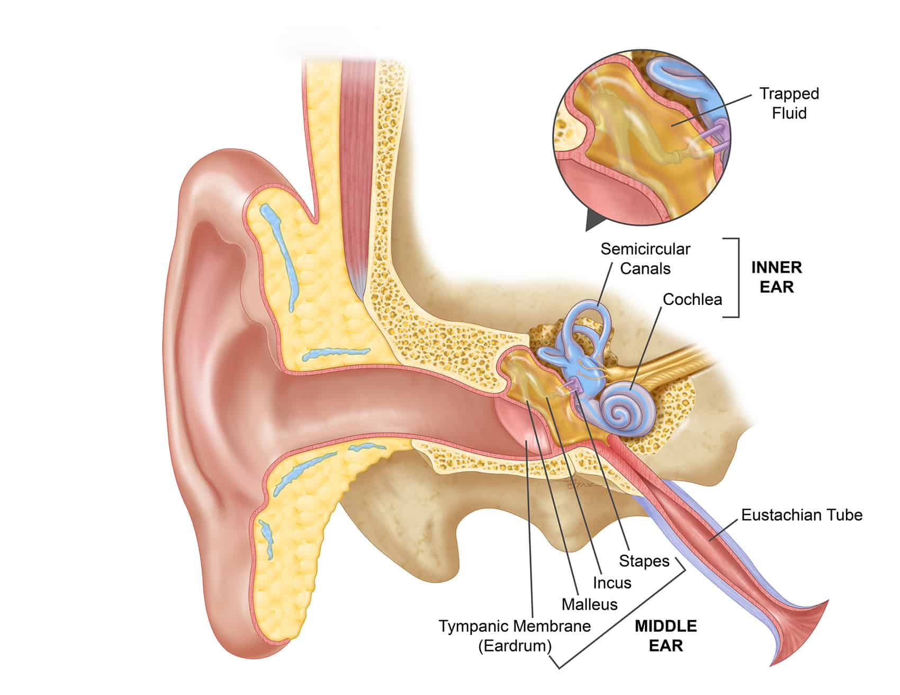
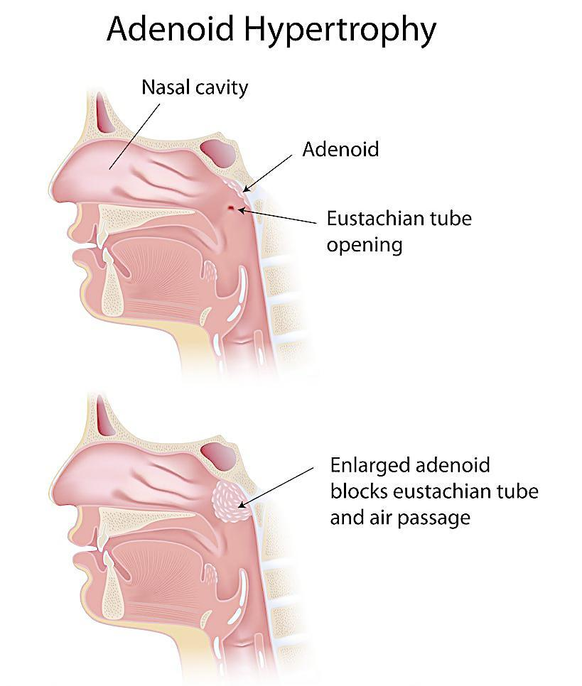
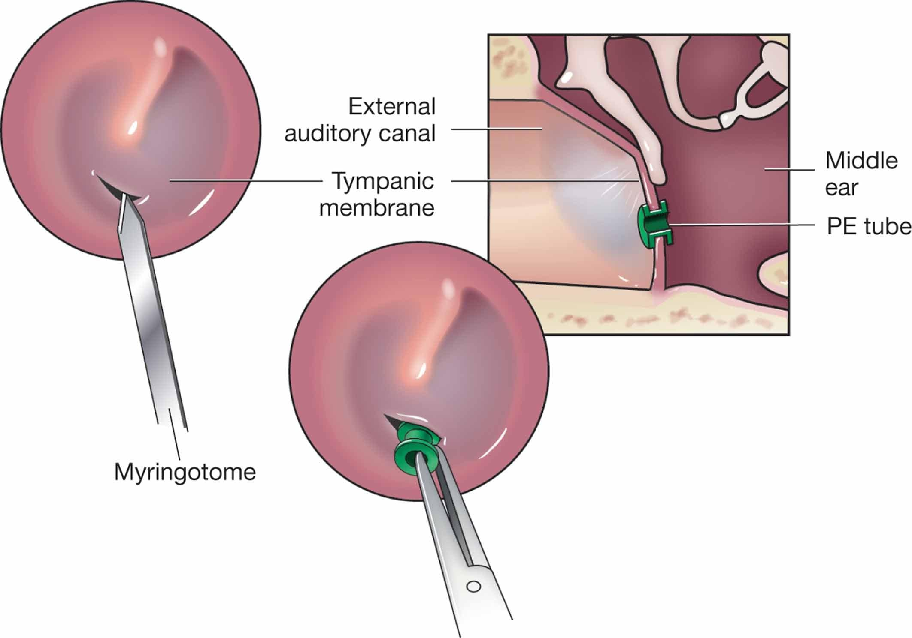
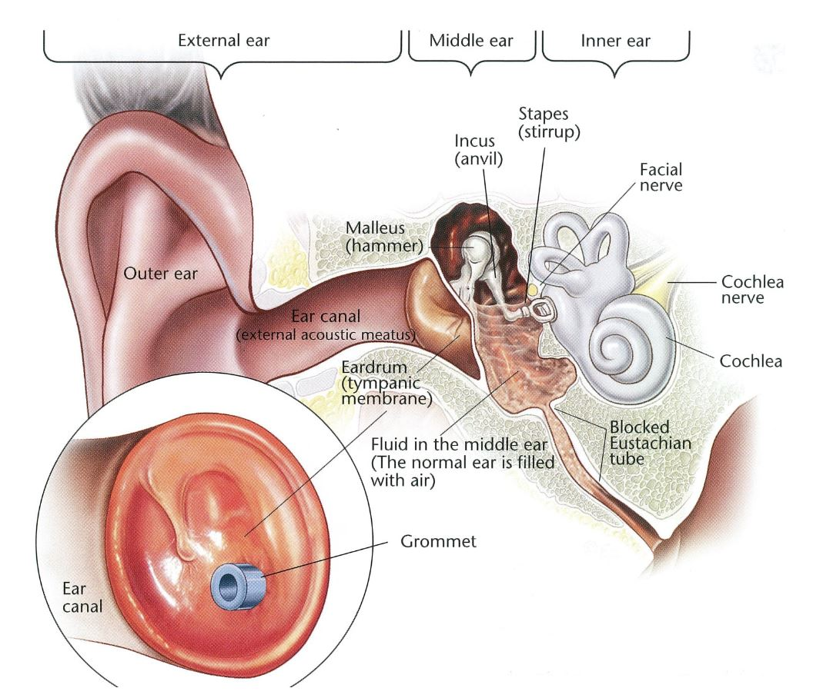

 
 

 
 

Το υγρό στο αυτί είναι μια πολύ συχνή πάθηση στα παιδιά. Μπορεί να εμφανιστεί σε οποιαδήποτε ηλικία και μπορεί να επηρεάσει το ένα ή και τα δύο αυτιά.

Πολλά παιδιά με εκκριτική ωτίτιδα ( Glue Ears ) δεν έχουν συμπτώματα.

Τα παιδιά έχουν προβλήματα στην ακoή και μπορεί να επαναλαμβάνουν λέξεις, να μιλούν δυνατά ή να έχουν την τηλεόραση πιο δυνατά. Οι γονείς ή οι εκπαιδευτικοί μπορούν να παρατηρήσουν εύκολα μια «επιλεκτική ακοή» ή την μη τήρηση λεκτικών οδηγιών, ειδικά σε ένα παιδί που μέχρι πρότινος ανταποκρινόταν άμεσα.
 
 

 
 
Το παιδί μπορεί να παραπονιέται από καιρό σε καιρό για αίσθημα πίεσης ή πόνο στο αυτί, ενώ ιστορικό επαναλαμβανόμενων ωτίτιδων δεν συναντάτε πάντα.

Στα μικρότερα παιδιά, η βαρηκοΐα που προκαλείται από το υγρό, μπορεί να επηρεάσει την ανάπτυξη της ομιλίας, της γλώσσας και συνολικά την κοινωνική τους αλληλεπίδραση.

Μερικά παιδιά φαίνεται να είναι πιο ευερέθιστα και έχουν προβλήματα ύπνου ή να έχουν προβλήματα με την ισορροπία.
 
 

 
 

Τα κύρια αίτια της συλλογής υγρού είναι η δυσλειτουργία της Ευσταχιανής Σάλπιγγας, οι επαναλαμβανόμενες Μέσες Ωτίτιδες και η υπερτροφία των Αδενοειδών Εκβλαστήσεων (κρεατάκια).

Εάν υποψιάζεστε ότι το παιδί σας έχει βαρηκοΐα ή ενοχλήσεις από τα αυτιά πρέπει να επισκεφθείτε τον ειδικό ΩΡΛ ιατρό. Ο γιατρός σας θα ρωτήσει για τα συμπτώματα και το ιατρικό ιστορικό και στη συνέχεια να προβεί σε πλήρη ΩΡΛ εξέταση του παιδιού.

 
 

 
 

Η εξέταση περιλαμβάνει Ωτομικροσκόπηση, Ωτοενδοσκόπηση, Ακοολογικό Έλεγχο με Ακοόγραμμα και Τυμπανόγραμμα, ενώ πρέπει να συμπληρωθεί με Ενδοσκοπικό έλεγχο της μύτης με Εύκαμπτο Παιδιατρικό Ενδοσκόπιο για την εκτίμηση του μεγέθους των αδενοειδών εκβλαστήσεων.

 
 

 
 

Μετά την αρχική εξέταση και εφόσον διαπιστωθεί παρουσία υγρού στα αυτιά το παιδί θα είναι υπό παρακολούθηση για διάστημα έως τρεις μήνες για να δούμε αν υπάρχει κάποια βελτίωση (“Watchful Waiting”). Αν η κατάσταση δεν βελτιωθεί, θα πρέπει να τοποθετηθούν στο παιδί σωληνίσκοι αερισμού (Grommets). Με τα σωληνάκια το παιδί θα έχει φυσιολογική ακοή και προστατεύονται τα αυτιά από τις επαναλαμβανόμενες λοιμώξεις. Τα σωληνάκια θα παραμείνουν στα αυτιά για διάστημα 8 έως 12 μήνες και μετά “πέφτουν” μόνα τους. Η επέμβαση γίνεται υπό γενική αναισθησία.

***Για περισσότερες πληροφορίες και ραντεβού με το γιατρό καλέστε [2130 575052](tel:2130575052 "2130 575052")***