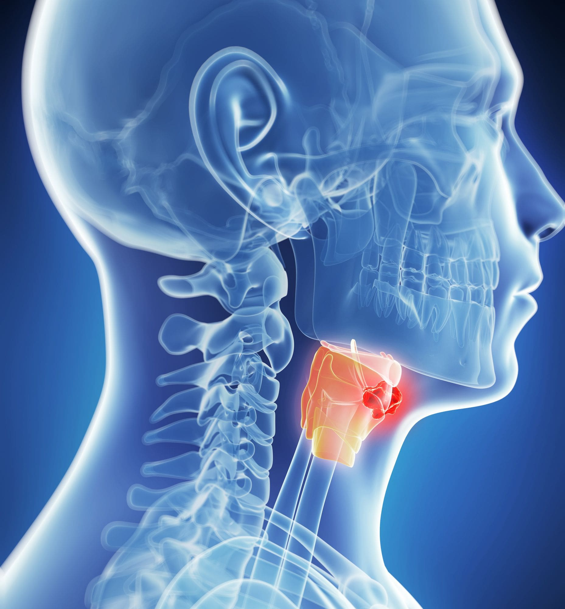
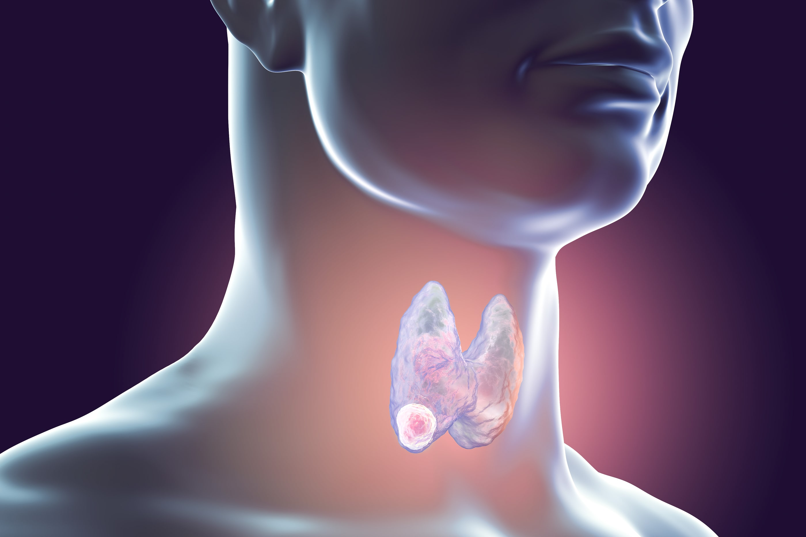

 
 

 
 

Ο καρκίνος της κεφαλής και του τραχήλου θεωρείται σχετικά συχνός. Στην Ευρώπη
αποτελεί το 5% των κακοήθων νοσημάτων, εμφανίζεται συχνότερα στους άνδρες και σε
άτομα άνω των 50 ετών, χωρίς να αποκλείονται και νεότερες ηλικίες. Παγκοσμίως
διαγιγνώσκονται περίπου μισό εκατομμύριο νέες περιπτώσεις καρκίνου κεφαλής και
τραχήλου κατ' έτος.

Ο καρκίνος κεφαλής και τραχήλου αποτελεί μια ετερογενή ομάδα όγκων από τη
στοματική κοιλότητα, το φάρυγγα, το λάρυγγα και το ρινοφάρυγγα. Κοινούς
προδιαθεσικούς παράγοντες αποτελούν η χρήση καπνού και αιθυλικής αλκοόλης.
Η λοίμωξη με τον ιό HPV έχει ενοχοποιηθεί για την παθογένεση μιας ομάδας όγκων και
κυρίως αυτών του στοματοφάρυγγα. Τα καρκινώματα που σχετίζονται με τον HPV
αποτελούν μια ξεχωριστή οντότητα όσον αφορά την βιολογική και την κλινική
συμπεριφορά, ενώ παρουσιάζουν καλύτερη πρόγνωση.

Ενώ οι περιπτώσεις καρκίνου του πνεύμονα μειώνονται, οι καρκίνοι της κεφαλής και του τραχήλου αυξάνονται. Οι περισσότεροι από αυτούς εμφανίζουν πρώιμα συμπτώματα σε αρχικά στάδια, στα οποία θεωρούνται θεραπεύσιμοι. Θα πρέπει να γνωρίζετε αυτά τα ενδεχόμενα πρώιμα συμπτώματα ώστε να μπορείτε να ειδοποιήσετε το γιατρό σας το
συντομότερο δυνατό.

<u>"Η επιτυχής αντιμετώπιση του καρκίνου της κεφαλής και του τραχήλου εξαρτάται από την έγκαιρη διάγνωση".</u>

 
 

 
 

##### Συμπτώματα Καρκίνου Κεφαλής και Τραχήλου (Red Flag Symptoms)

- **Μια διόγκωση στον Τράχηλο (λαιμό)** 
  Οι καρκίνοι της κεφαλής & του τραχήλου συνήθως εξαπλώνονται στους λεμφαδένες του τραχήλου. Μια διόγκωση στο λαιμό που διαρκεί περισσότερο από **δύο εβδομάδες** θα πρέπει να διερευνάται από τον Ειδικό Χειρουργό Ωτορινολαρυγγολόγο όσο το δυνατόν συντομότερα με Ενδοσκόπηση του Ανώτερου Αναπνευστικού. Φυσικά, δεν είναι όλες αυτές οι διογκώσεις καρκίνος. Αλλά ένα ογκίδιο στον τράχηλο μπορεί να είναι το πρώτο εύρημα καρκίνου του στόματος, του φάρυγγα, του λάρυγγα, του θυρεοειδούς αδένα ή ορισμένων λεμφωμάτων και καρκίνων του αίματος. Αυτές οι διογκώσεις συνήθως είναι ανώδυνες.

- **Αλλαγή της φωνής (Βραχνάδα)** 
  Οι περισσότεροι καρκίνοι στο Λάρυγγα προκαλούν αλλαγή στη φωνή. Ο Ωτορινολαρυγγολόγος είναι ο ειδικός που μπορεί να εξετάσει το Λάρυγγα και τις Φωνητικές Χορδές εύκολα και ανώδυνα. Οι περισσότερες αλλαγές στη φωνής δεν προκαλούνται από καρκίνο, ωστόσο αν παρατηρήσετε ένα βράγχος που επιμένει για περισσότερο από δύο εβδομάδες θα πρέπει να επισκεφθείτε τον ειδικό γιατρό για ενδοσκόπηση (Λαρυγγοσκόπηση).

- **Διογκώσεις και Έλκη του Στόματος** 
  Οι περισσότεροι καρκίνοι του στόματος ή της γλώσσας προκαλούν ερεθισμό ή διόγκωση που μπορεί να επιμένει για μέρες ή εβδομάδες. Η διόγκωση μπορεί να είναι ανώδυνη, κάτι που μπορεί να είναι παραπλανητικό. Ο καρκίνος είναι συχνά ανώδυνος. Αιμόπτυση ή ενεργός Αιμορραγία μπορεί να εμφανιστεί, αλλά συχνότερα σε πιο προχωρημένα στάδια της νόσου. Ένα έλκος ή οίδημα που καλύπτεται από θρόμβους αίματος στη περιοχή του στόματος, θα πρέπει να επειγόντως να διερευνηθεί. Μια διόγκωση ή πόνος ή εξέλκωση στο στόμα που δεν εξαφανίζεται μετά από δύο εβδομάδες θα πρέπει να αξιολογηθεί από ειδικό γιατρό. Ο Ειδικός Ωτορινολαρυγγολόγος μπορεί να καθορίσει αν μια βλάβη είναι ύποπτη και αν απαιτείται διερεύνηση με βιοψία.

- **Αιμόπτυση** 
  Η αιμόπτυση μπορεί να προκληθεί από διάφορα αίτια λιγότερο ή περισσότερο σοβαρά , αλλά και από τον καρκίνο. Όγκοι στη μύτη, στο στόμα, στο φάρυγγα, στον λάρυγγα ή στους πνεύμονες μπορεί να προκαλέσουν αιμορραγία. Εάν το αίμα εμφανίζεται στο σάλιο ή τα φλέγματα για περισσότερο από μερικές ημέρες, θα πρέπει να επισκεφτείτε κατά το δυνατόν συντομότερα Ειδικό Ωτορινολαρυγγολόγο για Ενδοσκόπηση του Ανώτερου Αναπνευστικού.

- **Προβλήματα κατάποσης - Δυσκαταποσία** 
  Ο καρκίνος του Φάρυγγα, του Λάρυγγα ή του Οισοφάγου μπορεί να καταστήσει δύσκολη ή επώδυνη την κατάποση στερεών τροφών και μερικές φορές υγρών. Το φαγητό μπορεί να "κολλήσει" σε κάποιο σημείο και στη συνέχεια είτε να περάσει με δυσκολία στο στομάχι ή να επιστρέψει στο στόμα ως αναγωγή. Αν έχετε πρόβλημα κάθε φορά που προσπαθείτε να καταπιείτε ή αν έχετε διαπιστώσει μια επιδεινούμενη δυσκαταποσία θα πρέπει να δείτε το γιατρό. Ο Ειδικός Ωτορινολαρυγγολόγος θα προχωρήσει σε ενδοσκοπικό έλεγχο του Φάρυγγα και του Λάρυγγα και θα σας συστήσει ακτινολογικό έλεγχο με διάβαση Βαρίου ή/και Μαγνητική Τομογραφία. Ο έλεγχος ολοκληρώνεται με Οισοφαγοσκόπηση εφόσον κριθεί αναγκαίο για την διάγνωση.

- **Επίμονος Πόνος στο Αυτί - Ωταλγία** 
  Ο συνεχής πόνος στο αυτί ή πόνος γύρω απ’ το αυτί κατά την κατάποση μπορεί να αποτελεί ένδειξη ανάπτυξης ενός όγκου στον λαιμό (Αντανακλαστική Ωταλγία). Η Ωταλγία είναι ένα ύποπτο σύμπτωμα και πρέπει να διερευνηθεί ειδικά αν δεν υπάρχει πρόσφατο ιστορικό λοίμωξης ή αν σχετίζεται με δυσκολία στην κατάποση, βραχνάδα, ή μια διόγκωση στο λαιμό. Ένας πόνος στο αυτί ή γύρω από αυτό που επιμένει θα πρέπει να αξιολογείται από Ειδικό Ωτορινολαρυγγολόγο με Ενδοσκόπηση του Ανώτερου Αναπνευστικού.

- **Βλάβες του Δέρματος στη περιοχή της Κεφαλής & του Τραχήλου** 
  Ο πιο συχνός καρκίνος της κεφαλής και του τραχήλου είναι ο καρκίνος του δέρματος εκ βασικών κυττάρων **(Βασικοκυτταρικό Καρκίνωμα)**. Ο καρκίνος αυτός σπάνια είναι σοβαρός εάν αντιμετωπιστεί έγκαιρα. Οι καρκίνοι εκ βασικών κυττάρων εμφανίζονται πιο συχνά σε περιοχές που εκτίθενται στον ήλιο, όπως το μέτωπο, το πρόσωπο και τα αυτιά, αλλά μπορούν να εμφανιστούν σχεδόν οπουδήποτε στο δέρμα.

Ο καρκίνος εκ πλακωδών κυττάρων **(Ακανθοκυτταρικό Καρκίνωμα)** είναι ο δεύτερος συχνότερος. Συνήθεις περιοχές εντόπισης είναι το κάτω χείλος και το αυτί. Ο καρκίνος αυτός εάν διαγνωστεί και αντιμετωπιστεί έγκαιρα θεραπεύεται πλήρως.

Το **κακοήθες μελάνωμα** παράγει συνήθως μπλε σκούρο ή μαύρο αποχρωματισμό του δέρματος. Κάθε σπίλος του δέρματος που αλλάζει μέγεθος, χρώμα ή αιμορραγεί χρήζει άμεσης διερεύνησης από ειδικό Ωτορινολαρυγγολόγο ή Δερματολόγο.
 
 

 
 

##### ΑΣΘΕΝΕΙΣ ΥΨΗΛΟΥ ΚΙΝΔΥΝΟΥ

Το 90% των καρκίνων της κεφαλής και του τραχήλου εμφανίζονται μετά από παρατεταμένη έκθεση σε συγκεκριμένους παράγοντες κινδύνου. Η χρήση καπνού και τα οινοπνευματώδη ποτά αποτελούν τη συνηθέστερη αιτία. Σε ενήλικες που δεν καπνίζουν ή δεν καταναλώνουν αλκοόλ, ο καρκίνος μπορεί να εμφανιστεί ως αποτέλεσμα της μόλυνσης από τον Ιό των Ανθρωπίνων Θηλωμάτων ειδικά με τον Υπότυπο 16 (Human Papilloma Virus - HPV). Η παρατεταμένη έκθεση στον ήλιο συνδέεται με την εμφάνιση καρκίνου του δέρματος.
 
 

 
 

##### ΤΙ ΠΡΕΠΕΙ ΝΑ ΚΑΝΕΤΕ

Όλα τα παραπάνω συμπτώματα μπορούν να εμφανιστούν και σε άλλες παθολογικές καταστάσεις εκτός του καρκίνου. Αυτό ωστόσο μπορεί να επιβεβαιωθεί μόνο μετά την ειδική εξέταση και διερεύνηση.

Όταν διαγνωστούν νωρίς οι περισσότεροι καρκίνοι της κεφαλής και του τραχήλου μπορούν να θεραπευτούν πλήρως με μικρές μόνο παρενέργειες. Τα ποσοστά θεραπείας θα μπορούσαν να βελτιωθούν σε μεγάλο βαθμό εάν οι ασθενείς ζητούσαν ιατρικές συμβουλές νωρίτερα.

**Εάν εντοπίσετε κάποιο από τα συμπτώματα καρκίνου της κεφαλής και του τραχήλου επισκεφτείτε το γιατρό σας**

Ο Ειδικός Ωτορινολαρυγγολόγος μπορεί να αξιολογήσει τα συμπτώματα σας και με τον ενδοσκοπικό έλεγχο μπορεί να καθορίσει αν υπάρχει ύποπτη βλάβη που απαιτεί διερεύνηση.

 
 

###### **Κωνσταντίνος Χ. Μπουκόνης**

###### **Χειρουργός Ωτορινολαρυγγολόγος Περιστέρι**

###### **Επιστημονικός Συνεργάτης – Χειρουργός ΩΡΛ Νοσοκομείο "ΥΓΕΙΑ"**

###### **_Για περισσότερες πληροφορίες και ραντεβού με το γιατρό καλέστε [2130 575052](tel:2130575052 '2130 575052')_**
