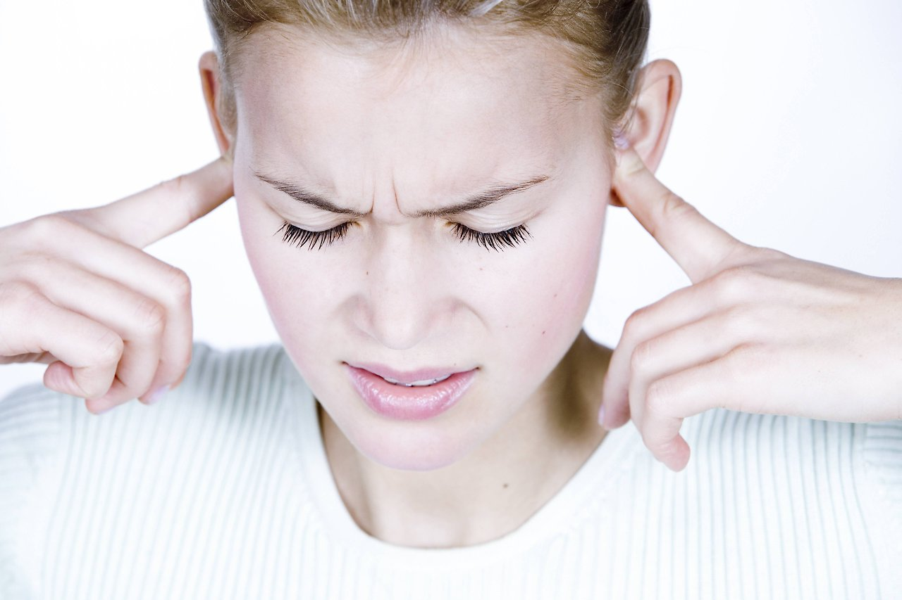
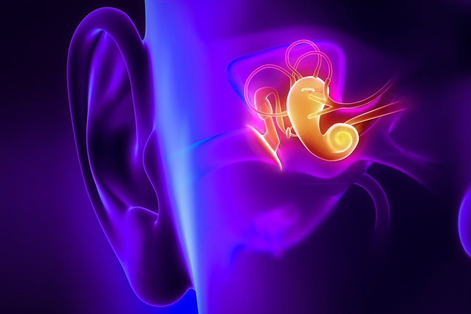
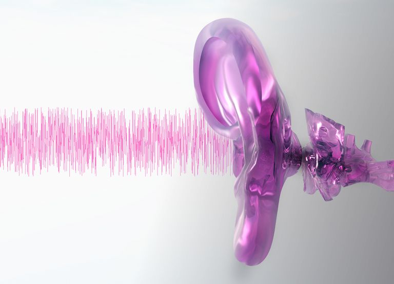

 
 

 
 
Υπερακουσία είναι ο ιατρικός όρος που περιγράφει την αδυναμία να ανεχθεί κάποιος συνηθισμένους θορύβους του περιβάλλοντός. Πρόκειται για μια εξαιρετικά ενοχλητική κατάσταση που προκαλεί έντονη δυσφορία και δυσκολεύει την καθημερινή ζωή και την εργασία του ασθενούς. Ήχοι που για τους περισσότερους είναι απλά ενοχλητικοί και ανεκτοί για τους ασθενείς με Υπερακουσία είναι αφόρητοι.

Το ακουστικό σύστημα μας έχει εξαιρετικό εύρος, μπορούμε να ακούσουμε χαμηλής έντασης ήχους όπως το θρόισμα των φύλλων και ταυτόχρονα να ανεχτούμε εξαιρετικά δυνατούς ήχους όπως η μουσική σε ένα κλαμπ. Το επίπεδο ήχου που προκαλεί σωματικό πόνο είναι περίπου 120dB (ο ήχος αεροσκάφους που απογειώνεται). Η μέγιστη ανεκτή ένταση μπορεί να ποικίλει από άτομο σε άτομο και επηρεάζεται από τη διάθεση του ατόμου αλλά και τα χαρακτηριστικά του ήχου. Στα άτομα με Υπερακουσία η μέγιστη ανεκτή ένταση θορύβου είναι κοντά στα 60 dB.

Μια ειδική μορφή Υπερακουσίας είναι η **Φωνοφοβία (Phonophobia)**. Στη Φωνοφοβία υπάρχει ευαισθησία για ένα συγκεκριμένο ήχο ή ομάδα ήχων. Οι ασθενείς εμφανίζουν αποστροφή για αυτούς τους συγκεκριμένους ήχους και όχι γενική αδυναμία ανοχής δυνατών ήχων. **Μισοφωνία (Misophonia)** ένας νέος ιατρικός όρος και περιγράφει την έντονη δυσφορία σε συγκεκριμένους ήχους που παράγονται από άλλους ανθρώπους, για παράδειγμα ο θόρυβος που κάνει κάποιος που μασάει.
 
 

 
 

### **Αιτιολογία**

Η αιτιοπαθογένεια της Υπερακουσίας παραμένει άγνωστη μέχρι σήμερα. Σε κάποιες περιπτώσεις εμφανίζεται μετά από παρατεταμένη έκθεση σε υψηλής έντασης θόρυβο που προκαλεί βλάβη στα ακουστικά νεύρα και διεγείρει περιοχές του εγκεφάλου που σχετίζονται με την αντίληψη του ήχου. Υπερακουσία μπορεί να προκληθεί μετά από σοβαρό τραύμα στο κεφάλι, από έντονο συναισθηματικό, συγκινησιακό ή μετα-τραυματικό stress, από αγχώδεις διαταραχές και εμβοές.
 
 

### **Συμπώματα**

Στην πιο σοβαρή της μορφή η έκθεση σε θόρυβο μπορεί να προκαλέσει **πόνο στα αυτιά, διαταραχή της συγκέντρωσης, πονοκεφάλους, έντονη κόπωση, διαταραχές του ύπνου, έντονο άγχος και κατάθλιψη**. Μερικοί ασθενείς καταλήγουν να εγκαταλείπουν τη δουλειά τους, να απέχουν από κοινωνικές δραστηρίοτητες και να κλείνονται σπίτι τους.
 
 

### **Διερεύνηση της Υπερακουσίας**

Για τη διερεύνηση της Υπερακουσίας ακολουθούμε τον αλγόριθμο για τις εμβοές. Ο Ωτορινολαρυγγολόγος μετά τη λήψη αναλυτικού ιατρικού και ωτολογικού ιστορικού και πλήρη ΩΡΛ εξέταση, θα διενεργήσει εξειδικευμένες εξετάσεις όπως το ακοόγραμμα, το τυμπανόγραμμα, τα ακουστικά αντανακλαστικά και το ηλεκτρονυσταγμογράφημα σε περίπτωση ιλίγγου.

Η διερεύνηση συμπληρώνεται με απεικονιστικό έλεγχο, συνήθως χρειάζεται Μαγνητική Τομογραφία, σπανιότερα θα απαιτηθεί Αξονική Τομογραφία ειδικά αν υπάρχει ιστορικό χρόνιας μέσης ωτίτιδας ή κάκωσης του κρανίου ή του αυχένα.
 
 

 
 

### **Θεραπευτική Προσέγγιση**

Η αναλυτική εξήγηση της φύσης του προβλήματος στον ασθενή και των θεραπευτικών επιλογών είναι απαραίτητη για την αποφυγή της απογοήτευσης και του ψυχολογικού stress. Σε κάθε περίπτωση φράσεις όπως "δεν υπάρχει καμιά λύση και καμιά θεραπεία" θεωρούνται απαράδεκτες.

Όταν η Υπερακουσία είναι σύμπτωμα μιας συγκεκριμένης νόσου τότε αντιμετωπίζεται η υποκείμενη παθολογική κατάσταση και κατά συνέπεια και το πρόβλημα.

Όταν δεν ανευρεθεί κάποια υποκείμενη παθολογική κατάσταση ο ασθενής θα πρέπει να ενημερωθεί για την καλοήθη φύση της πάθησης και τις μεθόδους προστασίας από πολύ έντονους ήχους.

Για τις πιο απλές περιπτώσεις συνιστάται η **χρήση ωτοασπίδων**, ειδικά αν υπάρχει έκθεση σε θόρυβο στο εργασιακό περιβάλλον.
Θεραπεία επιλογής είναι η **Ηχοθεραπεία**, δηλαδή η **Θεραπεία Επανεκπαίδευσης των Εμβοών (Tinnitus Retraining Therapy - TRT)**.
Με καλά αποτελέσματα έχει δοκιμαστεί η **Γνωστική Συμπεριφορική Θεραπεία (Cognitive Behavioral Therapy – CBT)**.
Ανάλογα με το ψυχολογικό προφίλ του ασθενή μπορεί να χρειαστεί αγωγή με αντικαταθλιπτικά ή αγχολυτικά χάπια προκειμένου να αποκατασταθεί μια φυσιολογική καθημερινότητα.

 
 

###### **Κωνσταντίνος Χ. Μπουκόνης**

###### **Χειρουργός Ωτορινολαρυγγολόγος Περιστέρι**

###### **Επιστημονικός Συνεργάτης – Χειρουργός ΩΡΛ Νοσοκομείο "ΥΓΕΙΑ"**

###### **_Για περισσότερες πληροφορίες και ραντεβού με το γιατρό καλέστε [2130 575052](tel:2130575052 '2130 575052')_**
