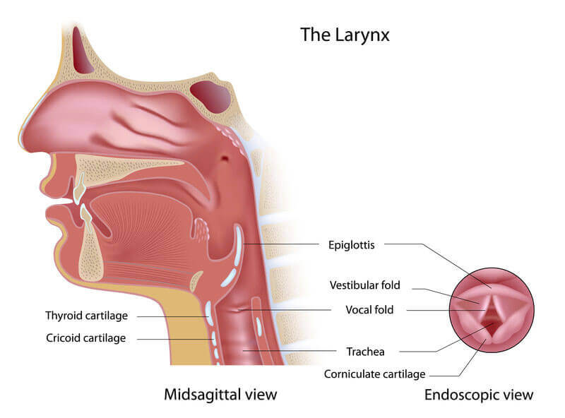
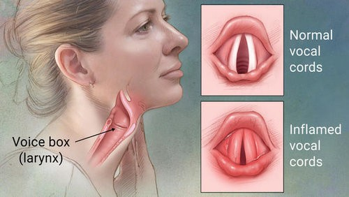
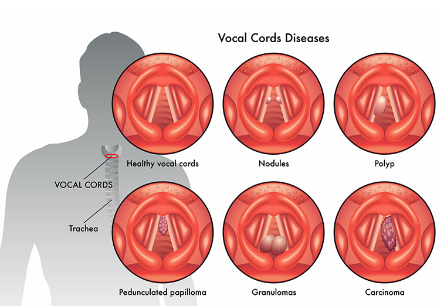
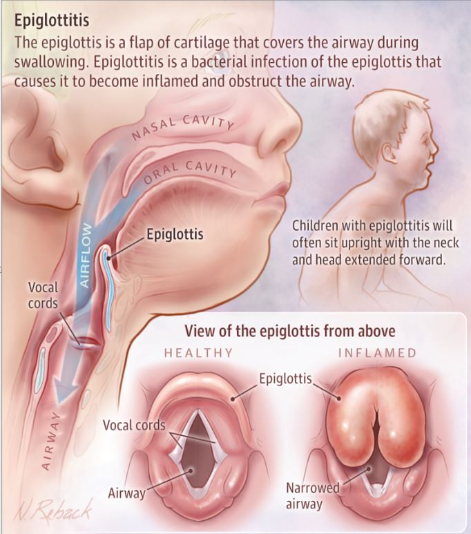

 
 

 
 

Η Λαρυγγίτιδα είναι μια φλεγμονή των Φωνητικών Χορδών που μπορεί να προκληθεί από υπερβολική χρήση της φωνής, ερεθισμό ή λοίμωξη.
Οι φωνητικές χορδές σχηματίζονται από δύο πτυχές βλεννογόνου που καλύπτουν τους μύες, τους συνδέσμους και τους χόνδρους που αποτελούν το σκελετό τους. Φυσιολογικά, οι φωνητικές χορδές ανοίγουν και κλείνουν ομαλά και συμμετρικά, σχηματίζοντας ήχους μέσω της δόνησης τους.
Στη Λαρυγγίτιδα οι φωνητικές χορδές ερεθίζονται και διογκώνονται με αποτέλεσμα την παραμόρφωση των ήχων. Η φωνή ακούγεται βραχνή ή μπορεί να χαθεί τελείως επειδή η δόνηση των φωνητικών χορδών από τον αέρα που διέρχεται δεν είναι φυσιολογική.
Η λαρυγγίτιδα μπορεί να είναι οξεία και χρόνια.
Οι περισσότερες περιπτώσεις λαρυγγίτιδας προκαλούνται από ιογενή λοίμωξη ή φωνητική καταπόνηση.
Ωστόσο, μια επίμονη βραχνάδα ή παραμόρφωση της φωνής μπορεί να είναι το πρώτο σύμπτωμα μιας πιο σοβαρής υποκείμενης παθολογικής κατάστασης.

<u>"Κάθε αλλαγή στη φωνή - βραχνάδα - που επιμένει πάνω απο δύο εβδομάδες θα πρέπει να διερευνηθεί με Ενδοσκόπηση Λάρυγγα απο Ειδικό Ωτορινολαρυγγολόγο"</u>
 
 

###### Παράγοντες κινδύνου Λαρυγγίτιδας

- Λοιμώξεις του ανωτέρου ή κατώτερου αναπνευστικού όπως το κοινό κρυολόγημα, η φαρυγγίτιδα, η ιγμορίτιδα ή η βρογχίτιδα.
- Έκθεση σε ερεθιστικές ουσίες, όπως καπνός τσιγάρων, υπερβολική πρόσληψη αλκοόλ και σε χημικές ουσίες στο χώρο εργασίας.
- Λαρυγγο-φαρυγγική παλινδρόμηση.
- Υπερβολική χρήση της φωνής.
- Αλλεργίες.

 
 

 
 

###### Αίτια Οξείας Λαρυγγίτιδας

- Ιογενείς λοιμώξεις, παρόμοιες με εκείνες που προκαλούν το κοινό κρυολόγημα.
- Φωνητική καταπόνηση, που προκαλείται από έντονες φωνές ή υπερβολική χρήση της φωνής.
- Βακτηριακές λοιμώξεις.
   
   

###### Αίτια Χρόνιας Λαρυγγίτιδας

Μια λαρυγγίτιδα που διαρκεί περισσότερο από τρεις εβδομάδες χαρακτηρίζεται ως Χρόνια Λαρυγγίτιδα. Αυτός ο τύπος λαρυγγίτιδας προκαλείται γενικά από την έκθεση σε ερεθισμό για μεγάλο χρονικό διάστημα.

Η χρόνια λαρυγγίτιδα μπορεί να προκληθεί από:

- Χρόνια έκθεση σε εισπνεόμενες ερεθιστικές ουσίες (χημικά, αλλεργιογόνα ή καπνός).
- Λαρυγγο-φαρυγγική παλινδρόμηση.
- Χρόνια Ρινίτιδα, Χρόνια Παραρρινοκολπίτιδα - Ιγμορίτιδα.
- Υπερβολική κατανάλωση αλκοόλ.
- Χρόνια κατάχρηση της φωνής (εκπαιδευτικοί, δικηγόροι, τραγουδιστές).
- Κάπνισμα.

 
 

 
 

###### Άλλα αίτια ενός χρόνιου βράγχους φωνής

- Καρκίνος του Λάρυγγα και Προ-Καρκινωματώδεις αλλοιώσεις.
- Μη καρκινικές βλάβες όπως πολύποδες, οζίδια, οίδημα Reinke, κοκκιώματα και κύστεις των φωνητικών χορδών που προκαλούν έντονη δυσφωνία, μπορούν να εξαιρεθούν με τη χρήση Laser και εργαλείων Μικροχειρουργικής.
- Παράλυση Φωνητικής Χορδής, η οποία μπορεί να οφείλεται σε Τραυματισμό, Εγκεφαλικό Επεισόδιο, Όγκο του πνεύμονα, Σκλήρυνση Κατά Πλάκας ή Μετεγχειρητική επιπλοκή θυρεοειδεκτομή.
- Αδυναμία και Ατροφία των φωνητικών χορδών λόγω γήρατος.
- Χρόνιες Βακτηριακές, Μυκητιασικές και Παρασιτικές λοιμώξεις.

 
 

 
 

###### Συμπτώματα

Στις περισσότερες περιπτώσεις τα συμπτώματα λαρυγγίτιδας διαρκούν λιγότερο από δέκα μέρες και ο ασθενής αναφέρει Βραχνάδα, Αδύναμη φωνή ή Πλήρη απώλεια φωνής, Πονόλαιμο, Ξηρό βήχα, Ξηρότητα και Ερεθισμό στο λαιμό.
 
 

###### Ζητήστε άμεση ΩΡΛ εξέταση αν έχετε:

- Βράγχος φωνής που επιμένει πάνω από δύο εβδομάδες.
- Δυσκολία στην αναπνοή.
- Αιμόπτυση.
- Πυρετό πάνω από 38,5 oC, που επιμένει.
- Έντονο πόνο στο φάρυγγα.
- Δυσκολία ή Πόνο κατά την κατάποση.
   
   

###### Ζητήστε επείγουσα ΩΡΛ ή Παιδιατρική εξέταση αν το παιδί σας εμφανίζει:

- Δυσκολία στην αναπνοή.
- Εισπνευστικό Συριγμό (έντονο υψίσυχνο ήχο κατά την εισπνοή).
- Σιελόρροια.
- Δυσκολία στη κατάποση.
- Πόνο κατά την κατάποση.
- Πυρετό πάνω από 38,5 oC, που επιμένει.

Τα συμπτώματα αυτά μπορεί να αποτελούν σημεία μιας Επιγλωττίτιδας ή ΛαρυγγοΤραχειοβρογχίτιδας.
 
 

###### Επιγλωττίτιδα

Η Επιγλωττίτιδα είναι μια επικίνδυνη φλεγμονή της Επιγλωττίδας, η οποία λειτουργεί ως προστατευτικό κάλυμμα για την τραχεία κατά την κατάποση. Η Επιγλωττίτιδα μπορεί να εξελιχθεί ταχύτατα και να αποφράξει τον Λάρυγγα, κατάσταση που μπορεί να είναι απειλητική για τη ζωή σε παιδιά και ενήλικες.
 
 

###### Λαρυγγο-Τραχειοβρογχίτιδα (Croup)

Είναι μια φλεγμονή του Λάρυγγα και της Τραχείας συχνή σε παιδιά, που απαιτεί ιατρική παρακολούθηση και αγωγή.

 
 

 
 

###### Διάγνωση

Ο ειδικός ωτορινολαρυγγολόγος θα πάρει ένα αναλυτικό Ιστορικό και θα προχωρήσει σε πλήρη ΩΡΛ εξέταση.

Η ποιότητα της φωνής και τα ειδικά χαρακτηριστικά της θα αξιολογηθούν με βάση τα πρωτόκολλα και τις κατευθυντήριες οδηγίες (Guidelines) της σύγχρονης Φωνιατρικής επιστήμης.

Η διερεύνηση θα ολοκληρωθεί με Ενδοσκοπικό έλεγχο του Λάρυγγα και των Φωνητικών Χορδών.

<u>"Η Ενδοσκόπηση είναι μια ανώδυνη εξέταση, καλά ανεκτή ακόμα και από παιδιά προσχολικής ηλικίας."</u>

Μπορεί να γίνει με ή χωρίς ήπια τοπική αναισθησία . Ο γιατρός θα περάσει μέσα από τη μύτη ένα ειδικό εύκαμπτο Ρινο-Φαρυγγο-Λαρυγγοσκόπιο, προκειμένου να δει τη περιοχή του φάρυγγα , του λάρυγγα και τις φωνητικές χορδές.

Στην περίπτωση που εντοπιστεί ύποπτη βλάβη ο γιατρός θα σας προτείνει βιοψία, βάσει των Αμερικανικών και Βρετανικών κατευθυντήριων οδηγιών για τη διάγνωση του καρκίνου της κεφαλής και του τραχήλου.

Στη σύγχρονη εποχή υπάρχει δυνατότητα βίντεο καταγραφής της εξέτασης και των παθολογικών ευρημάτων. Ο ασθενής μπορεί να έχει στο προσωπικό ιατρικό του αρχείο βίντεο και φωτογραφίες με σκοπό τη μελλοντική σύγκριση ανάλογων εξετάσεων.

 
 

 
 

###### Θεραπεία

Η θεραπεία θα καθοριστεί ανάλογα με τη διάγνωση και την υποκείμενη αιτία που προκαλεί την αλλοίωση της φωνής.

<u>"Σε περίπτωση παρουσίας μιας ύποπτης βλάβης ο γιατρός θα συστήσει Μικρολαρυγγοσκόπηση με χρήση Laser για την πλήρη αφαίρεση του Όγκου και Βιοψία"</u>

Μη καρκινικές βλάβες όπως πολύποδες, οζίδια, οίδημα Reinke, κοκκιώματα και κύστεις των φωνητικών χορδών που προκαλούν έντονη δυσφωνία ή δύσπνοια, μπορούν να εξαιρεθούν με χρήση Laser και εργαλείων Μικροχειρουργικής.
 
 

###### Γενικά μέτρα την αντιμετώπιση και θεραπεία της Λαρυγγίτιδας

- Φωνητική ανάπαυση.
- Επαρκής ενυδάτωση.
- Θεραπεία αλλεργίας.
- Διακοπή του καπνίσματος.
- Περιορισμός της κατανάλωσης αλκοόλ.
- Φαρμακευτική αγωγή.
- Φωνοθεραπεία.

 
 

###### **Κωνσταντίνος Χ. Μπουκόνης**

###### **Χειρουργός Ωτορινολαρυγγολόγος Περιστέρι**

###### **Επιστημονικός Συνεργάτης – Χειρουργός ΩΡΛ Νοσοκομείο "ΥΓΕΙΑ"**

###### **_Για περισσότερες πληροφορίες και ραντεβού με το γιατρό καλέστε [2130 575052](tel:2130575052 '2130 575052')_**
