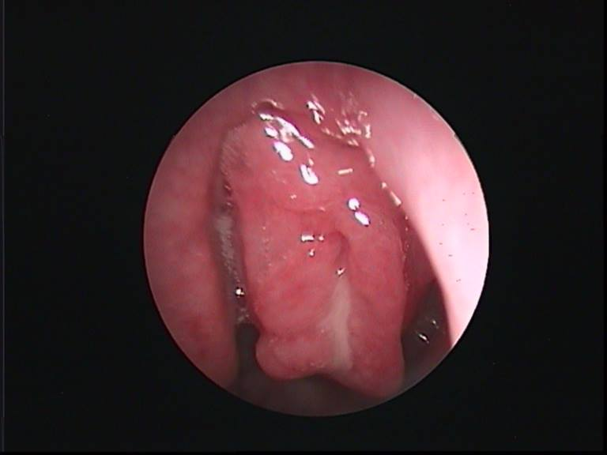

 
 

 
 

Η αποφρακτική υπνική άπνοια (OSA) είναι η συχνότερη αιτία της διαταραχής της αναπνοής στον ύπνο (SDB) στα παιδιά. Συνδέεται με σημαντική νοσηρότητα, με καρδιαγγειακές και μεταβολικές διαταραχές και μπορεί να επηρεάσει την νοητική (neurocognitive) και συμπεριφορική (behavioural) ανάπτυξη.

Η άπνοια κατά τη διάρκεια του ύπνου χαρακτηρίζεται από έντονο ροχαλητό και αυξημένη αναπνευστική προσπάθεια λόγω της αυξημένης αντίστασης του ανώτερου αεραγωγού και προκαλεί υποξία, υπερκαπνία, έντονες μεταβολές της ενδοθωρακικής πίεσης και κατακερματισμό του ύπνου.

Υπάρχουν ενδείξεις από τελευταίες έρευνες ότι η αποφρακτική άπνοια μπορεί να πυροδοτεί μια χρόνια χαμηλού βαθμού συστηματική φλεγμονή και αυξημένο οξειδωτικό στρες.

Η αποφρακτική υπνική άπνοια στα παιδιά πρέπει να διερευνηθεί και να διαγνωστεί έγκαιρα και η αντιμετώπιση να είναι άμεση.

Η υπερτροφία των αδενοειδών εκβλαστήσεων (κρεατάκια) και των αμυγδαλών είναι η συνηθέστερη αιτία.

Όπως και στους ενήλικες, η παχυσαρκία είναι σοβαρός παράγοντας κινδύνου και πρέπει να αξιολογείται σε συνδυασμό με τα ευρήματα της κλινικής εξέτασης.

Άλλα ανατομικά χαρακτηριστικά που οδηγούν σε στένωση των ανώτερων αεραγωγών είναι η μικρογναθία, η μακρογλωσσία και η υποπλασία του προσωπικού κρανίου. Αυτά τα χαρακτηριστικά εμφανίζονται συχνότερα σε παιδιά με κρανιοπροσωπικά σύνδρομα (Treacher Collins syndrome, Crouzon syndrome, Apert syndrome, Pierre Robin sequence), όπως επίσης σε αχονδροπλασία, σύνδρομο Down, σύνδρομο Beckwith Wiedemann και βλεννοπολυσακχαριδώσεις.

Τα κύρια χαρακτηριστικά του συνδρόμου είναι το έντονο και επίμονο ροχαλητό, ο ανήσυχος ύπνος, η νυχτερινή ενούρηση, η στοματική αναπνοή, η υπνηλία κατά τη διάρκεια της ημέρας, η δυσκολία στην συγκέντρωση και οι μαθησιακές διαταραχές.

Η διάγνωση του συνδρόμου θα γίνει βάσει του ιστορικού, της κλινικής εξέτασης και της μελέτης ύπνου.

Η ενδοσκόπηση του ανωτέρου αναπνευστικού από τον ειδικό ιατρό Παιδο-ΩΡΛ αποτελεί βασική εξέταση για την εκτίμηση του προβλήματος. Η εξέταση είναι ασφαλής και ανεκτή απ' τα περισσότερα παιδιά. Ο ενδελεχής ενδοσκοπικός έλεγχος μας προσφέρει πολύτιμες πληροφορίες για τη κατάσταση του αεραγωγού και μας αποκαλύπτει το ακριβές σημείο της απόφραξης, με τον τρόπο αυτό εξασφαλίζουμε ένα ορθό θεραπευτικό πλάνο που είναι εξατομικευμένο για κάθε παιδί. Σύμφωνα με τις διεθνείς οδηγίες ( American Academy of Pediatrics ) η αντιμετώπιση της αποφρακτικής άπνοιας στα παιδιά περιλαμβάνει την χειρουργική αφαίρεση των αδενοειδών και των αμυγδαλών σε πρώτο χρόνο και επί επιμονής των συμπτωμάτων οξυγονοθεραπεία. Πολύ σπάνια στις μέρες μας θα απαιτηθεί τραχειοστομία.

***Για περισσότερες πληροφορίες και ραντεβού με το γιατρό καλέστε [2130 575052](tel:2130575052 "2130 575052")***