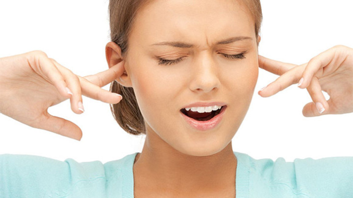

 
 

##### Τι είναι Εμβοές (βουητό στα αυτιά);

Σαν εμβοές ορίζουμε γενικά την αντίληψη ήχου ή βουητού ενώ υπάρχει απουσία εξωτερικού ηχητικού ερεθίσματος. Είναι μια συχνή ενόχληση (15% του πληθυσμού) αν και η πιο σοβαρή τους μορφή αφορά ένα πολύ μικρότερο ποσοστό (<1%).

Διακρίνονται γενικά σε Υποκειμενικές και Αντικειμενικές.

Συχνότερες είναι οι υποκειμενικές εμβοές και αφορούν την αντίληψη ενός ενοχλητικού υψίσυχνου ήχου (σαν κουδούνισμα, φύσημα, σφύριγμα ή σαν τζιτζίκια) που ακούει μόνο ο ασθενής ενώ δεν υπάρχουν ηχητικά ερεθίσματα στο περιβάλλον.

Σπανιότερες είναι οι αντικειμενικές εμβοές, αυτές είναι πραγματικοί ήχοι που προκαλούνται από κραδασμούς διαφόρων δομών του σώματος. Υπό προϋποθέσεις μπορεί να είναι αντιληπτές τόσο από τον ασθενή όσο και από το γιατρό. Τα ερεθίσματα συνήθως προέρχονται από μυικό σπασμό ή τον καρδιακό παλμό.

 
 

 
 

##### Γιατί έχω Εμβοές;

Η εύρεση της αιτιολογίας των εμβοών είναι συχνά μια πρόκληση για τον ειδικό ΩΡΛ και απαιτεί πλήρη νευρο-ωτολογικό έλεγχο που συμπληρώνεται από ειδικές εξετάσεις.

Ο ακριβής μηχανισμός δημιουργίας των εμβοών παραμένει άγνωστος . Κατά καιρούς διάφορες θεωρίες τον έχουν τοποθετήσει στον κοχλία, την ακουστική οδό και διάφορες φλοιώδεις και υποφλοιώδεις περιοχές του εγκεφάλου. Υπάρχει στενή σύνδεση της έντασης των εμβοών με ψυχικές διαταραχές. Συχνά οι εμβοές χαρακτηρίζονται **ιδιοπαθείς** που σημαίνει αγνώστου αιτιολογίας. Στη διάγνωση ιδιοπαθείς καταλήγουμε όταν αποκλειστούν άλλες παθολογικές καταστάσεις.

Οι **υποκειμενικές (ή μη-σφύζουσες)** εμβοές συνήθως σχετίζονται με απώλεια ακοής και βλάβη του ακουστικού νεύρου. Οι παθήσεις που προκαλούν εμβοές μπορεί να είναι ωτολογικές και μη-ωτολογικές.

- Παθήσεις του ωτός που προκαλούν εμβοές είναι **η αιφνίδια απώλεια ακοής, η κυψελίδα, η ωτίτιδα, η δυσλειτουργία ευσταχιανής σάλπιγγας,**
  **η διάτρηση του τυμπανικού υμένα, η ωτοσκλήρυνση, όγκοι του ωτός όπως το ακουστικό νευρίνωμα, η νόσος Meniere,**
  **η πρεσβυακουσία, το ακουστικό τραύμα και κακώσεις ωτός και κεφαλής**.
- Μη-ωτολογικές παθήσεις είναι **η σκλήρυνση κατά πλάκας, οι ενδοκρανιακοί όγκοι, η ενδοκρανιακή υπέρταση, ο σακχαρώδης διαβήτης,**
  **η θυρεοειδοπάθεια, η υπερλιπιδαιμία, η αναιμία, η έλλειψη βιταμινών**.

Έχει αποδειχτεί ότι οι εμβοές σχετίζονται με τη λήψη φαρμάκων (πχ ασπιρίνη, αντιφλεγμονώδη, αντιβιοτικά, διουρητικά κ.α.), με το κάπνισμα και τη λήψη καφεΐνης και αλκοόλ.  
Σοβαρές και ανθεκτικές στη θεραπεία εμβοές εμφανίζονται σε ασθενείς με **κατάθλιψη και αγχώδεις διαταραχές**.

Οι **αντικειμενικές (ή σφύζουσες) εμβοές** συνήθως εμφανίζουν ρυθμικότητα και προέρχονται από μυικό σπασμό ή κραδασμούς με προέλευση το καρδιαγγειακό σύστημα.

Στην πιο καλοήθη μορφή τους ο ασθενής ακούει δονήσεις που αντιστοιχούν στον παλμό της καρδιάς του.

Παθολογικές καταστάσεις που εκδηλώνονται με σφύζουσες εμβοές είναι **το ανεύρυσμα εγκεφάλου, οι ενδοκρανιακές αρτηριο-φλεβώδεις δυσπλασίες, η στηθάγχη (στεφανιαία νόσος), η καρδιακή ανεπάρκεια, οι καρδιακές βαλβιδοπάθειες (πχ πρόπτωση μητροειδούς), η υπέρταση, η αθηροσκλήρωση των καρωτίδων και οι αγγειακοί όγκοι τραχήλου και εγκεφάλου (παραγαγγλίωμα) .**

Αντικειμενικές εμβοές προκαλούνται σπάνια από μυικό σπασμό. Πρόκειται συνήθως για **μυοκλονίες των μυών της μαλθακής υπερώας και των μυών του μέσου ωτός**.

 
 

 
 

##### Πως γίνεται η Διερεύνηση των εμβοών;

Η διερεύνηση των εμβοών γίνεται από Ειδικό Ωτορινολαρυγγολόγο και περιλαμβάνει τη λήψη αναλυτικού ιατρικού και ωτολογικού ιστορικού και πλήρη ΩΡΛ εξέταση. Ο Νευρο-Ωτολογικός έλεγχος ολοκληρώνεται με τη διενέργεια εξειδικευμένων εξετάσεων όπως το ακοόγραμμα, το τυμπανόγραμμα, τα ακουστικά αντανακλαστικά και το ηλεκτρονυσταγμογράφημα σε περίπτωση ιλίγγου.

Η διερεύνηση συμπληρώνεται με απεικονιστικό έλεγχο και αιματολογικές εξετάσεις όταν απαιτείται.

Η Μαγνητική Τομογραφία είναι η συνήθης εξέταση για τον αποκλεισμό όγκων του εγκεφάλου και σκλήρυνσης κατά πλάκας.

Η Αξονική Τομογραφία αξιοποιείται όταν υπάρχει ιστορικό χρόνιας μέσης ωτίτιδας ή κάκωσης του κρανίου ή του αυχένα.

Η διάγνωση Ιδιοπαθείς Εμβοές τίθεται όταν αποκλειστούν όλες οι προαναφερθείσες παθολογικές καταστάσεις.

##### Υπάρχει θεραπεία για τις εμβοές;

Η αναλυτική εξήγηση της φύσης του προβλήματος στον ασθενή και των θεραπευτικών επιλογών είναι απαραίτητη για την αποφυγή της απογοήτευσης και του ψυχολογικού stress.
Σε κάθε περίπτωση φράσεις όπως "δεν υπάρχει καμιά λύση και καμιά θεραπεία" θεωρούνται απαράδεκτες.

Όταν οι εμβοές είναι σύμπτωμα μιας συγκεκριμένης νόσου τότε αντιμετωπίζεται η υποκείμενη παθολογική κατάσταση και κατά συνέπεια και οι εμβοές.

**<u>"Ειδικά στις περιπτώσεις πρόσφατης έναρξης έντονων εμβοών θα πρέπει ο ασθενής να υποβληθεί σε πλήρη έλεγχο για τον αποκλεισμό αιφνίδιας βαρηκοΐας, που απαιτεί άμεση θεραπεία με στεροειδή"</u>**

- Η πιο απλή μέθοδος αντιμετώπισης είναι η **ηχοκάλυψη των εμβοών (tinnitus masking)**. Με τον όρο ηχοκάλυψη εννοούμε τη χρήση εξωτερικών ήχων που καλύπτουν τις εμβοές και απαλλάσσουν τον ασθενή απ την συνεχή ενόχληση. Πιο πρακτικές λύσεις είναι η ακρόαση μουσικής από το ραδιόφωνο ή την τηλεόραση , όπως και η συνεχής λειτουργία συσκευών όπως ένας ανεμιστήρας.
- Σε ασθενείς με Εμβοές και απώλεια ακοής συνιστάται η χρήση Ακουστικού Βαρηκοΐας. Έχει αποδειχθεί πως με την διόρθωση της ακουστικής απώλειας ο ασθενής ανακουφίζεται, λόγω της ενίσχυσης των ήχων του περιβάλλοντος, καλύπτουν ηχητικά τις εμβοές. Τα ακουστικά βαρηκοΐας είναι πιο χρήσιμα για ασθενείς που πάσχουν από εμβοές και βαρηκοΐα μέσων και χαμηλών συχνοτήτων.
- Οι συσκευές ηχοκάλυψης (masking device, white noise device), παράγουν ήχους που δεν είναι δυσάρεστοι και ενοχλητικοί σε μεγαλύτερη ένταση απo τις εμβοές και τις καλύπτουν. Οι συσκευές ηχοκάλυψης μπορεί να είναι ενσωματωμένες σε ένα ακουστικό βαρηκοΐας ή αυτόνομες.
- Η πλέον σύγχρονη θεραπευτική επιλογή είναι η **Θεραπεία Επανεκπαίδευσης των Εμβοών (Tinnitus Retraining Therapy - TRT)**. Η μέθοδος αυτή έχει αποδειχτεί ότι μπορεί να αντιμετωπίσει το πρόβλημα με τη χρήση συσκευής παραγωγής ήχων χαμηλότερης έντασης απ τις εμβοές. Η φιλοσοφία της συγκεκριμένης μεθόδου είναι η πρόκληση του φαινομένου της κόπωσης από συνεχή ηχητικό ερεθισμό των περιοχών του εγκεφάλου που δημιουργούν τις εμβοές.
- Πολλά υποσχόμενη είναι η αξιοποίηση της **Γνωστικής Συμπεριφορικής Θεραπείας (Cognitive Behavioral Therapy – CBT)** στην αλλαγή της στάσης του ασθενή απέναντι στο πρόβλημα με την οικοδόμηση μιας πιο θετικής προσέγγισης. Η αρνητική επίπτωση των εμβοών στη ψυχολογία του ασθενή μπορεί να ελεγχθεί και να βελτιωθεί η καθημερινότητα και η απόδοση στην εργασία.

 
 

###### **Κωνσταντίνος Χ. Μπουκόνης**

###### **Χειρουργός Ωτορινολαρυγγολόγος Περιστέρι**

###### **Επιστημονικός Συνεργάτης – Χειρουργός ΩΡΛ Νοσοκομείο "ΥΓΕΙΑ"**

###### **_Για περισσότερες πληροφορίες και ραντεβού με το γιατρό καλέστε [2130 575052](tel:2130575052 '2130 575052')_**
