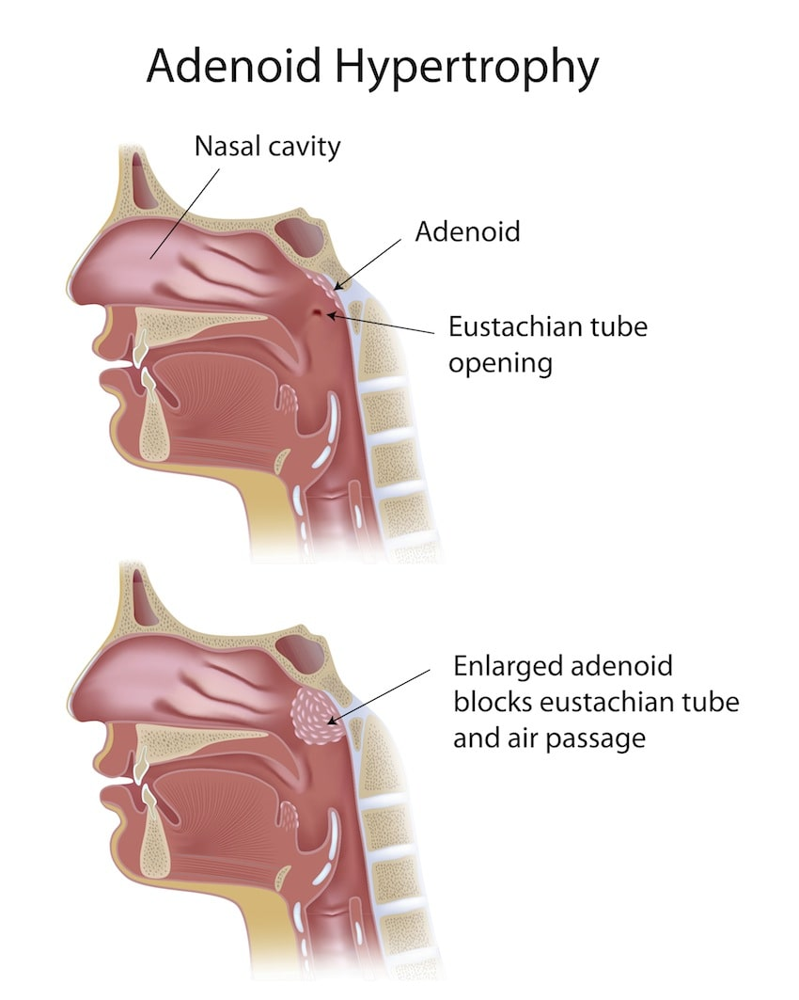
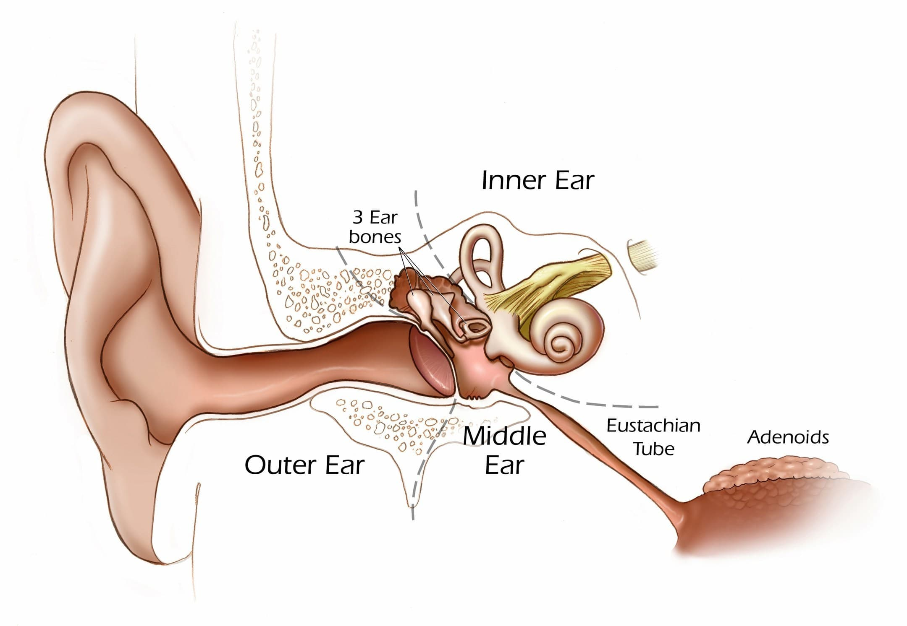
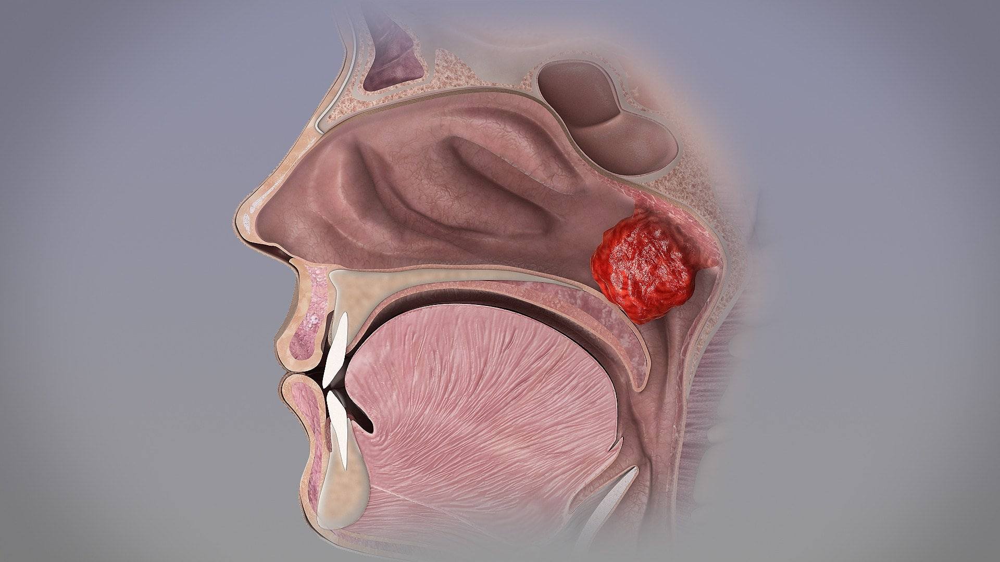
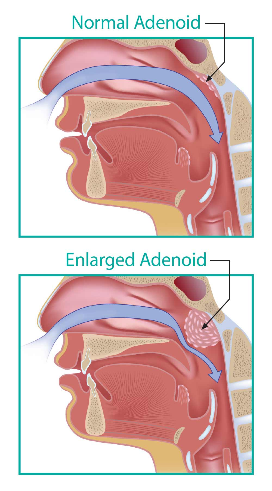

 
 

 
 

Αδενοειδεκτομή είναι η χειρουργική επέμβαση για την αφαίρεση του υπερτροφικού λεμφικού ιστού που σχηματίζει τα "κρεατάκια" και αποφράσσει τον ρινοφάρυγγα, στο πίσω μέρος της μύτης.
Η υπερτροφία των αδενοειδών εκβλαστήσεων στα παιδιά είναι αποτέλεσμα παθολογικής ανάπτυξης του λεμφικού ιστού και οφείλεται σε αίτια είτε κληρονομικά - γενετικά, είτε είναι αποτέλεσμα επαναλαμβανόμενων λοιμώξεων της ανώτερης αναπνευστικής οδού. 

**Ο υπερτροφικός αδενοειδής ιστός προκαλεί δύο βασικές επιπλοκές:**
* **Απόφραξη της Ευσταχιανής Σάλπιγγας που οδηγεί σε μόνιμη συλλογή υγρού στο αυτί και βαρηκοΐα**
* **Απόφραξη του ανώτερου αεραγωγού, Ροχαλητό και πιθανόν Άπνοιες στον Ύπνο**

Επιπλέον, τα κρεατάκια προκαλούν σε Παιδιά και Ενήλικες επαναλαμβανόμενες λοιμώξεις στη μύτη (**ρινίτιδα, ρινοκολπίτιδα - ιγμορίτιδα**), στο φάρυγγα και το λάρυγγα (**αμυγδαλίτιδα, υποτροπιάζουσα λαρυγγίτιδα και βρογχίτιδα**) και στα αυτιά (**υποτροπιάζουσα πυώδης ωτίτιδα, εκκριτική ωτίτιδα**)

Τα τυπικά συμπτώματα είναι η χρόνια ρινική απόφραξη, η στοματική αναπνοή, το έντονο ροχαλητό με επεισόδια άπνοιας στον ύπνο και η δυσκολία στην κατάποση. Χαρακτηριστική είναι επίσης η αλλοίωση της φωνής, η οποία ακούγεται ένρινη, όπως και η βαρηκοΐα λόγω της εκκριτικής και υποτροπιάζουσας ωτίτιδας. 

<u>"Στους ενήλικες η παρουσία υπερτροφικού ιστού στο ρινοφάρυγγα θεωρείται παθολογική και συνιστάται η αφαίρεση και η λήψη βιοψίας για να αποκλειστεί η πιθανότητα Καρκίνου ή Λεμφώματος"</u>

Η διάγνωση τίθεται από τα τυπικά συμπτώματα σε συνδυασμό με τον Ενδοσκοπικό Έλεγχο της μύτης. Σπάνια στις μέρες απαιτείται απεικονιστικός έλεγχος με ακτινογραφία.

Η Ενδοσκόπηση της μύτης είναι γενικά καλά ανεκτή από την ηλικία των 3 ετών και γίνεται στο ιατρείο. Δεν απαιτείται κάποια ιδιαίτερη προετοιμασία του παιδιού και δεν έχει επιπλοκές. Συνήθως φανερώνει τη σημαντική αύξηση του όγκου του λεμφικού ιστού στον ρινοφάρυγγα που πολλές φορές επεκτείνεται εντός της ρινικής κοιλότητας.

Η διερεύνηση ολοκληρώνεται με **Ακοολογικό έλεγχο** για την αξιολόγηση της ακουστικής λειτουργίας. Τυχόν βλάβες της Τυμπανικής Μεμβράνης (Εισολκή, Διάτρηση κτλ) εντοπίζονται με τον **Ενδοσκοπικό έλεγχο των αυτιών - Ωτο-Ενδοσκόπηση**.

Χειρουργική ένδειξη αφαίρεσης των αδενοειδών υπάρχει σε κάθε περίπτωση που προκαλείται απόφραξη και εμφανίζονται επιπλοκές και πάντα πριν την εκδήλωση αναπτυξιακών διαταραχών ή καθυστέρηση της ομιλίας.

Ο συνήθης χρόνος εκτέλεσης της επέμβαση είναι μετά την ηλικία των 3 ετών. Σε πολύ επιλεγμένες περιπτώσεις η χειρουργική επέμβαση μπορεί να γίνει με ασφάλεια από την ηλικία των οκτώ μηνών.

Όταν συνυπάρχουν προβλήματα από τα αυτιά και τις αμυγδαλές μπορεί να γίνει ταυτόχρονα και **Ενδοσκοπική Μυριγγοτομή με τοποθέτηση Σωληνίσκων Αερισμού (Grommets)** ή/και **Αμυγδαλεκτομή**.

 
 

 
 

###### Η Χειρουργική Τεχνική

Υπάρχουν δύο χειρουργικές τεχνικές για την αφαίρεση των αδενοειδών:
* Η Παραδοσιακή διαστοματική απόξεση με ψυχρά εργαλεία
* Η Ενδοσκοπική Διαρρινική Αδενοειδεκτομή

Έχει αποδειχθεί από πολλές μελέτες πως η συμβατική διαστοματική απόξεση συνδέεται με τη **διατήρηση έως και 35% του προεγχειρητικού όγκου των αδενοειδών**. Ανάλογα με τον όγκο του ιστού που παραμένει μετά την επέμβαση, το παιδί μπορεί μην έχει την αναμενόμενη βελτίωση, ενώ πολλές φορές δεν αφαιρείται πλήρως η μάζα που αποφράσσει την ευσταχιανή σάλπιγγα και προκαλεί εκκριτική ωτίτιδα και βαρηκοΐα. Με την παραδοσιακή χειρουργική είναι επίσης αυξημένος ο κίνδυνος επιπλοκών όπως η μετεγχειρητική αιμορραγία και ο τραυματισμος της ευσταχιανής σάλπιγγας.

 
 

 
 

###### Ενδοσκοπική Διαρρινική Αδενοειδεκτομή

Η πλέον σύγχρονη χειρουργική μέθοδος αφαίρεσης των Αδενοειδών είναι η Ενδοσκοπική Διαρρινική Αδενοειδεκτομή, η οποία αξιοποιεί όλη τη τεχνολογική πρόοδο της ιατρικής επιστήμης των τελευταίων ετών.

Με τη χρήση **Άκαμπτων Ενδοσκοπίων** (0,30 και 70 μοιρών) και την προβολή σε **οθόνη Υψηλής Ανάλυση HD** επιτρέπεται η άμεση παρατήρηση του συνολικού όγκου των αδενοειδών και κατ' επέκταση η πλήρης αφαίρεση του. Η αφαίρεση των αδενοειδών μπορεί να γίνει με χρήση Μονοπολικής Διαθερμίας-Αναρρόφησης ή με τη χρήση Shaver.

 
 

 
 

###### Πλεονεκτήματα της Ενδοσκοπικής Διαρρινικής Αδενοειδεκτομής

* Επέμβαση υψηλής χειρουργικής ακρίβειας 
* Ριζική αφαίρεση του αδενοειδούς ιστού απ' το ρινοφάρυγγα, χωρίς πιθανότητα επανεμφάνισης
* Πλήρης αφαίρεση απ την περιοχή της Ευσταχιανής Σάλπιγγας 
* Διαρκεί ελάχιστα και δεν απαιτείται νοσηλεία 
* Είναι αναίμακτη
* Η άμεση παρατήρηση ελαχιστοποιεί τον κίνδυνο τραυματισμού της ευσταχιανής σάλπιγγας ή άλλων επιπλοκών.

Η επέμβαση γίνεται με γενική νάρκωση, ωστόσο δεν απαιτείται νοσηλεία και δεν χρειάζεται να διανυκτερεύσει το παιδί στο νοσοκομείο. Στην εποχή μας οι κίνδυνοι της γενικής αναισθησίας θεωρούνται αμελητέοι, με τις πολύ σοβαρές επιπλοκές να μην ξεπερνούν την μία ανά 100.000 επεμβάσεις.

 
 

 
 

###### Τα παιδιά αναρρώνουν ταχύτατα από την επέμβαση

Σπάνια μπορεί να παρουσιάσουν για μικρό διάστημα άρνηση λήψης τροφής. Σε κάθε περίπτωση συνιστάται άφθονη λήψη υγρών και καλή διατροφή για την ταχύτερη επούλωση. Γενικά προτιμώνται κρύες και μαλακές τροφές, χωρίς άλλο περιορισμό ή ειδικό διαιτολόγιο. Χορηγούνται παυσίπονα και αντιβιοτικά για 7 ημέρες. 

Για το διάστημα της ανάρρωσης συνιστάται η αποφυγή έντονης σωματικής δραστηριότητας καθώς και η επαφή με άτομα που έχουν κάποια ιογενή λοίμωξη ή βήχουν.
 
 

***Για περισσότερες πληροφορίες και ραντεβού με το γιατρό καλέστε [2130 575052](tel:2130575052 "2130 575052")***