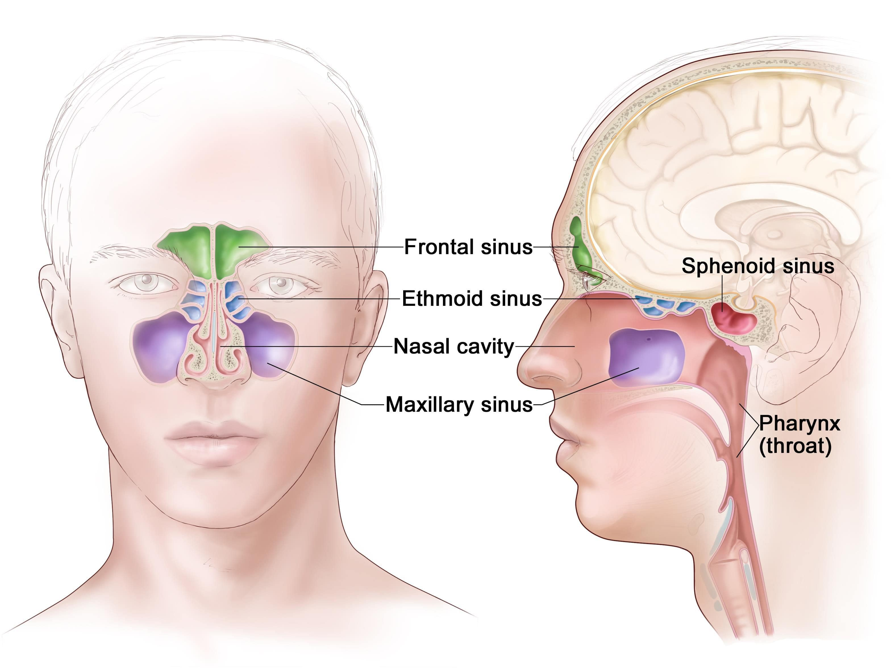
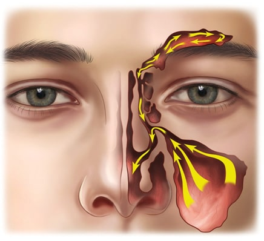

##### Functional Endoscopic Sinus Surgery - FESS
##### Χρόνια Ρινοκολπιτιδα, Χρόνια Ιγμορίτιδα, Ρινικοί Πολύποδες
 

###### Παραρρίνιοι Κόλποι, Ιγμόρειο
Οι Παραρρίνιοι Κόλποι είναι κοιλότητες με αέρα μέσα στα οστά του προσώπου και του κρανίου. Σχηματίζουν ένα πολυσύνθετο δίκτυο κοιλοτήτων και πόρων που συνδέονται και αερίζονται μέσω της ρινικής κοιλότητας. Έχουμε 4 ζεύγη παραρρίνιων κόλπων, το ιγμόρειο που βρίσκεται κάτω απ’ τα μάτια, ο μετωπιαίος κόλπος πάνω απ’ τα μάτια, οι ηθμοειδείς κυψέλες στα πλάγια της μύτης και ο σφηνοειδής κόλπος στη βάση του κρανίου.

Η λειτουργία τους δεν είναι απόλυτα γνωστή, ενδέχεται να υπάρχουν για να κάνουν το κεφάλι πιο ελαφρύ ή για να προστατεύουν τον εγκέφαλο από μια πρόσθια πρόσκρουση, σαν τον αερόσακο ενός αυτοκινήτου.

Οι κόλποι και η μύτη επενδύονται εσωτερικά με βλεννογόνο που παράγει λεπτή βλέννα και διαθέτει πολλά μικροσκοπικά τριχίδια που ονομάζονται κροσσοί. Οι κροσσοί απομακρύνουν τη βλέννα έξω από τους κόλπους μέσω των φυσικών στομίων και πόρων στη ρινική κοιλότητα και έπειτα στο λαιμό όπου καταπίνονται.

Όταν τα στόμια των κόλπων είναι αποφραγμένα ή το κροσσωτό επιθήλιο υπολειτουργεί μπορεί να προκύψει νόσος του κόλπου.

Οι επιπλοκές της Ρινοκολπίτιδας είναι σπάνιες στις μέρες μας και συμβαίνουν συχνότερα σε παιδιά. Η ανεπαρκής αντιμετώπιση ή ανατομικές παραλλαγές μπορεί να επιτρέψουν επέκταση της μόλυνσης στα οστά γύρω από τους κόλπους (οστεομυελίτιδα) ή ακόμα και στον εγκέφαλο (μηνιγγίτιδα, εγκεφαλικό απόστημα) και στον οφθαλμικό κόγχο (κυτταρίτιδα του κόγχου, ενδοκογχικό απόστημα).
 
 

###### Λειτουργική Ενδοσκοπική Χειρουργική Ρινός & Παραρρινίων – FESS
Η Ενδοσκοπική Χειρουργική Ρινός & Παραρρινίων είναι η σύγχρονη προσέγγιση για τη χρόνια ρινοκολπίτιδα, ιγμορίτιδα και τους ρινικούς πολύποδες.

Το χειρουργείο είναι ελάχιστα επεμβατικό και ανώδυνο μετεγχειρητικά

Οι κύριες ενδείξεις είναι η Χρόνια Ρινοκολπίτιδα - Ιγμορίτιδα, oι Ρινικοί Πολύποδες και οι πολλαπλές υποτροπές της Οξείας Ρινοκολπίτιδας - Ιγμορίτιδας.

Η ενδοσκοπική χειρουργική χρησιμοποιείται επίσης στην αντιμετώπιση της υποτροπιάζουσας Ρινορραγίας, για την αφαίρεση όγκων, στη διάνοιξη του ρινοδακρυικού πόρου και στην παροχέτευση αποστημάτων του οφθαλμικού κόγχου.

Η λειτουργική ενδοσκοπική χειρουργική δίνει έμφαση στην αποκατάσταση της φυσιολογικής λειτουργίας των παραρρίνιων κόλπων. Η χειρουργική επέμβαση αποκαθιστά τον εξαερισμό των κόλπων και την απομάκρυνση των εκκρίσεων μέσω των φυσιολογικών οδών ενώ ταυτόχρονα διατηρεί ανέπαφο τον υγιή βλεννογόνο.

Στόχος της επέμβασης είναι η διάνοιξη των αποφραγμένων στομίων αφαιρώντας τον υπερτροφικό ή παθολογικό ιστό ή ενδεχομένως τους πολύποδες. Συχνά απαιτείται αφαίρεση όλων των ηθμοειδών κυψελών μέχρι τη βάση του κρανίου για την πλήρη απομάκρυνση του παθολογικού ιστού και την αποφυγή υποτροπών της νόσου.

Συχνά, ταυτόχρονα με τη διάνοιξη των παραρρινίων, γίνεται και ενδοσκοπική διαφραγματοπλαστική και κογχοπλαστική για καλύτερη χειρουργική πρόσβαση και βελτίωση της ρινικής αναπνοής.

Οι περισσότερες περιπτώσεις υποτροπής της νόσου οφείλονται σε ανεπαρκή χειρουργικό καθαρισμό όλων των εστιών της νόσου.
 
 

###### Επιπλοκές Ενδοσκοπικής Χειρουργικής Ρινός & Παραρρινίων
Σε όλες τις χειρουργικές επεμβάσεις υπάρχει ο κίνδυνος των επιπλοκών. Οι επιπλοκές μετά από FESS μπορεί να είναι σοβαρές ιδιαίτερα σε εκτεταμένους όγκους ή ανατομικές παραλλαγές. Οι επιπλοκές προλαμβάνονται με τον Προ-εγχειρητικό έλεγχο (Αξονική Τομογραφία, Εξετάσεις Αίματος, Ενδοσκόπηση Ρινός), την επιλογή κατάλληλου χειρουργικού εξοπλισμού (Navigator) και την αυστηρή τήρηση των αρχών της ενδοσκοπικής χειρουργικής.

Ο χειρουργός θα πρέπει να έχει την ανάλογη εκπαίδευση και εμπειρία τόσο για την αποφυγή όσο και την αντιμετώπιση των επιπλοκών εφόσον συμβούν.
 
 

###### Αιμορραγία
Σοβαρή αιμορραγία σπάνια παρατηρείται.

Μικρή αιματηρή έκκριση δεν είναι σπάνιο να παρατηρηθεί αμέσως μετά την αφαίρεση του ρινικού πωματισμού. Ο ρινικός επιπωματισμός αφαιρείται 3 με 4 ώρες μετεγχειρητικά από το γιατρό. Πολλές φορές δεν χρησιμοποιείται καθόλου επιπωματισμός. Ήπια ορο-αιματηρή ρινική έκκριση μπορεί υπάρχει κατά το πρώτο 24ωρο και δεν είναι ανησυχητική.
 
 

###### Επιπλοκές από τα μάτια
Οι παραρρίνιοι κόλποι χωρίζονται απ’ τον οφθαλμικό κόγχο με ένα λεπτό οστό. Μπορεί να συμβεί το οστό αυτό να διαρραγεί και να έχουμε μικρο-αιμορραγία εντός του κόγχου. Ο χειρουργός οφείλει να αναγνωρίσει την επιπλοκή κατά την διάρκεια του χειρουργείου και να μην προκαλέσει περαιτέρω βλάβη. Στις περιπτώσεις αυτές δεν απαιτείται αντιμετώπιση και συμβουλεύουμε τον ασθενή να μην φυσά τη μύτη του. Σε σπάνιες περιπτώσεις μπορεί να υπάρχει σοβαρή αιμορραγία εντός του κόγχου που μπορεί να προκαλέσει μόνιμη απώλεια όρασης, εφόσον δεν αντιμετωπιστεί εγκαίρως με κανθοτομή.
 
 

###### Τραύμα στη Βάση του Κρανίου και διαρροή εγκεφαλονωτιαίου υγρού (ΕΝΥ)
Οι παραρρίνιοι κόλποι χωρίζονται απ’ τον εγκέφαλο με ένα οστό που ονομάζεται βάση του κρανίου. Όταν υπάρξει τραύμα κατά την επέμβαση μπορεί να παρατηρηθεί ροή ΕΝΥ μέσα στη μύτη. Στην πλειονότητα των περιπτώσεων το τραύμα επουλώνεται αυτόματα και απαιτείται μόνο μια παράταση της νοσηλείας. Σε εμμένουσα εκροή ΕΝΥ θα απαιτηθεί νέα επέμβαση για την αποκατάσταση της βάσης του κρανίου

***Για περισσότερες πληροφορίες και ραντεβού με το γιατρό καλέστε [2130 575052](tel:2130575052 "2130 575052")***