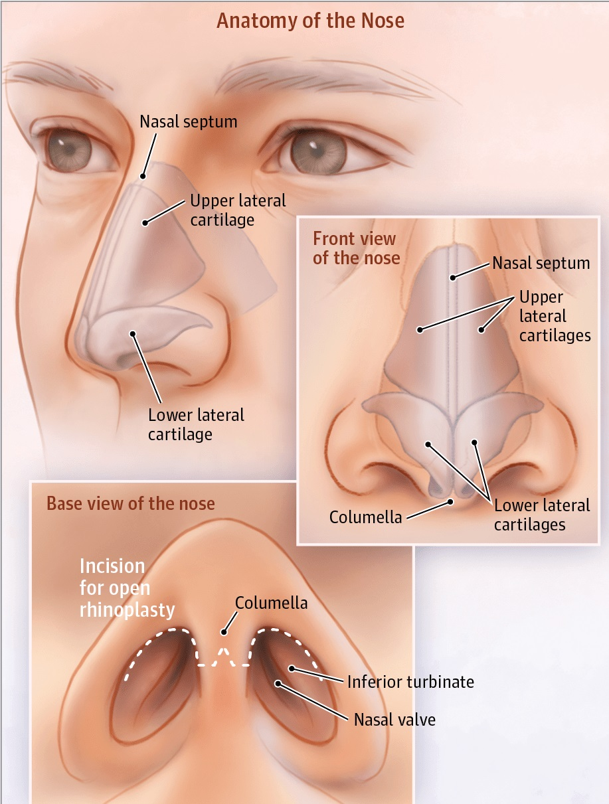

 
 

 
 

###### "Μια επέμβαση με διττό χαρακτήρα"
Η Λειτουργική Ρινοπλαστική είναι μια απ’ τις συχνότερες επεμβάσεις στη Ρινολογία και εξυπηρετεί ταυτόχρονα δυο στόχους. Αφ’ ενός διορθώνει τις ατέλειες του σχήματος και της εμφάνισης της μύτης και αφετέρου εξασφαλίζει την ομαλή και ανεμπόδιστη ρινική αναπνοή. Ο διττός στόχος της επέμβασης εξασφαλίζεται με την ταυτόχρονη διόρθωση των εξωτερικών ατελειών της μύτης και των εσωτερικών ανατομικών προβλημάτων.

Ο πλήρης προ-εγχειρητικός έλεγχος των εξωτερικών χαρακτηριστικών, συμπληρωμένος από ενδελεχή Ενδοσκοπική εξέταση του εσωτερικού της μύτης, επιτρέπει την εντόπιση όλων των ιδιαιτεροτήτων μιας μύτης και με τον τρόπο αυτό τον σχεδιασμό ενός **εξατομικευμένου χειρουργικού πλάνου**.

 
 

 
 

###### Πλεονεκτήματα της Λειτουργικής Ρινοπλαστικής

* Ευθειασμός μιας στραβής εξωτερικά μύτης με ταυτόχρονη βελτίωση της ρινικής αναπνοής.
* Διόρθωση του σκολιωτικού ρινικού διαφράγματος και της υπερτροφίας των ρινικών κογχών.
* Βελτίωση της εμφάνισης της κορυφής της μύτης (Nasal Tip).
* Διόρθωση της ανεπάρκειας της ρινικής βαλβίδας με μοσχεύματα (Spreader Grafts).
* Διόρθωση της απώλειας στήριξης της στυλίδας με μοσχεύματα (Columellar Strut Graft).
* Βελτίωση του Ροχαλητού & της αποφρακτικής Υπνικής Άπνοιας.
* Αλλαγή το σχήμα και μέγεθος της μύτης ώστε να είναι σε ισορροπία και αρμονία με τα υπόλοιπα χαρακτηριστικά του προσώπου .
* Αντιμετώπιση των κοσμητικών ατελειών μιας μύτης ταυτόχρονα με λειτουργικές βελτιώσεις.
* Επέμβαση εκλογής σε περιπτώσεις δεύτερης επέμβασης (revision septorhinoplasty), μετά από αποτυχημένο χειρουργείο όπου απαιτείται ανακατασκευή του σκελετού μύτης.

Στην παραδοσιακή ρινοπλαστική, βασικός στόχος της επέμβασης είναι να έχουμε μια όμορφη αισθητικά, μικρή και λεπτή μύτη. Ωστόσο, η εμπειρία έχει δείξει, πως δεν είναι λίγες οι περιπτώσεις όπου το λειτουργικό αποτέλεσμα της επέμβασης είναι φτωχό, με αποτέλεσμα ο ασθενής να εμφανίζει μετεγχειρητικά σοβαρή δυσχέρεια της ρινικής αναπνοής.

Ιστορικά, πολλοί χειρουργοί υπεραπλουστεύουν την πολυπλοκότητα και τις προκλήσεις που ενέχει η Ρινοπλαστική. Στην πραγματικότητα η Ρινοπλαστική και η Revision Ρινοπλαστική συγκαταλέγονται στις πιο δύσκολες τεχνικά, χειρουργικές επεμβάσεις.

Για την επίτευξη άριστων αποτελεσμάτων, που σημαίνει να επιτύχουμε ταυτόχρονα σταθερά και μακροχρόνια, κοσμητικά και λειτουργικά αποτελέσματα, απαιτείται υψηλή χειρουργική δεξιότητα και εξατομικευμένη προσέγγιση. Μετά το χειρουργείο η μύτη δεν πρέπει να είναι μόνο εναρμονισμένη και συμμετρική με τα υπόλοιπα χαρακτηριστικά του προσώπου αλλά και να αναπνέει.

 
 

 
 

Για παράδειγμα, πολλοί ασθενείς που ενδιαφέρονται για Ρινοπλαστική προκειμένου να αφαιρεθεί ο ύβος (καμπούρα) κατά μήκος της ράχης της μύτης, συχνά ενημερώνονται λανθασμένα ότι η επέμβαση είναι μια «απλή διαδικασία». Στην πραγματικότητα, η Ρινοπλαστική που περιλαμβάνει την απομάκρυνση του ύβου απαιτεί προσεκτικό σχεδιασμό, αφού συχνά παρατηρείται μετεγχειρητικά κατάρρευση της περιοχής της έσω ρινικής βαλβίδας και οι ασθενείς αναπτύσσουν αναπνευστική δυσχέρεια που δεν προϋπήρχε. Αυτό οφείλεται στο γεγονός ότι κάθε επέμβαση που περιλαμβάνει το μεσαίο τρίτο μύτης μεταβάλλει σημαντικά την αναπνευστική της λειτουργία.

Επιπλέον, κατά την κλινική εξέταση και τον προ-εγχειρητικό σχεδιασμό είναι απαραίτητο να γίνεται ενδελεχής Ενδοσκοπικός έλεγχος του εσωτερικού της μύτης. Με την Ενδοσκόπηση θα εντοπιστούν όλες οι βλάβες που χρήζουν διόρθωσης και δεν θα έχουμε «εκπλήξεις» την ώρα του χειρουργείου και μια αποτυχημένη λειτουργικά Ρινοπλαστική. Η απλή πρόσθια ρινοσκόπηση σαφώς δεν παρέχει όλες τις λεπτομέρειες για την κατάσταση του εσωτερικού της μύτης και πρέπει να συμπληρώνεται από ενδοσκόπηση. Ο έλεγχος της ρινικής βαλβίδας με ειδικούς χειρισμούς προ-εγχειρητικά, είναι απαραίτητος για την πρόληψη μετεγχειρητικής στένωσης.

Ο προεγχειρητικός έλεγχος ολοκληρώνεται με τη λήψη φωτογραφιών από διάφορες θέσεις και επεξήγηση στον ασθενή των αλλαγών που θα επιφέρει το χειρουργείο.
 
 

 
 

###### Η επικοινωνία ασθενή – χειρουργού
Εφόσον ο ασθενής είναι αποφασισμένος να προχωρήσει στην επέμβαση, θα πρέπει να διασαφηνιστούν οι προσδοκίες του. 
<u>Η επικοινωνία ασθενή – χειρουργού είναι ο θεμέλιος λίθος για μια επιτυχημένη Ρινοπλαστική</u>.
Ο χειρουργός οφείλει να ξεκαθαρίσει αν οι στόχοι της επέμβασης είναι ρεαλιστικοί και την χειρουργική τεχνική που θα πρέπει να ακολουθήσει. Ο κατάλληλος υποψήφιος θα πρέπει να έχει κατανοήσει τους περιορισμούς της επέμβασης και να έχει επίγνωση των επιπλοκών.
 
 

 
 

###### Η χειρουργική τεχνική
Η Ρινοπλαστική διακρίνεται γενικά σε κλειστή και ανοιχτή
Στην **Κλειστή Ρινοπλαστική** όλες οι χειρουργικές τομές είναι στο εσωτερικό της μύτης και αξιοποιείται στις επεμβάσεις που απαιτείται μικρή ή μέτρια παρέμβαση.

Η **τεχνική delivery** για τη διαμόρφωση της κορυφής της μύτης (Nasal Tip) είναι μια αξιόπιστη επιλογή για ήπιες και μέτριου βαθμού ανωμαλίες και γίνεται με Κλειστή Ρινοπλαστική.

Στην **Ανοιχτή Ρινοπλαστική**, η πρόσβαση στον οστεοχόνδρινο σκελετό της μύτης γίνεται με μια μικρή τομή σχήματος ανάστροφου V στην Στυλίδα. Η τομή μετεγχειρητικά σπάνια είναι ορατή και δεν προκαλεί αισθητικό πρόβλημα. Η τεχνική επιτρέπει στον χειρουργό να έχει άριστη ορατότητα του σκελετού της μύτης και την ευχέρεια για την εκτέλεση λεπτών χειρουργικών χειρισμών. Η Ανοιχτή Ρινοπλαστική αξιοποιείται σε μεγάλες δυσμορφίες της μύτης, όταν χρησιμοποιούνται μοσχεύματα και σε σοβαρές δυσμορφίες του ρινικού διαφράγματος.

Το σκολιωτικό ρινικό διάφραγμα, στην σύγχρονη εποχή, διορθώνεται με Ενδοσκοπική Διαφραγματοπλαστική. Η τεχνική επιτρέπει την άριστη επισκόπηση του εσωτερικού της μύτης , είναι ελάχιστα επεμβατική και ατραυματική. Είναι η τεχνική επιλογής για την αποφυγή επιπλοκών, όπως η μετεγχειρητική διάτρηση του διαφράγματος.
 
 

 
 

###### Μετά τη Ρινοπλαστική
* Η Ρινοπλαστική και η Διαφραγματοπλαστική είναι γενικά ανώδυνες επεμβάσεις
* Ο ασθενής δεν είναι απαραίτητο να διανυκτερεύσει στο Νοσοκομείο. Συνήθως χρειάζεται να παραμείνει μόνο για μερικές ώρες μετεγχειρητικά.
* Το εσωτερικό της μύτης ενδέχεται να πωματιστεί με βαζελινούχο γάζα , η οποία αφαιρείται από το γιατρό μετά από διάστημα 3 ωρών.
* Η μύτη καλύπτεται από ένα μικρό νάρθηκα για σταθεροποίηση. Ο νάρθηκας αφαιρείται από το γιατρό μετά από 7 ημέρες.
* Ρινικές πλύσεις, αντιφλεγμονώδη και αντιβιοτικά είναι η συνήθης φαρμακευτική αγωγή.
* Όλα τα ράμματα είναι απορροφήσιμα, εκτός από τα εξωτερικά ράμματα στην ανοιχτή ρινοπλαστική, τα οποία αφαιρούνται από το γιατρό μετά από 5 ημέρες.
* Η επιστροφή στην καθημερινότητά γίνεται μετά από 7 ημέρες.
* Η αναρρωτική άδεια μετά την επέμβαση είναι συνήθως 2 εβδομάδες. Αν η εργασία περιλαμβάνει έκθεση σε σκόνη ή έντονη σωματική κόπωση , ο γιατρός θα σας συστήσει να εξαντλήσετε την άδεια.
* Για διάστημα 2 έως 3 εβδομάδων ο ασθενής θα πρέπει να απέχει από έντονες δραστηριότητες και γυμναστική
 
 

 
 

######**Κωνσταντίνος Χ. Μπουκόνης**
######**Χειρουργός Ωτορινολαρυγγολόγος Περιστέρι**
######**Επιστημονικός Συνεργάτης – Χειρουργός ΩΡΛ  Νοσοκομείο "ΥΓΕΙΑ"**
######***Για περισσότερες πληροφορίες και ραντεβού με το γιατρό καλέστε [2130 575052](tel:2130575052 "2130 575052")***