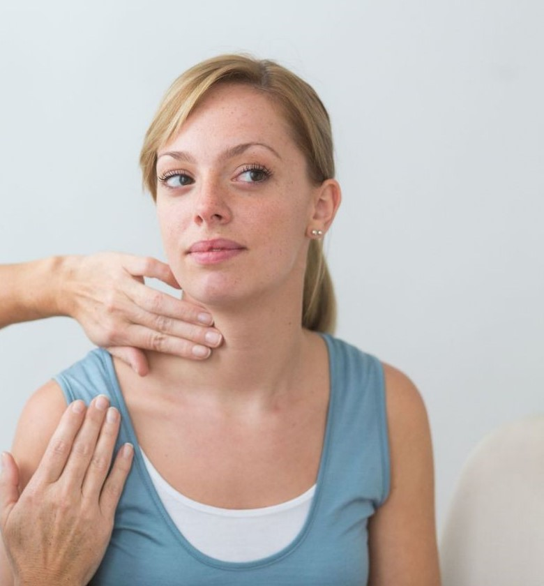
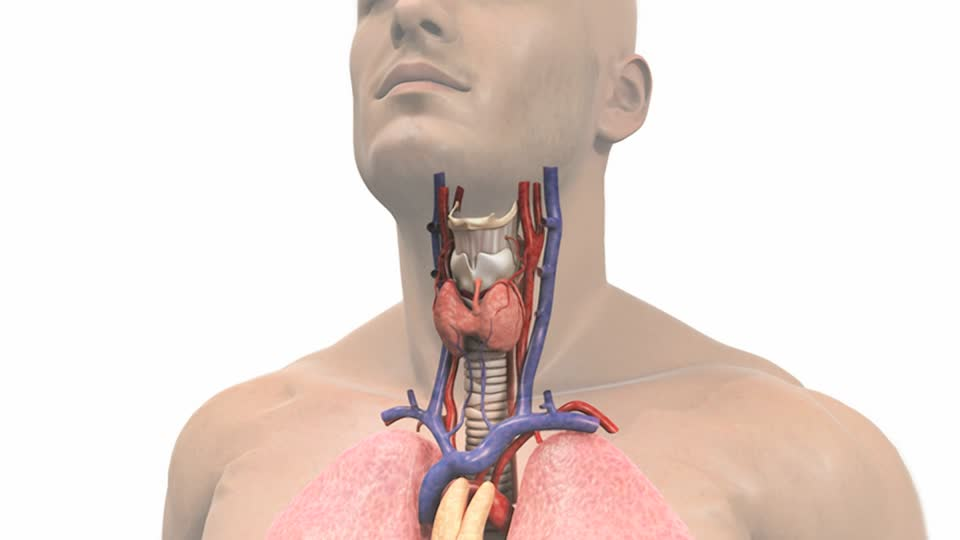
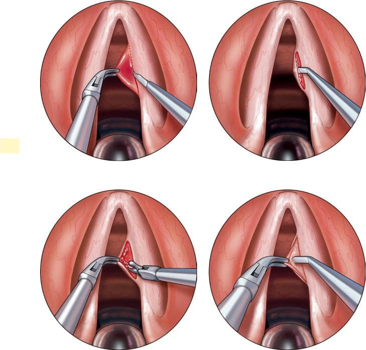
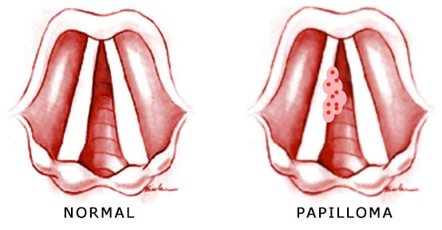
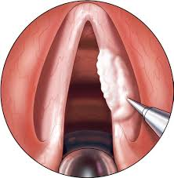
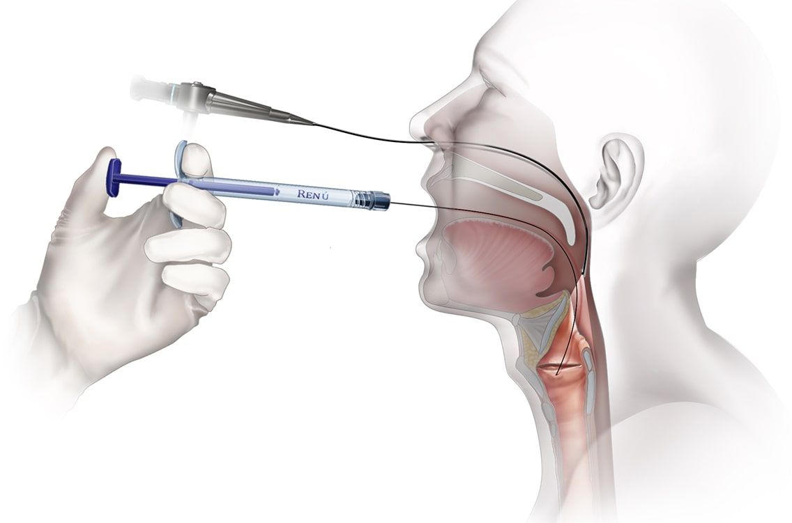
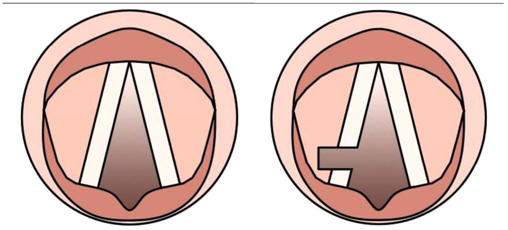

##### LASER Χορδεκτομή

##### Μικρολαρυγγοσκόπηση

##### Φωνομικροχειρουργική

 
 

 
 

##### **Ο Ενδοσκοπικός Έλεγχος**

Η διάγνωση των παθήσεων του Λάρυγγα και των Φωνητικών Χρδών γίνεται μετά από ενδελεχή Ενδοσκοπικό Έλεγχο

Η ενδοσκόπηση της μύτης , του φάρυγγα και του λάρυγγα είναι μια σύγχρονη , ανώδυνη και με μεγάλη διαγνωστική ακρίβεια εξέταση .
Γίνεται στο ιατρείο με άκαμπτο ή εύκαμπτο ενδοσκόπιο συνήθως κατόπιν ήπιας τοπικής αναισθησίας .
Είναι ασφαλής , γρήγορη και καλώς ανεκτή από παιδιά και ενήλικες. Δεν έχει επιπλοκές , διαρκεί μόλις λίγα λεπτά και δεν απαιτείται κάποια προετοιμασία .
Το Εύκαμπτο Ενδοσκόπιο με ειδικούς μικρο-χειρισμούς μπορεί να διεισδύσει και στα πιο δύσκολα σημεία επιτρέποντας τον ενδελεχή έλεγχο του ανώτερου αναπνευστικού συστήματος και να μεταφέρει λεπτομερή εικόνα και βίντεο υψηλής ανάλυσης σε οθόνη Full HD .

Ο ασθενής , εφόσον το επιθυμεί , μπορεί να συμμετέχει στην εξέταση και να παρακολουθεί στην οθόνη την ενδοσκοπική εικόνα .
Έχει τη δυνατότητα να μιλάει κανονικά καθώς ο γιατρός εξηγεί τα ευρήματα και να διαμορφώνει τη δική του άποψη για το αποτέλεσμα της εξέτασης .
Η αναλυτική παρουσίαση των κλινικών ευρημάτων επιτρέπει τη σύγκριση τους προ και μετά τη χειρουργική επέμβαση και βελτιώνει τη σχέση εμπιστοσύνης μεταξύ γιατρού και ασθενή .

**LASER Μικρολαρυγγοσκόπιση**
είναι η χειρουργική επέμβαση κατά την οποία ο χειρουργός έχει πρόσβαση δια του στόματος στο Λάρυγγα και τις Φωνητικές Χορδές. Η επέμβαση γίνεται υπό γενική αναισθησία και εξετάζεται ο Λάρυγγας με Χειρουργικό Μικροσκόπιο ή/και ειδικό άκαμπτο Ενδοσκόπιο.

**Φωνομικροχειρουργική**
είναι το σύνολο των πλέον σύγχρονων και ατραυματικών χειρουργικών τεχνικών που χρησιμοποιούμε προκειμένου να επέμβουμε στις φωνητικές χορδές για την αφαίρεση παθολογικών εξεργασιών.

 
 

 
 

###### Αφαίρεση Καλοήθων Όγκων και Καρκίνου του Λάρυγγα και των Φωνητικών Χορδών

###### LASER Χορδεκτομή

Οι ογκόμορφες βλάβες του λάρυγγα διακρίνονται γενικά σε καλοήθεις, προ-καρκινικές και καρκινικές.

Ανάλογα με την εντόπιση, το μέγεθος και την αλλοίωση στη φωνή που προκαλεί μια καλοήθης βλάβη μπορεί να είναι απαραίτητη η χειρουργική της εξαίρεση. Ειδικά βλάβες που προκαλούν δυσκολία στην αναπνοή λόγω μεγάλου μεγέθους χρήζουν άμεσης αφαίρεσης.

Μη καρκινικές βλάβες όπως πολύποδες, οζίδια, οίδημα Reinke, κοκκιώματα και κύστεις των φωνητικών χορδών που προκαλούν έντονη δυσφωνία, μπορούν να εξαιρεθούν με τη χρήση LASER και εργαλείων Μικροχειρουργικής.

Η πλέον σύγχρονη χειρουργική προσέγγιση για τις βλάβες των φωνητικών χορδών είναι η **Τεχνική Microflap**. Υπό γενική αναισθησία και με τη χρήση ειδικών εργαλείων μικροχειρουργικής και LASER, ο Χειρουργός ανυψώνει το ανώτερο και εξωτερικό τμήμα του βλεννογόνου της φωνητικής χορδής για να έχει πρόσβαση στην υποκείμενη βλάβη, προστατεύοντας από κακοποίηση το φωνητικό άκρο.
 
 

 
 

Οι προ-καρκινικές βλάβες περιλαμβάνουν την υποτροπιάζουσα αναπνευστική θηλωμάτωση απο τον ιό HPV - θηλώματα φωνητικών χορδών - HPV Papilloma - και τη Λευκοπλακία (εντοπισμένη λευκωπής απόχρωσης ελκώδης βλάβη του βλεννογόνου).
 
 

 
 

<u>"Σε όλες τις περιπτώσεις προ-καρκινικής βλάβης ή άλλης βλάβης με ενδιάμεσα χαρακτηριστικά, ο γιατρός θα σας συστήσει την πλήρη χειρουργική εξαίρεση με LASER και βιοψία του ύποπτου όγκου"</u>.

Οι καρκινικές βλάβες του Λάρυγγα εφόσον εντοπιστούν και εξαιρεθούν σε αρχικό στάδιο έχουν εξαιρετικά καλή πρόγνωση. Με την αξιοποίηση του LASER και της μικροχειρουργικής, επιτυγχάνουμε την πλήρη αφαίρεση της βλάβης χωρίς απώλεια της λειτουργικότητας του Λάρυγγα (φώνηση, αναπνοή και ασφαλής κατάποση).

Στα αρχικά στάδια της νόσου η Χειρουργική Επέμβαση είναι αρκετή ως Μονοθεραπεία, ενώ σε πιο εξελιγμένα στάδια συνήθως η χειρουργική εξαίρεση συνδυάζεται με ακτινοθεραπεία και χημειοθεραπεία.

<u>"Η επιτυχής αντιμετώπιση και θεραπεία του καρκίνου του Λάρυγγα εξαρτάται από την έγκαιρη διάγνωση"</u>.
 
 

 
 

###### Ενέσεις Βοτουλινικής (Αλλαντικής) Τοξίνης

- Η έγχυση μικρής ποσότητας Αλλαντικής Τοξίνης στο δέρμα του λαιμού μπορεί να μειώσει το μυϊκό σπασμό και τις μη φυσιολογικές κινήσεις του λάρυγγα σε νευρολογικές διαταραχές που επηρεάζουν τους φωνητικούς μύες του λάρυγγα . Ειδικά στη σπασμωδική δυσφωνία η έγχυση της τοξίνης έχει εντυπωσιακά και άμεσα αποτελέσματα.

- Η έγχυση Βοτουλινικής τοξίνης με Μικρολαρυγγοσκόπηση μπορεί να λύσει τον σπασμό του ανώτερου οισοφάγου - Σπασμός του Κρικοφαρυγγικού Μυός -, που προκαλεί έντονη δυσκολία στην κατάποση. Η επέμβαση γίνεται υπό γενική νάρκωση και βελτιώνει άμεσα το πρόβλημα.

   
   

  

   
   

###### Χειρουργική Αντιμετώπιση Παράλυτης Φωνητικής Χορδής

Η παράλυση της φωνητικής χορδής μπορεί να οφείλεται σε Τραυματισμό, Εγκεφαλικό Επεισόδιο, Όγκο του Λάρυγγα, Όγκο του Πνεύμονα, Σκληρυνση Κατα Πλακας ή να εμφανιστεί σαν μετεγχειρητική επιπλοκή της θυρεοειδεκτομής.

Λόγω της παράλυσης η φωνή συνήθως ακούγεται ασθενική και αδύναμη , ενώ είναι εξαντλητική για τον ασθενή η προσπάθεια να μιλήσει. Η ποιότητα της φωνής συνήθως είναι αντιστρόφως ανάλογη της δυσκολίας στην αναπνοή που έχει ο ασθενής. Αυτό εξαρτάται από τη θέση που έχει παραμείνει καθηλωμένη η παράλυτη χορδή, όσο χειρότερη είναι η φωνή τόσο καλύτερη είναι η αναπνοή του ασθενούς.

Η παράλυση επίσης, μπορεί να προκαλεί εισροφήσεις κατά την κατάποση υγρών ή και στερεών τροφών. Αυτό συμβαίνει γιατί δεν αποφράσσεται πλήρως ο λάρυγγας και στοιχεία της τροφής εισέρχονται στη τραχεία και τους πνεύμονες.

Σκοπός των θεραπευτικών επεμβάσεων είναι η καλύτερη σύγκλιση των χορδών για καλύτερη ποιότητα φώνησης αλλά και η προστασία του αναπνευστικού από εισρόφηση τροφών και υποτροπιάζουσες πνευμονίες.

Οι επεμβάσεις περιλαμβάνουν:

- **Χορδοτομή με χρήση LASER για Παράλυση και των δυο χορδών** 
  Η αμφοτερόπλευρη παράλυση και ακινησία των φωνητικών χορδών σε θέση προσαγωγής είναι μια σοβαρή επιπλοκή της Θυρεοειδεκτομής .
  Εκδηλώνεται με έντονη δύσπνοια και εισπνευστικό συριγμό μετά την επέμβαση , ενώ η φωνή είναι σχεδόν φυσιολογική .
  Η δύσπνοια προκαλείται από την βλάβη των κάτω λαρυγγικών νεύρων που προκαλεί απόφραξη του αεραγωγού .
  Όταν η βλάβη είναι μόνιμη , η θεραπεία είναι χειρουργική και περιλαμβάνει τη διεύρυνση του αεραγωγού στο επίπεδο των φωνητικών χορδών με τη χρήση LASER .

   
   

  

   
   

* **Έγχυση λίπους ή κολλαγόνου** 
  Η έγχυση λίπους ή συνθετικού κολλαγόνου στη παράλυτη φωνητική χορδή μπορεί να γίνει μέσω του στόματος (Μικρολαρυγγοσκόπηση) ή εξωτερικά δια του δέρματος. Με την επέμβαση επιτυγχάνουμε την ελάττωση του γλωττιδικού κενού.
  Το υλικό αυξάνει τον όγκο της παράλυτης φωνητικής χορδής και ελαττώνει τον κενό χώρο με την υγιή πλευρά, επιτρέποντάς μια πιο ομαλή δόνηση των χορδών.

* **Θυρεοπλαστική** 
  Είναι μια επέμβαση κατά την οποία υπό τοπική αναισθησία δημιουργείται ένα μικρό άνοιγμα στον χόνδρο του λάρυγγα. Ο χειρουργός εισάγει ένα εμφύτευμα μέσα από το άνοιγμα εντός της παράλυτης φωνητικής χορδής και την σπρώχνει ώστε να πλησιάσει την υγιή φωνητική χορδή. Η επέμβαση είναι αποτελεσματική άμεσα στη ποιότητα της φωνής.

  
   

 
 

###### **Κωνσταντίνος Χ. Μπουκόνης**

###### **Χειρουργός Ωτορινολαρυγγολόγος Περιστέρι**

###### **Επιστημονικός Συνεργάτης – Χειρουργός ΩΡΛ Νοσοκομείο "ΥΓΕΙΑ"**

###### **_Για περισσότερες πληροφορίες και ραντεβού με το γιατρό καλέστε [2130 575052](tel:2130575052 '2130 575052')_**
