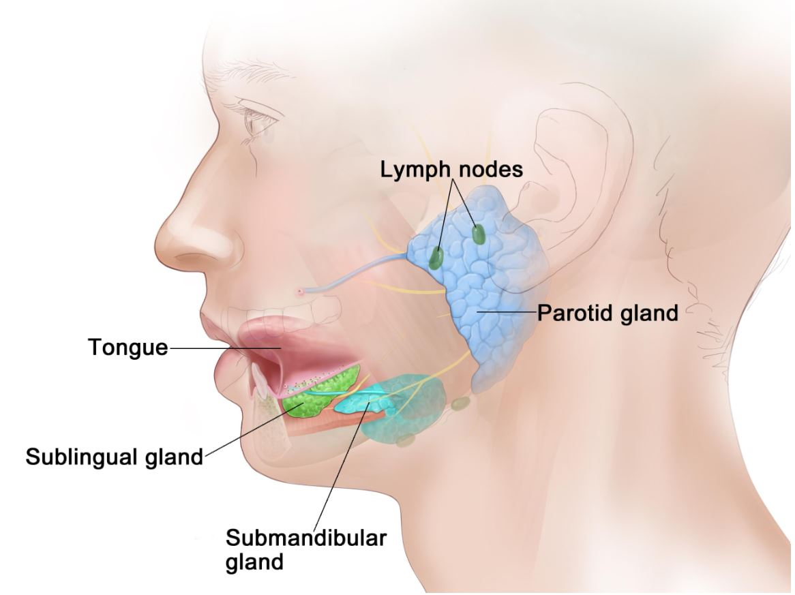
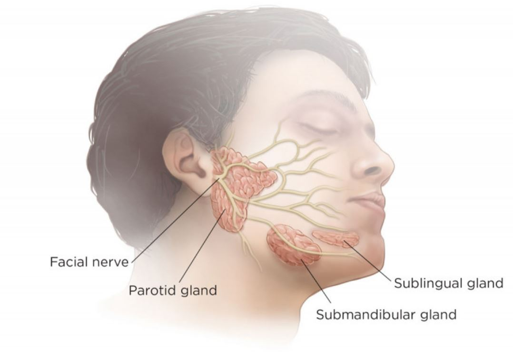
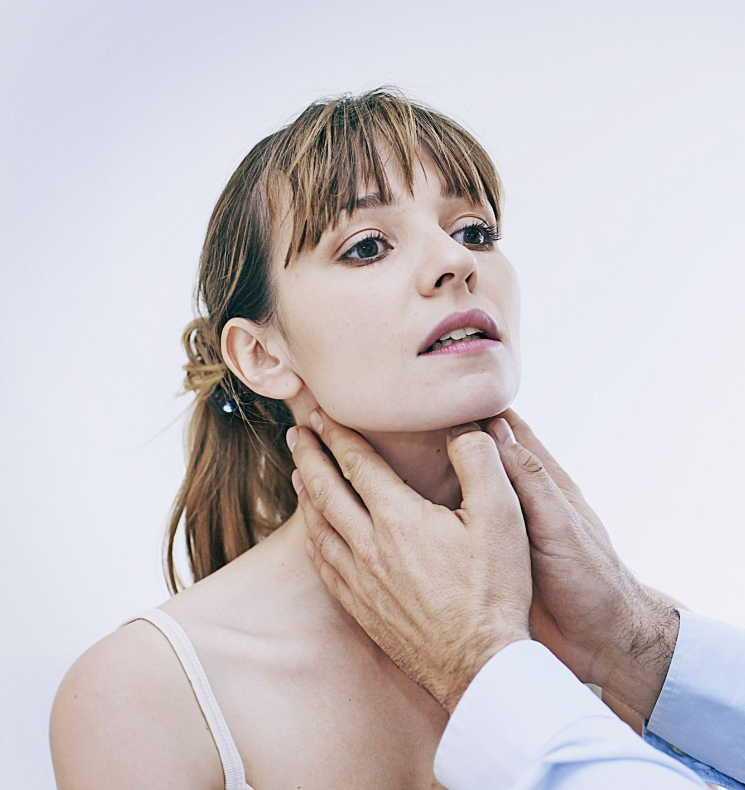
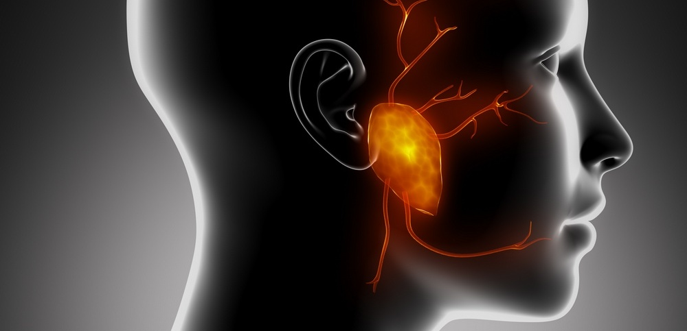
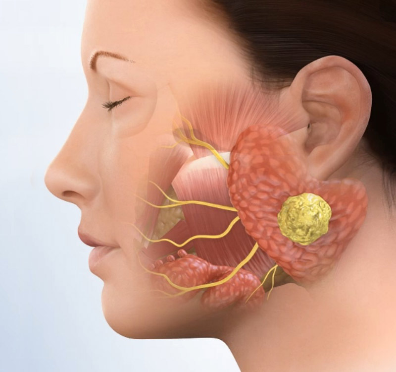
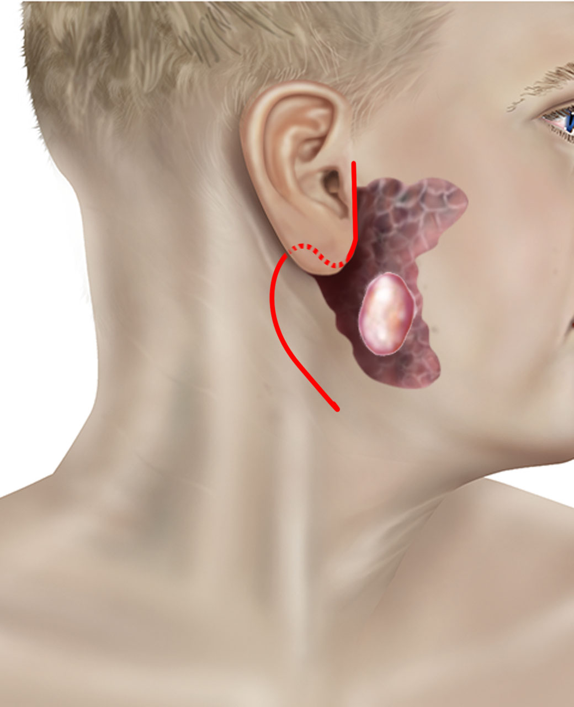

 
 

 
 

Οι σιελογόνοι αδένες διακρίνονται γενικά σε Μείζονες και Ελάσσονες.

Υπάρχουν τρία ζεύγη **Μείζονων σιελογόνων αδένων: Οι Παρωτίδες, οι Υπογνάθιοι αδένες και οι Υπογλώσσιοι αδένες**.
 
 

 
 

Οι **Ελάσσονες σιελογόνοι αδένες** είναι αρκετές εκατοντάδες και βρίσκονται διάσπαρτοι στο βλεννογόνο που καλύπτει τη στοματική κοιλότητα και το φάρυγγα.

Οι σιελογόνες αδένες εκκρίνουν καθημερινά περίπου 1 λίτρο σάλιο. Το σάλιο είναι εξαιρετικά σημαντικό για την υγιεινή των δοντιών και της στοματικής κοιλότητας, την πέψη και την άμυνα του οργανισμού.

Η χειρουργική αντιμετώπιση των παθήσεων των Σιελογόνων Αδένων παρουσιάζει ιδιαιτερότητες και είναι πάντα απαιτητική.
Πολύ σημαντικά νεύρα και μεγάλα αγγεία είναι σε άμεση επαφή ή διαπερνούν τους αδένες και επιβάλλεται να εντοπιστούν και να προστατευτούν κατά τη διάρκεια της επέμβασης.
 
 

 
 

##### Σιελαδενίτιδα

Σιελαδενίτιδα είναι η λοίμωξη των σιελογόνων αδένων και προκαλείται συνήθως από ιούς ή βακτήρια. Συχνότερα επηρεάζεται η παρωτίτιδα και ο υπογνάθιος αδένας.
Εκδηλώνεται με έντονο πόνο, πυρετό, ερυθρότητα και εντοπισμένη διόγκωση του αδένα.

Συνήθως επηρεάζει ηλικιωμένους και ασθενείς με χρόνιες παθήσεις, ειδικά εκείνους με ξηροστομία και αφυδάτωση. Υψηλού κινδύνου είναι άτομα με Σακχαρώδη Διαβήτη, Νεφρική Ανεπάρκεια και οι Ανοσοκατεσταλμένοι.
Η σιελαδενίτιδα μπορεί να εμφανιστεί σε οποιαδήποτε ηλικία, συμπεριλαμβανομένων των παιδιών και των νεογνών. Η απόφραξη του εκφορητικού πόρου του αδένα (από όγκο ή λίθο) ή η μείωση της ροής του σάλιου (από αφυδάτωση) προκαλεί στάση του σάλιου εντός του αδένα και επιτρέπει την επιμόλυνση από μικρόβια.

Η διάγνωση τίθεται συνήθως με την κλινική εξέταση, ωστόσο περαιτέρω διερεύνηση με Υπέρηχο , Αξονική ή Μαγνητική Τομογραφία μπορεί να απαιτηθεί εάν υπάρχει υποψία αποστήματος , όγκου ή λιθίασης (πέτρα εντός του αδένα).

Η θεραπεία περιλαμβάνει χορήγηση τη αντιβιοτικών απο του στόματος, αύξηση της πρόσληψης υγρών και καλή στοματική υγιεινή.
Στις περιπτώσεις που η φλεγμονή έχει ξεπεράσει τα όρια του αδένα μπορεί εύκολα να εξελιχθεί σε απόστημα στον τράχηλο, κατάσταση που απαιτεί εισαγωγή σε νοσοκομείο και επείγουσα χειρουργική επέμβαση.
 
 

 
 

##### Σιελολιθίαση

Η σιελοθίαση είναι η κύρια αιτία διάχυτης διόγκωσης της παρωτίδας και του υπογνάθιου αδένα.
Είναι μια σχετικά συχνή πάθηση κατά την οποία παρατηρείται η δημιουργία λίθων είτε μέσα στους αδένες, είτε μέσα στους εκφορητικούς πόρους. Οι λίθοι αυτοί αποτελούνται από ασβέστιο και οργανικά συστατικά.

Η επίπτωσή της φαίνεται να είναι μεταξύ 1 με 2 περιστατικά ανά 15.000 - 30.000 πληθυσμού κατ έτος. Ο υπογνάθιος σιελογόνος αδένας επηρεάζεται συχνότερα ( 80-90% των περιπτώσεων ) .
Αυτό κυρίως οφείλεται στο αυξημένο ιξώδες του σάλιου που παράγει ο υπογνάθιος αδένας. Η σιελιθίαση είναι μια ασθένεια των ενηλίκων, εμφανίζεται τυπικά στις ηλικίες μεταξύ 30 και 60 ετών και συχνότερα στους άνδρες.

Η λιθίαση προκαλεί απόφραξη και μηχανική παρεμπόδιση της εκροής του σάλιου στον εκφορητικό πόρο.
Ο ασθενής συνήθως αναφέρει επαναλαμβανόμενη διόγκωση κατά τη διάρκεια των γευμάτων, τα οποία μπορεί να επιμείνουν παροδικά ή να περιπλέκονται από βακτηριακές λοιμώξεις (Σιελαδενίτιδα).

Η διάγνωση συνήθως γίνεται βάσει του τυπικού ιστορικού και της κλινικής εξέτασης .
Η επιβεβαίωση θα γίνει με Υπερηχογράφημα του πάσχοντος αδένα, που αναδεικνύει την ακριβή θέση του λίθου. Σπανιότερα θα απαιτηθεί Αξονική Τομογραφία ή Σιελογραφία .

Τα επαναλαμβανόμενα επεισόδια απόφραξης με ανάπτυξη πυώδους σιελαδενίτιδας αντιμετωπίζονται με χειρουργική επέμβαση και αφαίρεση του πάσχοντος αδένα .
Στις περιπτώσεις που ο λίθος εντοπίζεται στον εκφορητικό πόρο μπορεί εύκολα να αφαιρεθεί στο ιατρείο με τοπική αναισθησία .
 
 

 
 

##### Όγκοι Σιελογόνων Αδένων

Οι όγκοι των σιελογόνων αδένων αποτελούν το 3% των όγκων της κεφαλής και του τραχήλου και το 80% εντοπίζεται στην παρωτίδα. Οι όγκοι της παρωτίδας εμφανίζονται συχνότερα στον επιπολής λοβό ( επιφανειακά ) σε ποσοστό έως 80% και είναι συχνότερα καλοήθεις σε ποσοστό περίπου 80%.

Οι όγκοι του υπογνάθιου σιελογόνου αδένα είναι καλοήθεις σε ποσοστό 50 - 60%.
Οι όγκοι των Υπογλώσσιων αδένων και των διάσπαρτων Ελασσόνων αδένων είναι συνήθως κακοήθεις.

Συνήθως, οι καλοήθεις όγκοι εμφανίζονται σαν μια μαλακή, κινητή και ανώδυνη μάζα στον τράχηλο ή το πρόσωπο.
Γενικά αναπτύσσονται βραδέως, ωστόσο συστήνεται η αφαίρεση τους καθώς προκαλούν δυσμορφία στο πρόσωπο και με την πάροδο του χρόνου υπάρχει μικρή πιθανότητα εξαλλαγής σε καρκίνο.
Η απότομη αύξηση του μεγέθους του όγκου, ο πόνος τοπικά, η παράλυση του προσωπικού νεύρου και η εξέλκωση του δέρματος αποτελούν σοβαρές ενδείξεις κακοήθειας.
 
 

 
 

##### Ο Ενδοσκοπικός Έλεγχος

Η ενδοσκόπηση της μύτης, του φάρυγγα και του λάρυγγα είναι μια σύγχρονη, ανώδυνη και με μεγάλη διαγνωστική ακρίβεια εξέταση.
Γίνεται στο ιατρείο με άκαμπτο ή εύκαμπτο ενδοσκόπιο συνήθως κατόπιν ήπιας τοπικής αναισθησίας.
Είναι ασφαλής, γρήγορη και καλώς ανεκτή από παιδιά και ενήλικες. Δεν έχει επιπλοκές, διαρκεί μόλις λίγα λεπτά και δεν απαιτείται κάποια προετοιμασία.
Το Εύκαμπτο Ενδοσκόπιο με ειδικούς μικρο-χειρισμούς μπορεί να διεισδύσει και στα πιο δύσκολα σημεία επιτρέποντας τον ενδελεχή έλεγχο του ανώτερου αναπνευστικού συστήματος και να μεταφέρει λεπτομερή εικόνα και βίντεο υψηλής ανάλυσης σε οθόνη Full HD.

Ο ασθενής, εφόσον το επιθυμεί, μπορεί να συμμετέχει στην εξέταση και να παρακολουθεί στην οθόνη την ενδοσκοπική εικόνα.
Έχει τη δυνατότητα να μιλάει κανονικά καθώς ο γιατρός εξηγεί τα ευρήματα και να διαμορφώνει τη δική του άποψη για το αποτέλεσμα της εξέτασης.
Η αναλυτική παρουσίαση των κλινικών ευρημάτων επιτρέπει τη σύγκριση τους προ και μετά τη χειρουργική επέμβαση και βελτιώνει τη σχέση εμπιστοσύνης μεταξύ γιατρού και ασθενή.

Ο συχνότερος όγκος είναι το **Πλειόμορφο Αδένωμα** ενώ το **Θηλώδες Κυσταδενολέμφωμα (όγκος Warthin)** είναι ο δεύτερος σε συχνότητα.
Το **Βλεννοεπιδερμοειδές Καρκίνωμα** είναι ο συχνότερος κακοήθης όγκος.

Ο τυπικός προεγχειρητικός έλεγχος περιλαμβάνει **Υπερηχογράφημα και βιοψία δια λεπτής βελόνης ( FΝΑ Biopsy ), Αξονική Τομογραφία και Μαγνητική Τομογραφία**.
 
 

 
 

##### Χειρουργική της Παρωτίδας

##### Επιπολής Παρωτιδεκτομή - Ολική Παρωτιδεκτομή

Παρωτιδεκτομή είναι η χειρουργική επέμβαση αφαίρεσης μέρους ή όλης της παρωτίδας.

Όταν ο όγκος περιορίζεται στον επιφανειακό λοβό του παρωτιδικού αδένα η επέμβαση εκλογής είναι η **Επιπολής Παρωτιδεκτομή**.
Μαζί με τον όγκο αφαιρείται το επιφανειακό τμήμα της παρωτίδας , όπως αυτό ορίζεται ανατομικά από τους κλάδους του προσωπικού νεύρου που διαπερνούν τον αδένα.
Όταν ο όγκος επεκτείνεται ή εντοπίζεται στον εν τω βάθει λοβό του αδένα τότε γίνεται **Ολική Παρωτιδεκτομή**. Στη περίπτωση αυτή αφαιρείται τόσο το επιφανειακό όσο και το εν τω βάθει τμήμα του αδένα.

Η τομή αρχίζει από το μπροστινό μέρος του αυτιού και συνεχίζει προς προς τα κάτω στον λαιμό. Είναι παρόμοια με τη τομή που χρησιμοποιούμε στην αισθητική χειρουργική προσώπου (Face Lift).
Η επέμβαση γίνεται με γενική νάρκωση, η παραμονή στο νοσοκομείο είναι συνήθως για 24 ώρες και συνίσταται αναρρωτική άδεια 2 εβδομάδων.

Η αφαίρεση ενός όγκου της παρωτίδας περιλαμβάνει την αναγνώριση και προστασία του Προσωπικού Νεύρου . Δεν είναι υπερβολή να αναφέρουμε ότι **η Παρωτιδεκτομή είναι ουσιαστικά μικροχειρουργική των κλάδων του προσωπικού νεύρου** που διατρέχει τον αδένα και είναι υπεύθυνο για τις κινήσεις σχεδόν όλων των μυών του προσώπου.
Η πλήρης απομάκρυνση του όγκου, σε συνδυασμό με τη διατήρηση όλων των κλάδων του προσωπικού νεύρου , αποτελεί προτεραιότητα του χειρουργού.

**_<u>"Στην χειρουργική της παρωτίδας επιβάλλεται η άριστη ορατότητα του χειρουργικού πεδίου και η οπτική αναγνώριση ακόμα και των πλέον μικρών κλάδων του προσωπικού νεύρου"</u>_**

Για την προστασία του προσωπικού νεύρου επιστρατεύουμε την πλέον προηγμένη τεχνολογία που μας επιτρέπει να το αναγνωρίζουμε και να παρακολουθούμε τη λειτουργία του κατά τη διάρκεια της χειρουργικής επέμβασης.
Η **Διεγχειρητική Νευροπαρακολούθηση ( Intra-Operative Nerve Monitoring )** και η χρήση **Νευροδιεγέρτη ( Facial Nerve Electro-Stimulator )** εξασφαλίζει την ακεραιότητα όλων των κλάδων του νεύρου ακόμα και σε επεμβάσεις όπου ευμεγέθεις μάζες διαταράσσουν την φυσιολογική ανατομία.
Η αξιοποίηση της σύγχρονης τεχνολογίας σε συνδυασμό με την εμπειρία και εκπαίδευση του χειρουργού επιτρέπει την αφαίρεση μιας καλοήθους βλάβης χωρίς μετεγχειρητικές επιπλοκές.

Η Παρωτιδεκτομή θεωρείται μεγάλη επέμβαση και ο χειρουργός θα πρέπει με σαφήνεια να εξηγήσει στον ασθενή όλες τις πιθανές επιπλοκές, τη μετεγχειρητική πορεία και τους χρόνους ανάρρωσης.
 
 

 
 

##### Χειρουργική Αφαίρεση Υπογναθίου Σιελογόνου Αδένα

Η αφαίρεση του Υπογναθίου Αδένα έχει ένδειξη σε Χρόνια Υποτροπιάζουσα Σιελαδενίτιδα, σε Σιελολιθίαση και σε περίπτωση Όγκου.

Ο προεγχειρητικός έλεγχος περιλαμβάνει **Υπερηχογράφημα και βιοψία δια λεπτής βελόνης ( FΝΑ Biopsy ) , Αξονική Τομογραφία** και κατά περίπτωση **Μαγνητική Τομογραφία**, και αναδεικνύει την ακριβή φύση και εντόπιση της βλάβης.
Η επέμβαση γίνεται με γενική νάρκωση και διαρκεί 45 λεπτά. Η πρόσβαση στον αδένα γίνεται με εξωτερική τομή στο λαιμό , η οποία “κρύβεται” μέσα σε μια ρυτίδα του δέρματος, λίγο κάτω και πλάγια από το σαγόνι.
Ο ασθενής μένει στο νοσοκομείο για 24 ώρες και χορηγείται αναρρωτική άδεια 2 εβδομάδων.

Στη χειρουργική του Υπογναθίου Αδένα αδένα επιβάλλεται η παρακολούθηση και προστασία του Επιχείλιου Κλάδου του Προσωπικού Νεύρου με **Διεγχειρητική Νευροπαρακολούθηση ( Intra-Operative Nerve Monitoring )** και χρήση **Νευροδιεγέρτη ( Nerve Electro-Stimulator )**, όπως περιγράφεται παραπάνω στη χειρουργική της παρωτίδας.

Όπως σε κάθε χειρουργική επέμβαση, ο χειρουργός θα πρέπει με σαφήνεια να εξηγήσει στον ασθενή όλες τις πιθανές επιπλοκές, τη μετεγχειρητική πορεία και τους χρόνους ανάρρωσης.
 
 

 
 

###### **Κωνσταντίνος Χ. Μπουκόνης**

###### **Χειρουργός Ωτορινολαρυγγολόγος Περιστέρι**

###### **Επιστημονικός Συνεργάτης – Χειρουργός ΩΡΛ Νοσοκομείο "ΥΓΕΙΑ"**

###### **_Για περισσότερες πληροφορίες και ραντεβού με το γιατρό καλέστε [2130 575052](tel:2130575052 '2130 575052')_**
