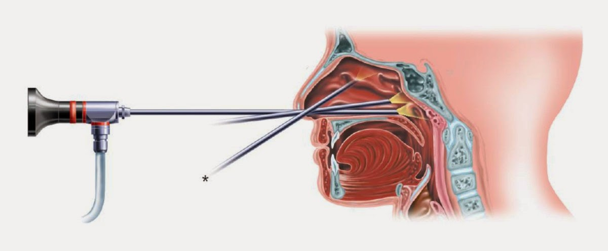

##### Ενδοσκοπική Διαφραγματοπλαστική (Endoscopic Septoplasty)
##### Ενδοσκοπική Κογχοπλαστική (Endoscopic Turbinoplasty)
 
 

 
 

###### Τί είναι το Ρινικό Διάφραγμα
Το ρινικό διάφραγμα είναι ένα οστεο-χόνδρινο πέταλο στο εσωτερικό της μύτης, το οποίο τη διαιρεί σε αριστερή και δεξιά ρινική κοιλότητα. Το ευθύ ρινικό διάφραγμα εξασφαλίζει την ομαλή ροή του αέρα και σταθεροποιεί τον σκελετό της ρινικής πυραμίδας στη μέση γραμμή του προσώπου.

 
 

 
 

###### Τί είναι το Σκολιωτικό Διάφραγμα
Το ρινικό διάφραγμα μπορεί να είναι κυρτό εκ γενετής (από κληρονομικά αίτια) ή αποτέλεσμα κάκωσης της μύτης (από κάταγμα ρινός). Το σκολιωτικό διάφραγμα προκαλεί μερική ή και πλήρη απόφραξη του αεραγωγού και στροβιλώδη ροή του αέρα.

Ο ασθενής με ρινική απόφραξη θα πρέπει να εκτιμηθεί με ενδοσκόπηση του εσωτερικού της μύτης στο ιατρείο. Ανάλογα με τον τύπο της απόκλισης (Τύπου C, Τύπου S, Απεξαρθρωμένο, Οστέινη Άκανθα) θα σχεδιαστεί και η χειρουργική επέμβαση. Οι ασθενείς με στραβό διάφραγμα ενδέχεται να έχουν απόκλιση και συνολικά της μύτης, στις περιπτώσεις αυτές συστήνεται ανοιχτή ρινοπλαστική και διόρθωση ταυτόχρονα και των δύο προβλημάτων.

 
 

 
 

###### Τα προβλήματα που προκαλεί το Σκολιωτικό Διάφραγμα
Η απόφραξη της μύτης προκαλεί δυσχέρεια της ρινικής αναπνοής, η οποία είναι μόνιμη και μπορεί να επιδεινώνεται από ένα ήπιο κρυολόγημα ή εξάρσεις αλλεργικής ρινίτιδας.

Η βουλωμένη μύτη αναγκάζει τον ασθενή σε αναπνέει από το στόμα, ιδιαίτερα στον ύπνο. Η Στοματική Αναπνοή προκαλεί ξηρότητα του στοματοφάρυγγα, υποτροπιάζουσα φαρυγγίτιδα και λαρυγγίτιδα.

Λόγω της κυρτότητας του διαφράγματος η ροή του αέρα εντός της μύτης είναι στροβιλώδης. Το φαινόμενο αυτό είναι υπεύθυνο για την εμφάνιση ρινίτιδας, ρινορραγίας και διόγκωσης των κογχών λόγω οιδήματος "εκ τραύματος" του βλεννογόνου. Επιπλέον, κατά την κλινική εξέταση συχνά εντοπίζονται κοκκιώματα και δύσοσμες κρούστες.

Η δυσκολία στην αναπνοή κατά τον ύπνο εκδηλώνεται με έντονο ροχαλητό ή/και αποφρακτική άπνοια στον ύπνο. Ο ασθενής εμφανίζει κούραση και έντονη υπνηλία κατά τη διάρκεια της ημέρας.

Ειδικά σε αθλητές η συνεχής αναπνοή απ’ το στόμα μειώνει την απόδοση και την αντοχή στην άσκηση.

Το στραβό διάφραγμα συνδέεται επίσης με Χρόνια Ρινοκολπίτιδα & Ιγμορίτιδα και εμμένουσα Κεφαλαλγία, ενώ όχι σπάνια προκαλεί πόνο στα αυτιά και αίσθημα απόφραξης, λόγω δυσλειτουργίας της ευσταχιανής σάλπιγγας.

 
 

 
 

###### Πώς θεραπεύεται το Σκολιό Διάφραγμα
Η θεραπεία είναι χειρουργική και έχει στόχο να ανακατασκευάσει ένα ευθύ διάφραγμα και να αποκαταστήσει τη φυσιολογική ροή του αέρα.

Μετά από ενδελεχή έλεγχο με Ενδοσκόπηση της μύτης και εφόσον αποκλειστούν άλλα αίτια ρινικής απόφραξης (αλλεργία, πολύποδες κα), ο ασθενής ενημερώνεται για το πρόβλημα και οργανώνεται ένα εξατομικευμένο χειρουργικό πλάνο.

Για τη χειρουργική του διαφράγματος υπάρχουν διάφορες τεχνικές, λιγότερο ή περισσότερο αξιόπιστες και αποτελεσματικές.

Στη σύγχρονη εποχή η επέμβαση επιλογής είναι η **Ενδοσκοπική Διαφραγματοπλαστική (Endoscopic Septoplasty)**, η οποία πραγματοποιείται με ειδικά εργαλεία μικροχειρουργικής βάσει των αρχών της ενδοσκοπικής και ελάχιστα επεμβατικής χειρουργικής.

 
 

 
 

###### Πλεονεκτήματα της Ενδοσκοπικής Πλαστικής του Διαφράγματος
* Άριστη ορατότητα και πρόσβαση στα δύσκολα σημεία εντός της μύτης. 

* Η επέμβαση έχει **άριστα αποτελέσματα**, δεν διαφεύγουν "κρυμμένες" οπίσθιες βλάβες - αποκλίσεις.

* **Ελάχιστα επεμβατική** τεχνική με γρήγορη ανάρρωση και επούλωση, αφού οι τομές περιορίζονται στο σημείο της κυρτότητας.

* Ο ρινικός χόνδρος επανατοποθετείται και σταθεροποιείται με ραφές σε ευθεία θέση.

* **Μικρότερη πιθανότητα επιπλοκών** (Διάτρηση, Αιμορραγία, Αιμάτωμα), λόγω του ελάχιστου τραύματος των φυσιολογικών ιστών και της τοποθέτησης ραμμάτων.

* Το χειρουργείο είναι **Ανώδυνο** και διαρκεί μικρότερο χρονικό διάστημα.

* **Δεν απαιτείται ρινικός επιπωματισμός**.

* Ο ασθενής **επιστρέφει στο σπίτι του την ίδια ημέρα** μετά το χειρουργείο.

* Επέμβαση εκλογής σε περιπτώσεις δεύτερης επέμβασης (revision septorhinoplasty), μετά από αποτυχημένο χειρουργείο διαφράγματος, όπου απαιτείται η ανακατασκευή του σκελετού μύτης.

 
 

 
 

###### Υπερτροφία των Ρινικών Κογχών

Οι Ρινικές Κόγχες βρίσκονται στα πλάγια εσωτερικά τοιχώματα της μύτης και διακρίνονται σε κάτω, μέση και άνω ρινική κόγχη. Οι κάτω ρινικές κόγχες εμφανίζουν πολύ συχνά υπερτροφία και διόγκωση λόγω του στυτικού ιστού που περιέχουν και της πλούσιας αιμάτωσης. Χαρακτηριστική είναι η διόγκωση σε περιπτώσεις ιογενούς ή αλλεργικής ρινίτιδας. Πιο σπάνια διογκώνονται λόγω ορμονικών μεταβολών (Ρινίτιδα της Κύησης) ή από κατάχρηση αποσυμφορητικών (Φαρμακευτική Ρινίτιδα).

Η μύτη καθαρίζει, υγραίνει και θερμαίνει τον αέρα που εισπνέουμε και ο βλεννογόνος που καλύπτει τις κόγχες έχει σπουδαίο ρόλο στη λειτουργία αυτή της μύτης ως "κλιματιστικού". Για το λόγο αυτό κατά την διάρκεια χειρουργικών επεμβάσεων θα πρέπει να παραμένει ανέπαφος.
 
 

###### Ενδοσκοπική Κογχοπλαστική (Endoscopic Turbinoplasty)

Η Ενδοσκοπική Κογχοπλαστική έχει αντικαταστήσει στις μέρες μας τον καυτηριασμό των ρινικών κογχών και τις ακρωτηριαστηκές επεμβάσεις κογχοτομής του παρελθόντος. Στόχος της επέμβασης είναι η συρρίκνωση - των κατά τα άλλα χρήσιμων αυτών ανατομικών δομών - αφήνοντας ανέπαφο τον βλεννογόνο που τις καλύπτει εξωτερικά.

Υπό την καθοδήγηση του ενδοσκοπίου αφαιρείται το μικρό οστό που στηρίζει την κόγχη με ειδικά εργαλεία μικροχειρουργικής και μαζί ο υποβλεννογόνιος (στυτικός) ιστός με ειδικό μηχάνημα Shaver.

Με την τεχνική αυτή προλαμβάνεται η υποτροπή της διόγκωσης των κογχών όπως συμβαίνει μετά από τον καυτηριασμό και δεν αφαιρείται βλεννογόνος (πρόληψη ξηράς ρινίτιδας με κρούστες).

 
 

 
 

###### Ενδοσκοπική διάνοιξη της φυσαλιδώδους μέσης ρινικής κόγχης

Η επέμβαση έχει στόχο τη διεύρυνση του ρινικού αεραγωγού όταν αυτός αποφράσσεται από μια ευμεγέθη πνευματώδη μέση ρινική κόγχη . Υπό την καθοδήγηση του ενδοσκοπίου και με ειδικά εργαλεία μικροχειρουργικής αφαιρείται το έξω πέταλο της ανατομικής αυτής παραλλαγής και επιτυγχάνουμε τη διάνοιξη της ρινικής κοιλότητας.
 
 

######  Μετά το Χειρουργείο
* Η Ενδοσκοπική Διαφραγματοπλαστική & Κογχοπλαστική είναι γενικά **Ανώδυνες επεμβάσεις**.
* Ο ασθενής δεν είναι απαραίτητο να διανυκτερεύσει στο Νοσοκομείο και συνήθως χρειάζεται να παραμείνει μόνο για μερικές ώρες μετεγχειρητικά.
* Το εσωτερικό της μύτης ενδέχεται να πωματιστεί με βαζελινούχο γάζα, η οποία αφαιρείται από το γιατρό μετά από διάστημα 3 ωρών.
* Ρινικές πλύσεις και αντιβιοτικά είναι η συνήθης φαρμακευτική αγωγή.
* Όλα τα ράμματα είναι εσωτερικά και απορροφήσιμα, και δεν υπάρχει καμία τομή ή μελανιές εξωτερικά της μύτης.
* Μετά το χειρουργείο θα έχετε ραντεβού με το γιατρό στο Ιατρείο για την παρακολούθηση της επούλωσης. Ο καθαρισμός από βλέννα και κρούστες είναι εξαιρετικής σημασίας για την αποφυγή μόλυνσης και σχηματισμού συμφύσεων.
* Η επιστροφή στην καθημερινότητά γίνεται μετά από 7 ημέρες.
* Η αναρρωτική άδεια μετά την επέμβαση είναι συνήθως 2 εβδομάδες. Αν η εργασία σας περιλαμβάνει έκθεση σε σκόνη ή έντονη σωματική κόπωση, ο γιατρός θα σας συστήσει να εξαντλήσετε την άδεια.
* Για διάστημα 2 έως 3 εβδομάδων ο ασθενής θα πρέπει να απέχει από έντονες δραστηριότητες και γυμναστική.

***Για περισσότερες πληροφορίες και ραντεβού με το γιατρό καλέστε [2130 575052](tel:2130575052 "2130 575052")***