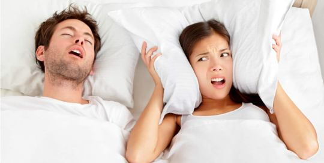
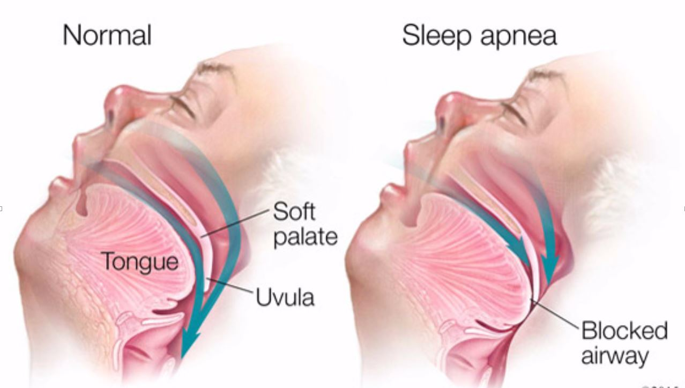
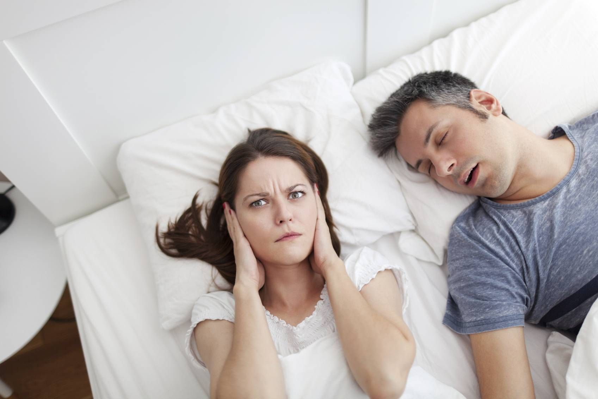
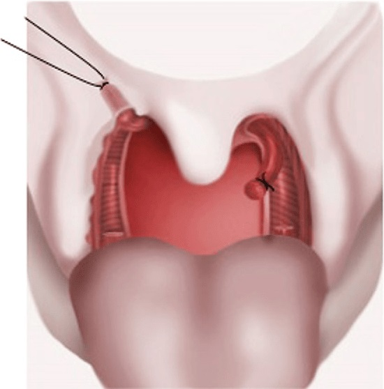
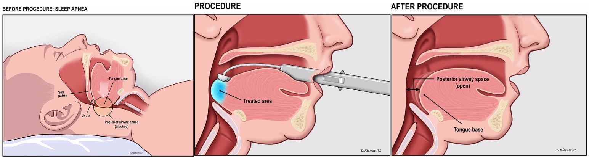
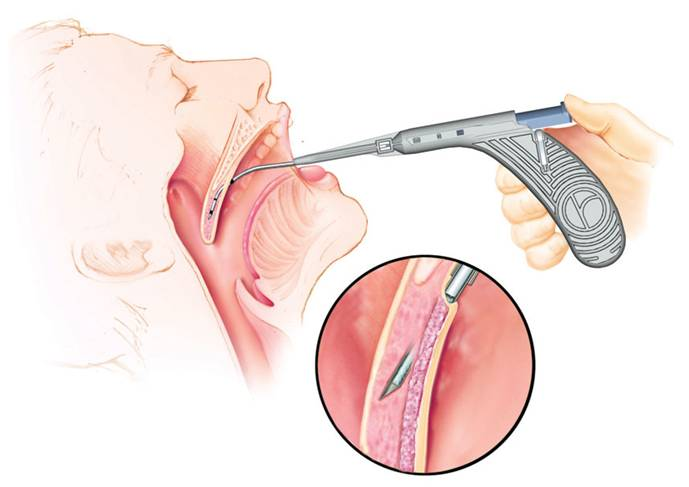

 
 

 
 

###### Το πρόβλημα του ροχαλητού
Έχει υπολογιστεί από έρευνες πως έως και το 50% των ενηλίκων ροχαλίζουν τουλάχιστον περιστασιακά , ενώ το 25% σε μόνιμη βάση. Το πρόβλημα είναι συχνότερο στους άνδρες και τα υπέρβαρα άτομα και συνήθως επιδεινώνεται με την ηλικία.

Το ροχαλητό μπορεί να αποτελεί ένδειξη σοβαρής παρεμπόδισης της αναπνοής κατά τον ύπνο και ως σύμπτωμα δεν θα πρέπει να αγνοείται. Το ροχαλητό μπορεί να είναι η μόνη ένδειξη Αποφρακτικής Άπνοιας στον ύπνο. Ο Ωτορινολαρυγγολόγος με εξειδίκευση στη διερεύνηση και θεραπεία ρογχοπαθειών και άπνοιας μπορεί να σας βοηθήσει εντοπίζοντας την ανατομική πηγή του ροχαλητού και να σας προσφέρει επιλογές αντιμετώπισης.
 
 

###### Τι προκαλεί το ροχαλητό;
Ο θορυβώδης ήχος του ροχαλητού δημιουργείται από τις δονήσεις των ιστών που προκαλούνται από την παρεμπόδιση στην ελεύθερη ροή του αέρα κατά την αναπνοή. Οι περιοχές όπου συχνότερα εντοπίζεται το πρόβλημα είναι η μύτη, η μαλθακή υπερώα, η βάση της γλώσσας και σπανιότερα η επιγλωττίδα.

Έντονο ροχαλητό εμφανίζουν επίσης ασθενείς με απόφραξη ή παρεμπόδιση στην ελεύθερη ροή του αέρα στο Σύνδρομο Αντίστασης των Αεροφόρων Οδών.
 
 

###### Αίτια

* Ρινική Απόφραξη (όγκοι και πολύποδες της μύτης, σκολίωση του διαφράγματος, υπερτροφία των ρινικών κογχών και αδενοειδών).

* Χαμηλός μυϊκός τόνος:
    * Οι μύες της γλώσσας χαλαρώνουν κατά την διάρκεια του ύπνου με αποτέλεσμα η    γλώσσα να πέφτει προς τα πίσω αποφράσσοντας τον αεραγωγό.
    * Η χαλάρωση των μυών του φάρυγγα μπορεί να προκαλέσει σύμπτωση των πλάγιων     τοιχωμάτων μέσα στον αεραγωγό, όταν κατά την εισπνοή δημιουργείται αρνητική   πίεση.
    * Κάποια χαλάρωση είναι φυσιολογικό να συμβαίνει κατά τη διάρκεια του βαθύ      ύπνου, ωστόσο μπορεί να επιδεινωθεί από το αλκοόλ, τα υπνωτικά και            ηρεμιστικά χάπια αλλά και από τη συσσώρευση λίπους στην περιοχή του λαιμού.

* Υπερτροφία των ιστών του φάρυγγα (αμυγδαλών, αδενοειδών).

* Όγκοι και Κύστεις του φάρυγγα.

* Μακριά Σταφυλή και Χαλάρωση της Μαλθακής Υπερώας.

 
 

 
 

###### Γιατί το ροχαλητό είναι ένα σοβαρό πρόβλημα;

Σε κοινωνικό επίπεδο το ροχαλητό μπορεί διαταράξει την ομαλή οικογενειακή συμβίωση, να δημιουργήσει προβλήματα στις διαπροσωπικές σχέσεις και να αναγκάσει τα ζευγάρια να κοιμούνται σε ξεχωριστές κρεβατοκάμαρες. Μια μελέτη του British Association of Snoring and Sleep Apnoea αποκάλυψε ότι οι άνθρωποι που ροχαλίζουν στερούν από τον σύντροφό τους περίπου 2 χρόνια ύπνου μετά από 25 χρόνια συμβίωσης.

Δεν είναι σπάνιες επίσης οι περιπτώσεις ιδιαίτερα νέων ανθρώπων που από ντροπή αποφεύγουν να κοιμούνται με το σύντροφο τους.

Σε ιατρικό επίπεδο, το ροχαλητό μπορεί να αποδιοργανώσει την ομαλή αλληλουχία των σταδίων του ύπνου με αποτέλεσμα ο ασθενής να ξυπνάει κουρασμένος. Το έντονο ροχαλητό μπορεί να αποτελεί ένδειξη αποφρακτικής υπνικής άπνοιας (OSA), η οποία σχετίζεται με σοβαρότατες επιπλοκές.
 
 

###### Τι είναι η αποφρακτική υπνική άπνοια (OSA)
Η αποφρακτική υπνική άπνοια χαρακτηρίζεται από πολλαπλά επεισόδια διακοπής της αναπνοής - μεγαλύτερα από 10 δευτερόλεπτα τη φορά - που προκαλείται από την πλήρη απόφραξη του αεραγωγού κατά τη διάρκεια του ύπνου. Ο ασθενής αναγκάζεται να ξυπνάει συνεχώς κατά τη διάρκεια της νύχτας προκειμένου να πάρει ανάσα.

<u>Συνήθως ο ασθενής δεν έχει επίγνωση αυτών των επεισοδίων.</u>

Οι συνεχείς αφυπνίσεις προκαλούν διαταραχή του φυσικού κύκλου του ύπνου με αποτέλεσμα ο ασθενής να μην ξεκουράζεται. Η σοβαρή μείωση του οξυγόνου στο αίμα από την άπνοια εξαναγκάζει την καρδιά να εργάζεται σκληρά όλη τη νύχτα και το πρωί ο ασθενής νιώθει εξαντλημένος.
 
 

###### Επιπλοκές αποφρακτικής υπνικής άπνοιας
Χαρακτηριστική είναι η υπνηλία κατά τη διάρκεια της ημέρας, που μπορεί να επηρεάσει την συγκέντρωση και την απόδοση στην εργασία, ενώ συνδέεται και με αυξημένο κίνδυνο τροχαίων ατυχημάτων σε οδηγούς και εργατικών ατυχημάτων σε χειριστές μηχανημάτων. Οι πάσχοντες εμφανίζουν επίσης σε μεγάλη συχνότητα διαταραχές συγκέντρωσης και μνήμης.

Η αποφρακτική άπνοια αυξάνει τον κίνδυνο εμφάνισης **ισχαιμικής καρδιοπάθειας, καρδιακής προσβολής και αιφνίδιου θανάτου**. Συνδέεται επίσης με **καρδιακές αρρυθμίες, υψηλή αρτηριακή πίεση, εγκεφαλικά επεισόδια και σακχαρώδη διαβήτη**.

Η αποφρακτική άπνοια φαίνεται να πυροδοτεί το **μεταβολικό σύνδρομο**, ενώ και το προ-υπάρχων μεταβολικό σύνδρομο μπορεί επιδεινώνει την άπνοια, δημιουργώντας ένα φαύλο κύκλο Υπο-Οξυγοναιμίας και Οξειδωτικού Stress στον οργανισμό.

Οι μηχανισμοί που προκαλούν τις παραπάνω καρδιαγγειακές επιπλοκές είναι η αυξημένη συμπαθητική αντίδραση, η φλεγμονή του ενδοθηλίου των αγγείων, οι διαταραχές πηκτικότητας και η αντίσταση στην ινσουλίνη Η αποφρακτική άπνοια έχει αποδειχθεί ότι σχετίζεται με **Στυτική Δυσλειτουργία, Σύνδρομο χρόνιας κόπωσης και Ορμονικές διαταραχές**.
 
 

<u>Γίνετε αντιληπτό πως η διερεύνηση και η θεραπεία του ροχαλητού δεν σχετίζεται μόνο με την βελτίωση της ποιότητας ζωής και την ομαλή οικογενειακή ζωή αλλά πρωτίστως με αμιγώς ιατρικούς λόγους.</u>

 
 

 
 

###### Πως αξιολογείται το έντονο ροχαλητό;
Οι ασθενείς με έντονο ροχαλητό πρέπει να ζητήσουν ιατρική συμβουλή για περαιτέρω διερεύνηση και τον αποκλεισμό της Άπνοιας στον ύπνο. Έντονο ροχαλητό θεωρείται πως έχουν τα άτομα που ροχαλίζουν συνεχώς και σε οποιαδήποτε θέση ή που επηρεάζουν αρνητικά τον ύπνο του συντρόφου τους.

Ο ειδικός ωτορινολαρυγγολόγος με εξειδίκευση στο ροχαλητό και την άπνοια θα εκτιμήσει την σοβαρότητα του προβλήματος με ειδικά ερωτηματολόγια άπνοιας, και θα πάρει ένα πλήρες ιατρικό ιστορικό. Επίσης θα εξετάσει με **ειδικά ενδοσκόπια** το ανώτερο αναπνευστικό, θα εκτιμήσει τη βατότητα του αεραγωγού και συγκεκριμένα σωματομετρικά χαρακτηριστικά.

Η μελέτη του ροχαλητού και ειδικά σε προ-εγχειρητικό επίπεδο πρέπει πάντα να ολοκληρώνεται με ενδοσκόπηση του αεραγωγού κατά τη διάρκεια του ύπνου **(Sleep Endoscopy)**.

Η μελέτη ύπνου **(Sleep Study)** σε εργαστήριο ή στο σπίτι είναι απαραίτητη για να διαπιστωθεί αν το ροχαλητό συνοδεύεται από επεισόδια άπνοιας και πόσο συχνά είναι.

Οι ασθενείς με ροχαλητό και υπνηλία κατά τη διάρκεια της ημέρας ή έντονη κόπωση, με υψηλή αρτηριακή πίεση, με ιστορικό καρδιακής νόσου ή/και εγκεφαλικού επεισοδίου χρήζουν περαιτέρω διερεύνησης ανεξάρτητα της σοβαρότητας του ροχαλητού.

Ολοκληρώνοντας την διερεύνηση ο γιατρός θα σας προτείνει ένα **εξατομικευμένο θεραπευτικό πλάνο** προσαρμοσμένο στις ιδιαίτερες ανάγκες κάθε ασθενή.
 
 

###### Ποιες θεραπευτικές επιλογές είναι διαθέσιμες;
Η θεραπεία εξαρτάται από τη διάγνωση και το επίπεδο της στένωσης των αεραγωγών, στην οποία σε πολλές περιπτώσεις εμπλέκονται περισσότερες από μία περιοχές. Όπως αναφέρθηκε το θεραπευτικό πλάνο πρέπει να εξατομικεύεται για κάθε ασθενή.

Το ροχαλητό και η υπνική άπνοια μπορούν να αντιμετωπιστούν ή να βελτιωθούν με συντηρητικά μέσα ή με χειρουργικές επεμβάσεις από εξειδικευμένο Ωτορινολαρυγγολόγο – Χειρουργό Κεφαλής και Τραχήλου.

* **Χειρουργικές Επεμβάσεις Ρινός και Ρινοφάρυγγα** 
Στη θεραπεία των ρογχοπαθειών βασικό ρόλο έχει η χειρουργική αντιμετώπιση της ρινικής απόφραξης. Τα συχνότερα ρινικά αίτια ροχαλητού και άπνοιας είναι η σκολίωση του ρινικού διαφράγματος, η υπερτροφία των ρινικών κογχών, οι ρινικοί πολύποδες και οι αδενοειδείς εκβλαστήσεις (κρεατάκια). Οι επεμβάσεις που μπορούν να αξιοποιηθούν στο χειρουργικό πλάνο είτε ως "Μονοθεραπεία" είτε ως επεμβάσεις 1ou Σταδίου είναι η **Ενδοσκοπική Διαφραγματοπλαστική, η Κογχοπλαστική, η Αδενοειδεκτομή και η Ενδοσκοπική Πολυποδεκτομή**.
* **Χειρουργικές Επεμβάσεις Φάρυγγα** 
Υπάρχουν περισσότερες από 30 επεμβάσεις στο Φάρυγγα που μπορούν να αξιοποιηθούν στη χειρουργική του Ροχαλητού και της Άπνοιας. Ο Χειρουργός ΩΡΛ με εξειδίκευση στο αντικείμενο θα πρέπει να τις γνωρίζει όλες και να αποφασίζει ανάλογα με τον ασθενή και το ιδιαίτερο πρόβλημα που έχει να αντιμετωπίσει.

Η **κλασσική Σταφυλο-Υπερωιο-Φαρυγγοπλαστική (UPPP) με LASER, η Αμυγδαλεκτομή και οι νεότεροι τύποι Φαρυγγοπλαστικής (Expansion Sphincter Pharyngoplasty, Relocation Pharyngoplasty, Lateral Pharyngoplasty)** είναι συχνότερες χειρουργικές επεμβάσεις για την αντιμετώπιση του ροχαλητού και της άπνοιας
 
 

<u>Οι επεμβάσεις αυτές έχουν συγκεκριμένες ενδείξεις και είναι αποτελεσματικές μόνο σε ασθενείς που έχουν επιλεγεί με αυστηρά προ- εγχειρητικά κριτήρια.</u>
 
 

 
 

* Οι **Ραδιοσυχνότητες** αποτελούν μια ήπια χειρουργική παρέμβαση και μπορούν να εφαρμοστούν στις ρινικές κόγχες, στη μαλακή υπερώα και τη βάση της γλώσσας. Η θερμική βλάβη είναι περιορισμένη και μειώνουν τον όγκο των ιστών σε ικανοποιητικό επίπεδο.
 
 

 
 

* Σε ορισμένους ασθενείς με ροχαλητό ή/και άπνοια μπορεί να χρησιμοποιηθεί ένας στοματικός νάρθηκας κατά τη διάρκεια του ύπνου, που προσαρμόζεται κατάλληλα στα δόντια ώστε να συγκρατεί τη κάτω γνάθο προς τα εμπρός. Η συσκευή αυτή έχει ένδειξη ιδιαίτερα σε ασθενείς με μικρογναθία ή οπισθογναθία και θα πρέπει να τοποθετηθεί από ωτορινολαρυγγολόγο ή γναθοχειρουργό με σχετική εξειδίκευση.
* Η αποφρακτική υπνική άπνοια (OSA) αντιμετωπίζεται με μια συσκευή που ανοίγει τον αεραγωγό με θετική πίεση αέρα. Η πίεση αυτή παρέχεται μέσω μιας ρινικής μάσκας που πρέπει φοράει ο ασθενής κατά τη διάρκεια του ύπνου. Αυτή η συσκευή ονομάζεται **CPAP** και αποτελεί τη θεραπεία επιλογής για ασθενείς με OSA. Για να είναι αποτελεσματική και ανεκτή η χρήση της συσκευής, ο ασθενής θα πρέπει να έχει άριστη Ρινική Αναπνοή και να έχουν αντιμετωπιστεί τα ανατομικά και λειτουργικά προβλήματα της μύτης.
* Σε υπέρβαρους ασθενείς συνιστάται σημαντική **απώλεια βάρους** η οποία μπορεί να βελτιώσει το ροχαλητό και την άπνοια είτε από μόνη της είτε σε συνδυασμό με άλλες θεραπείες.
* Σε ασθενείς με σοβαρή άπνοια που δεν ανταποκρίνονται στη χρήση της CPAP έχουν δοκιμαστεί διάφορες μεγάλες χειρουργικές επεμβάσεις όπως η **μέση γλωσσεκτομή**, η **ρομποτική χειρουργική**, η **μετατόπιση του Γενειογλωσσικού μυός και του Υοειδούς οστού** και η **Τραχειοστομία**.
 
 

 
 

###### Συνιστάτε η χρήση διαφόρων συσκευών που κυκλοφορούν ελεύθερα στο εμπόριο;
Δεν συνιστάται κάποια συγκεκριμένη συσκευή αφού δεν έχει αποδειχθεί σοβαρή βελτίωση των συμπτωμάτων. Περισσότερες από 300 πατέντες συσκευών έχουν καταχωρηθεί στο Patent and Trademark Office των Η.Π.Α. ως θεραπείες για ροχαλητό. Οι περισσότερες περιλαμβάνουν προϊόντα που βοηθούν τον ασθενή να αποφύγει να κοιμάται ανάσκελα αφού το ροχαλητό είναι πιο έντονο σε αυτή τη θέση.

Οι ενήλικες με ήπιο ή περιστασιακό ροχαλητό μπορούν να δοκιμάσουν τις ακόλουθες οδηγίες:
* Υιοθετήστε έναν υγιή και αθλητικό τρόπο ζωής για να αναπτύξετε ισχυρό μυϊκό τόνο.
* Προσπαθήστε να χάσετε βάρος.
* Αποφύγετε τα ηρεμιστικά, τα υπνωτικά και τα αντιισταμινικά χάπια πριν από τον ύπνο.
* Αποφύγετε το αλκοόλ και τα βαριά γεύματα για τουλάχιστον τέσσερις ώρες πριν τον ύπνο.
* Καθιέρωση τακτικών συνηθειών ύπνου.
* Κοιμηθείτε στο πλάι και όχι ανάσκελα.
 
 

 
 

######**Κωνσταντίνος Χ. Μπουκόνης**
######**Χειρουργός Ωτορινολαρυγγολόγος Περιστέρι**
######**Επιστημονικός Συνεργάτης – Χειρουργός ΩΡΛ  Νοσοκομείο "ΥΓΕΙΑ"**
######***Για περισσότερες πληροφορίες και ραντεβού με το γιατρό καλέστε [2130 575052](tel:2130575052 "2130 575052")***