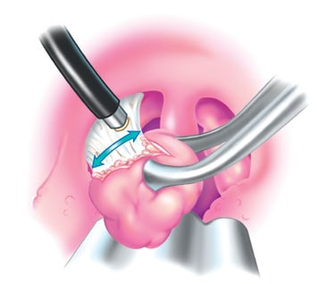
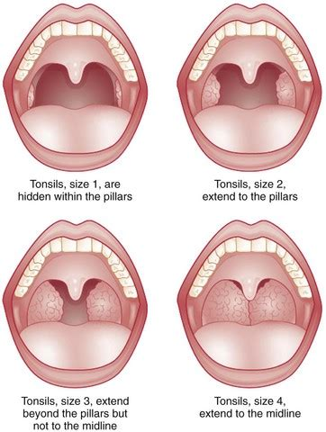
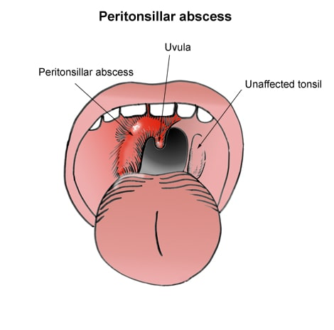
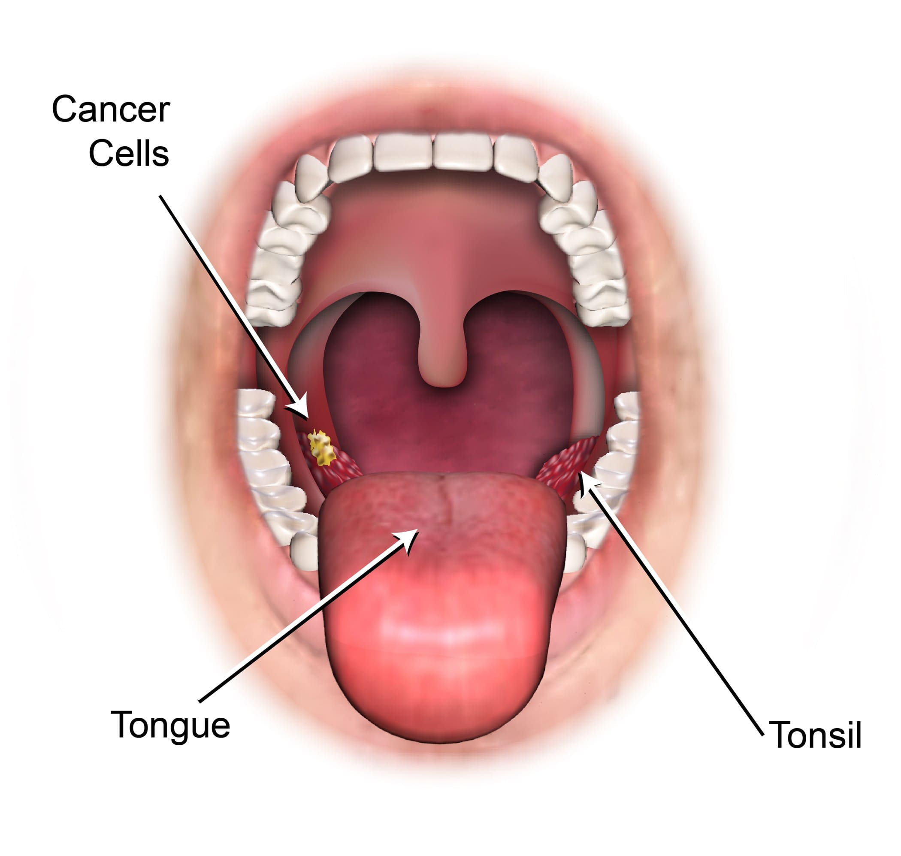

##### Ενδείξεις Επέμβασης

##### Περιαμυγδαλικό Απόστημα

##### Καρκίνος Αμυγδαλής

 
 

 
 

Οι αμυγδαλές και οι αδενοειδείς εκβλαστήσεις (κρεατάκια) σχηματίζονται από Λεμφικό Ιστό. Οι αμυγδαλές είναι ορατές στο πίσω μέρος του στόματος, ενώ οι αδενοειδείς εκβλαστήσεις βρίσκονται στο ρινοφάρυγγα, στο πίσω μέρος της μύτης και είναι ορατές με Ενδοσκόπηση Ρινός. Γενικά, οι αμυγδαλές και οι αδενοειδείς εκβλαστήσεις χρησιμεύουν στην ωρίμανση του ανοσοποιητικού συστήματος, στην άμυνα του οργανισμού και στην καταπολέμηση των λοιμώξεων.

Οι σοβαρότερες παθήσεις των αμυγδαλών είναι η **Υποτροπιάζουσα και Χρόνια Πυώδης Αμυγδαλίτιδα, η Υπερτροφία που προκαλεί Αναπνευστική Απόφραξη, ο Καρκίνος και το Λέμφωμα**.

Τα συχνότερα συμπτώματα από νόσους των αμυγδαλών και των αδενοειδών είναι ο πόνος στο φάρυγγα, η δυσκαταποσία, η δυσχέρεια αναπνοής, το ροχαλητό και η αποφρακτική υπνική άπνοια, η υποτροπιάζουσα ιγμορίτιδα και ωτίτιδα, τα απόστημα, η αιμόπτυση και η δυσπλασία του προσώπου και των δοντιών.

<u>"Σε χρόνιες φλεγμονώδεις παθήσεις, σε κακοήθειες και όταν προκαλούνται αποφρακτικά φαινόμενα είναι φανερό ότι, οι χρήσιμες κατά τα άλλα αυτές δομές, πρέπει να αφαιρεθούν".</u>

Αμυγδαλεκτομή είναι η χειρουργική επέμβαση με την οποία αφαιρούνται οι αμυγδαλές. Η επέμβαση γίνεται με γενική αναισθησία και διαρκεί περίπου 20 λεπτά , στα χέρια ενός έμπειρου Χειρουργού. Οι αδενοειδείς εκβλαστήσεις (κρεατάκια) αφαιρούνται με Αδενοειδεκτομή, η οποία στη σύγχρονη εποχή γίνεται Ενδοσκοπικά με Μονοπολική Διαθερμία. Συνήθως μετά την επέμβαση ο ασθενής δεν χρειάζεται να μείνει στο νοσοκομείο. Η επέμβαση είναι απόλυτα ασφαλής μετά την ηλικία των 3 ετών.
 
 

 
 

Οι συχνότερες ενδείξεις αφαίρεσης των αμυγδαλών είναι:

- Συχνά επεισόδια οξείας πυώδους αμυγδαλίτιδας.
  Βάσει των διεθνών κατευθυντήριων οδηγιών - International Guidelines - θα πρέπει να έχουν καταγραφεί 5 με 6 επεισόδια αμυγδαλίτιδας τον τελευταίο χρόνο ή περισσότερα από 3 επεισόδια κατ' έτος τα τρία τελευταία χρόνια.

- Καρκίνος Αμυγδαλών - Ειδικότερα όταν εντοπιστεί πρόσφατη ασυμμετρία στο μέγεθος των αμυγδαλών πάντα υπάρχει η υποψία νεοπλασίας.

- Περιαμυγδαλικό απόστημα.

- Υπερτροφία αμυγδαλών που παρεμποδίζουν την αναπνοή και προκαλούν Αποφρακτική Υπνική Άπνοια. Ο ασθενής έχει διαταραγμένο ύπνο, έντονο ροχαλητό και Άπνοιες (πλήρη διακοπή της αναπνοής για πάνω απο 10 δευτερόλεπτα).

- Δυσοσμία του στόματος (Χαλίτωση), λόγω χρόνιας κρυπτικής αμυγδαλίτιδας ή λιθίασης των αμυγδαλών.
   
   

 
 

##### Περιαμυγδαλικό Απόστημα

Το Περιαμυγδαλικό Απόστημα είναι μια εξαιρετικά δυσάρεστη επιπλοκή της αμυγδαλίτιδας. Συνίσταται στη συλλογή πύου στον περιαμυγδαλικό χώρο (χώρος πάνω από τις αμυγδαλές). Το απόστημα δημιουργείται συνήθως όταν μια πυώδης αμυγδαλίτιδα δεν θεραπεύεται επαρκώς και εμφανίζεται την 6 με 7 ημέρα από την έναρξη των συμπτωμάτων. Πιο σπάνια μια επιθετική φλεγμονή οδηγεί σε απόστημα ταχύτατα - μέσα σε 1 ή 2 ημέρες - και ο ασθενής εμφανίζει οξεία επιδείνωση και τοξική κλινική εικόνα.

**Η κλινική εικόνα είναι σοβαρή**. Υπάρχει έντονος πόνος στο λαιμό και η κατάποση είναι επώδυνη. Ο ασθενής συχνά δεν μπορεί να ανοίξει το στόμα του (τρισμός), μπορεί να έχει δύσπνοια και χαρακτηριστική αλλαγή στη φωνή σαν να έχει στο στόμα μια ζεστή πατάτα (hot potato voice).

**Η θεραπεία είναι χειρουργική**. Αφού αποδειχθεί η παρουσία πύου με Παρακέντηση δια βελόνης γίνεται άμεσα Διάνοιξη και Παροχέτευση ενδοστοματικά. Με την παροχέτευση ο ασθενής ανακουφίζεται άμεσα από τον πόνο. Η διάνοιξη θα πρέπει να επαναλαμβάνεται κάθε 24 ώρες μέχρι την ίαση και χορηγείται συνδυασμός αντιβιοτικών.

Η πιο συχνή επιπλοκή του περιαμυγδαλικού αποστήματος είναι το **Πλαγιοφαρυγγικό Απόστημα**, το οποίο αντιμετωπίζεται χειρουργικά με εξωτερική προσπέλαση υπό γενική αναισθησία και πολυήμερη νοσηλεία για ενδοφλέβια χορήγηση αντιβιοτικών.

Συνήθως συνιστάται να γίνει **Αμυγδαλεκτομή** 4 εως 6 εβδομάδες μετά την θεραπεία του αποστήματος. Ειδικά στην περίπτωση που υπάρχει ιστορικό αποστήματος και στο παρελθόν η επέμβαση είναι επιβεβλημένη. Στην τελευταία περίπτωση, η επέμβαση ειναι **πιο επώδυνη για τον ασθενή** επειδή έχουν δημιουργηθεί συμφύσεις ενώ είναι και τεχνικά πιο απαιτητική, ειδικά για τον μη έμπειρο χειρουργό. Σε ειδικές περιπτώσεις η αμυγδαλεκτομή γίνεται "εν θερμώ", δηλαδή ταυτόχρονα με την διάνοιξη του αποστήματος.
 
 

 
 

##### Καρκίνος της Αμυγδαλής

Οι αμυγδαλές πρέπει αφαιρούνται όταν υπάρχει η υποψία κακοήθειας. Ο καρκίνος της αμυγδαλής σχετίζεται με τη μόλυνση με τον ιό HPV (ιος των ανθρωπίνων θηλωμάτων), αλλά και με το κάπνισμα και την κατανάλωση αλκοόλ.

Στη περίπτωση λοίμωξης με τον **τύπο HPV 16 ή 18** μπορεί να εμφανιστούν στην αμυγδαλή και την στοματική κοιλότητα καλοήθεις βλάβες όπως τα θηλώματα, προκαρκινικές βλάβες (πχ λευκοπλακία) ή καρκίνος.

Τελευταίες έρευνες σε δείγματα ιστών αμυγδαλής από ασθενείς μετά από αμυγδαλεκτομή, διαπίστωσαν την παρουσία των καρκινογόνων στελεχών του HPV μέσα στις **αμυγδαλικές κρυπτες (tonsillar crypts)** που βρίσκονται στην επιφάνειά τους. Ο ιός επιβιώνει μέσα στα **βιοφίλμ** που σχηματίζονται στις αμυγδαλικές κρύπτες και προστατεύεται από το ανοσοποιητικό σύστημα για όσο διάστημα χρειαστεί. Ο ιός υπό καταλληλες συνθήκες μπορεί να ενεργοποιηθεί προσβάλλοντας τον αμυγδαλικό ιστό ιστό πυροδοτώντας τη διαδικασία της καρκινογένεσης.

Τα συχνότερα συμπτώματα είναι επίμονος πόνος στο λαιμό, πόνος στο αυτί, αίσθηση ξένου σώματος στο φάρυγγα, δυσκολία ή πόνος στην κατάποση, η εμφάνιση μιας μάζας στο τράχηλο και η αιμόπτυση.

Στα παιδιά ο καρκίνος των αμυγδαλών είναι εξαιρετικά επιθετικός. Ο συχνότερος ιστολογικός τύπος είναι το **Λέμφωμα non Hodgkin**. Μια μονόπλευρη και ασύμμετρη υπερτροφία της μιας αμυγδαλής θεωρείται πάντα ύποπτη, ειδικά όταν η διόγκωση εξελίσσεται σε σύντομο χρονικό διάστημα (1 ως 3 μήνες) και συνυπάρχει Τραχηλική Λεμφαδενίτιδα.

<u>"Σε μονόπλευρη υπερτροφία απαιτείται αμυγδαλεκτομή και βιοψία ώστε να αποκλεισθεί πιθανός καρκίνος"</u>.
 
 

 
 

##### Επιπλοκές Αμυγδαλεκτομής

Οι επιπλοκές μετά από Αμυγδαλεκτομή είναι γενικά σπάνιες και πιο συχνά εμφανίζονται όταν χειρουργούμε εκτεταμένους όγκους ή σε ασθενείς με διαταραχές της πήξης του αίματος.

Ο χειρουργός θα πρέπει να έχει την ανάλογη εκπαίδευση και εμπειρία τόσο για την αποφυγή όσο και την αντιμετώπιση των επιπλοκών εφόσον συμβούν.

- Η πιο σοβαρή επιπλοκή της αμυγδαλεκτομής είναι η αιμορραγία. Ανεξαρτήτως της μεθόδου που χρησιμοποιείται επισυμβαίνει σε ποσοστό 3 - 5%. Μπορεί να παρουσιαστεί άμεσα μετεγχειρητικά, αλλά και μέχρι 8 έως 12 ημέρες μετά την επέμβαση. Ο ασθενής λαμβάνει σαφείς οδηγίες και θα πρέπει σε κάθε περίπτωση να ενημερώσει τον Χειρουργό.

- Ο μετεγχειρητικός πόνος συνήθως ελέγχεται με απλά παυσίπονα και μπορεί να διαρκέσει ως 7 ημέρες.

- **Τα μικρά παιδιά αναρρώνουν ταχύτατα από την επέμβαση**. Σπάνια μπορεί να παρουσιάσουν και για μικρό διάστημα άρνηση λήψης τροφής.

- Για την αποφυγή μετεγχειρητικής λοίμωξης χορηγούνται αντιβιοτικά. Σε περίπτωση πυρετού ή μη ελεγχόμενου πόνου ο ασθενής πρέπει να επικοινωνήσει με το γιατρό.
  Στην εποχή μας οι κίνδυνοι της γενικής αναισθησίας θεωρούνται αμελητέοι, με τις πολύ σοβαρές επιπλοκές να μην ξεπερνούν την μία ανά 100.000 επεμβάσεις.
   
   

 
 

##### Μετά την επέμβαση

Συνήθως ο ασθενής δε χρειάζεται να διανυκτερεύσει στο νοσοκομείο μετά το χειρουργείο.

Στον ασθενή χορηγούνται παυσίπονα και αντιβιοτικά για 7 ημέρες.

Συνιστάται άφθονη λήψη υγρών και καλή διατροφή για την ταχύτερη επούλωση και αποφυγή επιπλοκών. Θα πρέπει να αποφεύγεται η λήψη σκληρών τροφών καθώς και όξινων και ζεστών ροφημάτων. Γενικά προτιμώνται κρύες και μαλακές τροφές, χωρίς άλλο περιορισμό ή ειδικό διαιτολόγιο.

Η επούλωση διαρκεί περίπου 2 εβδομάδες και στο διάστημα αυτό συνιστάται η αποφυγή έντονης σωματικής άσκησης και η επαφή με άτομα που έχουν κάποια ιογενή λοίμωξη ή βήχουν.

Η αναρρωτική άδεια που χορηγείται είναι 2 εβδομάδες.
 
 

 
 

###### **Κωνσταντίνος Χ. Μπουκόνης**

###### **Χειρουργός Ωτορινολαρυγγολόγος Περιστέρι**

###### **Επιστημονικός Συνεργάτης – Χειρουργός ΩΡΛ Νοσοκομείο "ΥΓΕΙΑ"**

###### **_Για περισσότερες πληροφορίες και ραντεβού με το γιατρό καλέστε [2130 575052](tel:2130575052 '2130 575052')_**
