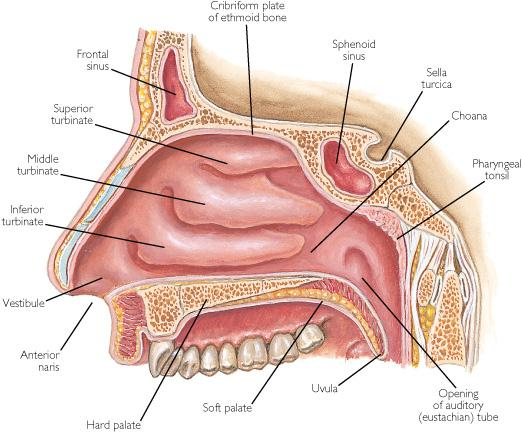
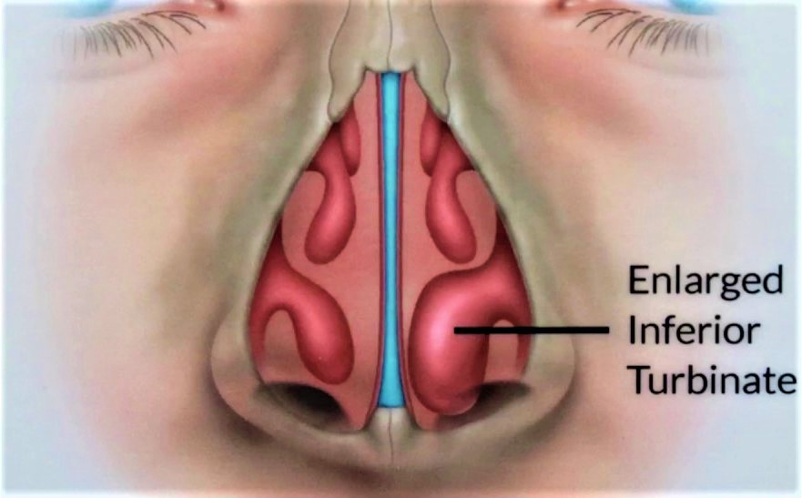
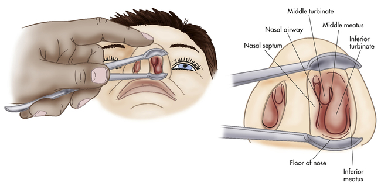
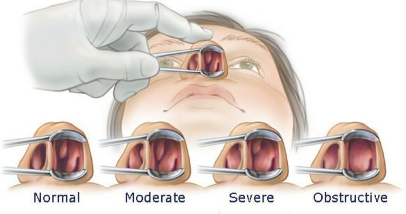

 
 

 
 

### **Ρινικές Κόγχες**

Οι Ρινικές Κόγχες βρίσκονται στα πλάγια εσωτερικά τοιχώματα της μύτης και διακρίνονται σε κάτω, μέση και άνω ρινική κόγχη.  
Διαθέτουν φλεβώδεις κόλπους (στυτικό ιστό) με πλούσια αιμάτωση και το μέγεθος τους μπορεί να μεταβάλετε, προκαλώντας απόφραξη του ρινικού αεραγωγού.
Ο εισπνεόμενος αέρας ερχόμενος σε επαφή με τις κόγχες και το βλεννογόνο που τις καλύπτει αποκτά την ιδανική υγρασία και θερμοκρασία και ταυτόχρονα καθαρίζεται από σκόνες και μικρόβια.
Δεν είναι υπερβολή να αναφέρουμε ότι η μύτη αποτελεί το "κλιματιστικό" του αναπνευστικού συστήματος.

Χαρακτηριστική είναι η διόγκωση των κογχών από ιογενή ή αλλεργική ρινίτιδα, η διόγκωση στις περιπτώσεις αυτές οφείλεται στη φλεγμονή και την πλήρωση με αίμα του φλεβικού δικτύου.
Συχνά εμφανίζουν μια μόνιμη υπερτροφία και προκαλούν χρόνια δυσχέρεια της ρινικής αναπνοής.  
Η χειρουργική αντιμετώπιση της υπερτροφίας της κάτω και μέσης ρινικής κόγχης ενδείκνυται όταν η συντηρητική θεραπεία αποτύχει.
**Ο επιθυμητός στόχος είναι η μείωση του όγκου των μαλακών ιστών των κογχών, διατηρώντας παράλληλα ανέπαφο τον βλεννογόνο.**
 
 

 
 

### **Αίτια**

Η μόνιμη υπερτροφία των κάτω ρινικών κογχών συνήθως είναι **Ιδιοπαθής** (άγνωστης αιτιολογίας), ωστόσο πολύ συχνά επιδεινώνεται από άλλες παθολογικές καταστάσεις όπως η
**αλλεργική ρινίτιδα, η χρόνια ρινοκολπίτιδα, το σκολιωτικό ρινικό διάφραγμα και οι ορμονικές διαταραχές**.
Σημαντικό ρόλο έχει και η υπερ-αντιδραστικότητα του βλεννογόνου λόγω έκθεσης σε ερεθιστικούς περιβαλλοντικούς παράγοντες όπως το κάπνισμα και διάφορα πτητικά χημικά προϊόντα.

Χαρακτηριστική είναι επίσης η διόγκωση των κογχών λόγω εγκυμοσύνης **(Ρινίτιδα της Κύησης)** και μετά από κατάχρηση αποσυμφορητικών spray **(Φαρμακευτική Ρινίτιδα)**.
 
 

 
 

### **Συμπτώματα**

Η υπερτροφία των κογχών προκαλεί χρόνια δυσχέρεια της ρινικής αναπνοής. Ο ασθενής συνήθως αναφέρει ρινική απόφραξη και στοματική αναπνοή.  
Η συμφόρηση προκαλεί αίσθημα πίεσης στο πρόσωπο, υποτροπιάζουσες ιγμορίτιδες, ρινοκολπίτιδες και ωτίτιδες.
Η χρόνια ρινική απόφραξη ευθύνεται για κακή ποιότητα ύπνου, στοματική αναπνοή, κακοσμία του στόματος, ξηρότητα του στόματος και του φάρυγγα, συχνούς πονοκεφάλους και αίσθημα κόπωσης.  
Η υπερτροφία μπορεί να επιδεινώσει το ροχαλητό και την αποφρακτική υπνική άπνοια.
 
 

 
 

### **Κλινική Εξέταση και Διάγνωση**

Πριν το σχεδιασμό και την επιλογή της χειρουργικής επέμβασης λαμβάνεται ένα λεπτομερές ιατρικό ιστορικό και γίνεται πλήρης ΩΡΛ εξέταση.
Η μύτη πρέπει να εξεταστεί ενδελεχώς εσωτερικά.
Μετά τη πρόσθια ρινοσκόπηση, γίνεται ενδοσκοπικός έλεγχος και αξιολόγηση του μεγέθους των κογχών και της κατάστασης του βλεννογόνου.

Η ενδοσκόπηση της μύτης, του στόματος, του φάρυγγα, του λάρυγγα και των αυτιών είναι μια σύγχρονη, ανώδυνη και με μεγάλη διαγνωστική ακρίβεια εξέταση.
Γίνεται στο ιατρείο με άκαμπτο ή εύκαμπτο ενδοσκόπιο, συνήθως κατόπιν ήπιας τοπικής αναισθησίας. Είναι ασφαλής, γρήγορη και καλώς ανεκτή από παιδιά και ενήλικες.
Δεν έχει επιπλοκές, διαρκεί μόλις λίγα λεπτά και δεν απαιτείται κάποια προετοιμασία. Το Εύκαμπτο Ενδοσκόπιο επιτρέπει τον ενδελεχή έλεγχο του ανώτερου αναπνευστικού.
Με ειδικούς μικρο-χειρισμούς μπορεί να διεισδύσει και στα πιο δύσκολα σημεία και να μεταφέρει λεπτομερή εικόνα και βίντεο υψηλής ανάλυσης σε οθόνη Full HD.

Ο ασθενής έχει τη δυνατότητα να μιλάει κανονικά κατά τη διάρκεια της εξέτασης και εφόσον το επιθυμεί, να παρακολουθεί την ενδοσκοπική εικόνα στην οθόνη.
Η αναλυτική παρουσίαση και επεξήγηση των ευρημάτων, επιτρέπει στον ασθενή να συμμετέχει ενεργά στην εξέταση και να να διαμορφώνει τη δική του άποψη.
Η βίντεο-καταγραφή των κλινικών ευρημάτων επιτρέπει τη σύγκριση τους προ και μετά τη χειρουργική επέμβαση και βελτιώνει τη σχέση εμπιστοσύνης μεταξύ γιατρού και ασθενή.

Ταυτόχρονα, πρέπει να αναγνωριστούν τυχόν άλλα αίτια παρεμπόδισης της ρινικής αναπνοής όπως **σκολιωτικό διάφραγμα, ρινικοί πολύποδες, υπερτροφία των αδενοειδών εκβλαστήσεων (" κρεατάκια") ή όγκοι της μύτης.**  
Η ενδοσκόπηση πρέπει να γίνεται δύο φορές, αρχικά εκτιμάται η φυσιολογική κατάσταση της μύτης και εν συνεχεία εξετάζεται μετά από τη χορήγηση αποσυμφορητικoύ spray.
Ο έλεγχος για αλλεργική ρινίτιδα με δερματικές δοκιμασίες αλλεργίας είναι επιβεβλημένος και πρέπει να προηγείται της επέμβασης.
Η ρινίτιδα και η ρινοκολπίτιδα αντιμετωπίζονται με ενδορρινικά spray και σε επιλεγμένα περιστατικά συστήνεται Αξονική Τομογραφία.
 
 

 
 
Ο όρος υπερτροφία των κογχών είναι γενικός και πρέπει πάντα να εντοπίζεται η ακριβής αιτία του προβλήματος.
Η διάγνωση πρέπει να διαχωρίζει την οιδηματώδη και πρησμένη κόγχη λόγω ρινίτιδας και την υπερμεγέθη κόγχη λόγω διάπλασης.
Επίσης, το οστό που συγκρατεί τη κάτω ρινική κόγχη μπορεί να είναι διογκωμένο και η κόγχη να προβάλλει υπερβολικά εντός της ρινικής κοιλότητας, δίνοντας την εντύπωση της υπερτροφίας.
Συχνά συναντούμε υπερτροφία της μιας κόγχης όταν υπάρχει έντονη σκολίωση του διαφράγματος προς αντίθετη πλευρά.
Η πολυποειδής εκφύλιση είναι ενδεικτική χρόνιας ρινίτιδας και προσβάλλει συνήθως το οπίσθιο τμήμα της κόγχης.

Γίνεται εύκολα κατανοητό πώς η ακριβής διάγνωση είναι εξαιρετικά σημαντική για τον σχεδιασμό ενός εξατομικευμένου θεραπευτικού πλάνου, η χειρουργική επέμβαση πρέπει να επιλέγεται ανάλογα με την περίπτωση και το ιδιαίτερο πρόβλημα που έχουμε να αντιμετωπίσουμε.

**_<u>"Η επιλογή της επέμβασης πρέπει να γίνεται βάσει των ιδιαίτερων χαρακτηριστικών της μύτης, ο Χειρουργός ΩΡΛ πρέπει να γνωρίζει άριστα όλες τις διαθέσιμες τεχνικές, να επιλέξει την καταλληλότερη και να την προσαρμόσει στον ασθενή του"</u>_**
 
 

 
 

### **Συντηρητική Θεραπεία**

Η φαρμακευτική αγωγή περιλαμβάνει spray κορτιζόνης, πλύσεις με φυσιολογικό ορό και αντιμετώπιση παθολογικών καταστάσεων που επιδεινώνουν το πρόβλημα όπως η αλλεργία και η χρόνια ιγμορίτιδα.
 

### **Χειρουργικές Επεμβάσεις**

Έχουν περιγραφεί περισσότερες από 15 διαφορετικές επεμβάσεις και χειρουργικές τεχνικές για τη μείωση του μεγέθους των κογχών.
**Η Μερική και Πλήρης Κογχοτομή** στις μέρες μας έχουν αντικατασταθεί από πιο σύγχρονες τεχνικές με κορυφαία την **Ενδοσκοπική Κογχοπλαστική**.
Ο καυτηριασμός των ρινικών κογχών είναι η πλέον ήπια παρέμβαση και μπορεί να γίνει με Μονοπολική Διαθερμία, με Ραδιοσυχνότητες και διάφορους τύπους LASER.
Στα παιδιά με υπερτροφία των κογχών προτιμούμε τον καυτηριασμό με Ραδιοσυχνότητες.

### **Ενδοσκοπική Κογχοπλαστική (Endoscopic Turbinoplasty)**

Η Ενδοσκοπική Κογχοπλαστική έχει αντικαταστήσει στις μέρες μας τον καυτηριασμό των ρινικών κογχών και τις ακρωτηριαστηκές επεμβάσεις κογχοτομής του παρελθόντος.
Στόχος της επέμβασης είναι η συρρίκνωση - των κατά τα άλλα χρήσιμων αυτών ανατομικών δομών - αφήνοντας ανέπαφο τον βλεννογόνο που τις καλύπτει εξωτερικά.

Υπό την καθοδήγηση του ενδοσκοπίου αφαιρείται το μικρό οστό που στηρίζει την κόγχη με ειδικά εργαλεία μικροχειρουργικής και μαζί ο υποβλεννογόνιος (στυτικός) ιστός με ειδικό μηχάνημα Shaver.  
Με την τεχνική αυτή προλαμβάνεται η υποτροπή της διόγκωσης των κογχών όπως συμβαίνει μετά από τον καυτηριασμό και δεν αφαιρείται βλεννογόνος (πρόληψη ξηράς ρινίτιδας με κρούστες).

**_<u>Ο βλεννογόνος που καλύπτει τις κόγχες έχει σπουδαίο ρόλο στη λειτουργία της μύτης ως "κλιματιστικού".</u>_**
**_<u>Η μύτη καθαρίζει, υγραίνει και θερμαίνει τον αέρα που εισπνέουμε και για το λόγο αυτό κατά την διάρκεια χειρουργικών επεμβάσεων ο βλεννογόνος θα πρέπει να παραμένει ανέπαφος.</u>_**
 
 

 
 

### **Ενδοσκοπική διάνοιξη της φυσαλιδώδους μέσης ρινικής κόγχης**

Η επέμβαση έχει στόχο τη διεύρυνση του ρινικού αεραγωγού όταν αυτός αποφράσσεται από μια ευμεγέθη πνευματώδη μέση ρινική κόγχη. Υπό την καθοδήγηση του ενδοσκοπίου και με ειδικά εργαλεία μικροχειρουργικής αφαιρείται το έξω πέταλο της ανατομικής αυτής παραλλαγής και επιτυγχάνουμε τη διάνοιξη της ρινικής κοιλότητας.

Συνήθως ταυτόχρονα διορθώνουμε και προβλήματα της μύτης και του ρινοφάρρυγα που επιδεινώνουν την αναπνοή, οι συχνότερες επεμβάσεις είναι **η Ενδοσκοπική Αδενοειδεκτομή, η Πλαστική του Ρινικού Διαφράγματος, η Ενδοσκοπική αφαίρεση Ρινικών Πολυπόδων και η Ενδοσκοπική Χειρουργική της χρόνιας ιγμορίτιδας και ρινοκολπίτιδας.**
 

### **Ατροφική Ρινίτιδα**

Η ατροφική ρινίτιδα είναι μια χρόνια φλεγμονή του ρινικού βλεννογόνου εξαιρετικά δύσκολη στη διαχείριση και στην αντιμετώπιση.
Χαρακτηρίζεται από ατροφία του βλεννογόνου και πυώδεις κρούστες με δυσάρεστη οσμή.  
Διακρίνεται σε Πρωτοπαθή ατροφική ρινίτιδα (Ιδιοπαθής) και Δευτεροπαθή ατροφική ρινίτιδα.
Η Δευτεροπαθής ατροφική ρινίτιδα εμφανίζεται μετά από ακρωτηριαστικές επεμβάσεις στη μύτη, από χρήση κοκαΐνης, μετά από ακτινοθεραπεία και στη πορεία χρόνιων κοκκιωματτωδών παθήσεων (σύφιλη, σαρκοείδωση και ρινοσκλήρωμα)
 

### **Πρωτοπαθής Ατροφική Ρινίτιδα - Ξηρά Ρινίτιδα (Rhinitis Sicca) - Όζαινα (Ozaena)**

Η πρωτοπαθής ατροφική ρινίτιδα είναι μια χρόνια διαταραχή του ρινικού βλεννογόνου, η οποία εγκαθίσταται αργά και προοδευτικά και συνήθως χωρίς κάποια αναγνωρίσιμη αιτία.
Χαρακτηρίζεται από την παρουσία φλεγμονωδών διηθήσεων και την απώλεια του φυσιολογικού κροσσωτού επιθηλίου.

Η αιτιολογία της πρωτοπαθούς ατροφικής ρινίτιδας είναι άγνωστη. Κατά καιρούς έχουν ενοχοποιηθεί ορμονικές διαταραχές, διατροφικά ελλείμματα (αβιταμίνωση) και χρόνιες βακτηριακές λοιμώξεις.
Οι ασθενείς εμφανίζουν έντονη ξηρότητα της μύτης, κρούστες και ρινική απόφραξη. Καθώς η νόσος εξελίσσεται εμφανίζονται υποτροπιάζουσες πυώδεις ιγμορίτιδες, ρινορραγίες, διάτρηση του διαφράγματος και πόνος στο μέσο τμήμα του προσώπου.

**Η Ξηρά Ρινίτιδα (Rhinitis Sicca)** είναι μια μορφή ατροφικής ρινίτιδας με χαρακτηριστικό την υπερτροφία και ξηρότητα του βλεννογόνου.
**Η Όζαινα (Ozaena)** είναι επίσης μια μορφή πρωτοπαθούς ατροφικής ρινίτιδας, που χαρακτηρίζεται από προοδευτική ατροφία του βλεννογόνου, την απορρόφηση των οστών, την απώλεια όσφρησης και την έντονη δυσοσμία της μύτης λόγω σχηματισμού εφελκίδων.
 
 

 
 

### **Δευτεροπαθής Ατροφική Ρινίτιδα**

### **Το Σύνδρομο της "Κενής Μύτη" ("Empty Nose" Syndrome)**

Το σύνδρομο της "κενής μύτης" είναι μια ιατρογενής παθολογική κατάσταση και ανήκει στο φάσμα της δευτερογενούς ατροφικής ρινίτιδας.
Είναι μια συγκεκριμένη κλινική οντότητα που προκαλείται από τις αλλαγές στη ροή του αέρα και την απώλεια του μηχανισμού κλιματισμού της μύτης μετά από ακρωτηριαστικές ρινολογικές επεμβάσεις.

Δεν υπάρχει σαφής τρόπος για να περιγράψουμε την αίσθηση της αναπνοής που έχουν οι ασθενείς με το σύνδρομο.
Οι περισσότεροι αναφέρουν ότι αισθάνονται τη μύτη τους "βουλωμένη" επειδή δεν βρίσκουν καλύτερη λέξη να περιγράφει το πρόβλημα τους.
Άλλοι νιώθουν τη μύτη τους πολύ ανοιχτή αλλά αναφέρουν ότι δεν μπορούν να γεμίσουν με αέρα τους πνεύμονες.
Κατά την κλινική εξέταση η μύτη καλύπτεται από εφελκίδες και υπάρχει έντονη ξηρότητα.

Η ικανοποίηση που προσφέρει η φυσιολογική ρινική αναπνοή είναι μια πολυσύνθετη νευρο-φυσιολογική λειτουργία.
Ειδικοί αισθητήρες πίεσης που υπάρχουν στο βλεννογόνο της μύτης διεγείρονται από τη ροή του αέρα προσφέροντας την ευχαρίστηση της ελεύθερης αναπνοής.
Για την ομαλή λειτουργία του μηχανισμού το ρεύμα του αέρα εντός της μύτης θα πρέπει να έχει συγκεκριμένη πίεση και ο αριθμός των αισθητήρων να είναι επαρκής.
Οι κόγχες εξυπηρετούν ένα πολύ σπουδαίο διττό ρόλο στη διαδικασία αυτή.
Αφενός ρυθμίζουν τη ροή του αέρα έτσι ώστε να φτάνει στους αισθητήρες με την κατάλληλη πίεση και αφετέρου ο βλεννογόνος που τις καλύπτει περιέχει ένα πολύ μεγάλο αριθμό αισθητήρων.

Η ριζική εκτομή των κογχών **(Πλήρης Κογχοτομή)** επηρεάζει σημαντικά την αναπνευστική λειτουργία.
Η μύτη μετεγχειρητικά έχει ευρείες ρινικές κοιλότητες με αποτέλεσμα το ρεύμα του εισπνεόμενου αέρα να έχει πολύ χαμηλή πίεση και μην καταφέρνει να διεγείρει τους υποδοχείς.
Επιπλέον, η απουσία των κογχών στερεί ένα πολύ σημαντικό αριθμό αισθητήρων που βρίσκονται φυσιολογικά στο βλεννογόνο που τις καλύπτει.
Η πλήρης κογχοτομή μπορεί να οδηγήσει σε σοβαρές λειτουργικές διαταραχές και ανάπτυξη δευτερογενούς ατροφικής ρινίτιδας.

 

### **Θεραπεία Ατροφικής Ρινίτιδας**

Βασικοί στόχοι της θεραπείας είναι η ενυδάτωση της μύτης και η αντιμετώπιση των μικροβιακών λοιμώξεων.
Συστήνονται συχνές ρινοπλύσεις με φυσιολογικό ορό ή με διάλυμα διττανθρακικών.
Τοπικά εφαρμόζονται για εφύγρανση παραφίνη, γλυκερίνη και έλαια.
Η χορήγηση βιταμινών και σιδήρου επίσης είναι ωφέλιμη.
Τα αντιβιοτικά χορηγούνται για την αντιμετώπιση της οξείας φλεγμονής αλλά και μακροχρόνια για την προστασία και "αποστείρωση" της μύτης.
Συνήθως προηγείται καλλιέργεια και αντιβιόγραμμα για την επιλογή του κατάλληλου αντιβιοτικού.
Η χορήγηση αντιβιοτικών σταγόνων έχει αποδειχτεί αποτελεσματική στον έλεγχο των συμπτωμάτων.

Διάφορες χειρουργικές και επεμβατικές τεχνικές έχουν δοκιμαστεί κατά καιρούς με αμφισβητούμενα ωστόσο αποτελέσματα.
Η επιλογή του χειρουργείου συστήνεται σε αποτυχία της συντηρητικής αγωγής και επιδεινούμενη νόσο.
Η λογική των επεμβάσεων είναι η μείωση του ελεύθερου χώρου των ρινικών κοιλοτήτων και για να επιτευχθεί χρησιμοποιούνται διάφορα μοσχεύματα.

Η συχνή απομάκρυνση των σκληρών εφελκίδων ενδοσκοπικά στο ιατρείο είναι εξαιρετικά σημαντική για την υγιεινή της μύτης, τη πρόληψη λοιμώξεων και τη βελτίωση της αναπνοής.
 
 

 
 

###### **Κωνσταντίνος Χ. Μπουκόνης**

###### **Χειρουργός Ωτορινολαρυγγολόγος Περιστέρι**

###### **Επιστημονικός Συνεργάτης – Χειρουργός ΩΡΛ Νοσοκομείο "ΥΓΕΙΑ"**

###### **_Για περισσότερες πληροφορίες και ραντεβού με το γιατρό καλέστε [2130 575052](tel:2130575052 '2130 575052')_**
